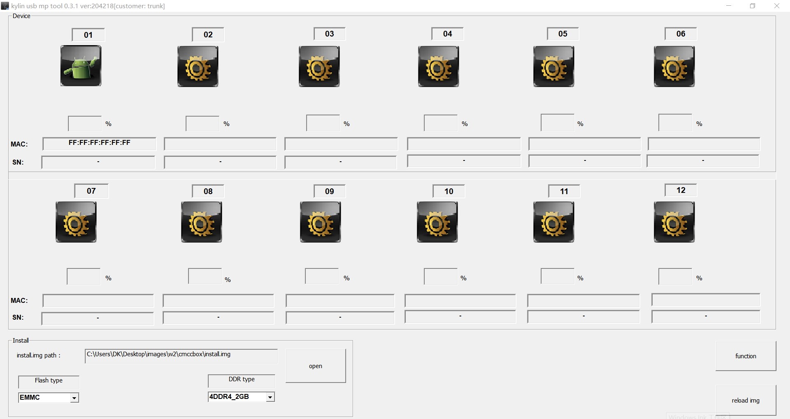

## 线刷说明
USB 线刷用于在无法进入救援模式的情况下修复固件，由于线刷涉及到固件底层，请小心操作。

## 准备
### 材料
1. USB 公对公数据线
   * 淘宝搜索“USB公对公数据线”即可找到，买 USB 2.0 速率就够用了，一般3块钱左右。例如：
   * [淘宝链接1](https://detail.tmall.com/item.htm?id=631625775896&skuId=4665820150311)
   * [淘宝链接2](https://detail.tmall.com/item.htm?id=632232271315&skuId=4677841843502)
2. Windows 电脑 （WinXP 以上，Win7 最好，实测 Win10 也可）
3. 刷机软件和驱动
   * 点此下载 [kylin_usb_mp_tools.zip](https://fw.koolcenter.com/binary/other-tools/kylin_usb_mp_tools.zip)
4. 官方固件
   * 打开[此页面](https://fw.koolcenter.com/iStoreOS/ars2/)下载最新固件即可
5. 牙签或其他类似玩意儿

### PC 端安装驱动
1. 解压前面下载的 `kylin_usb_mp_tools.zip` ，打开其中的 `usb_driver` 驱动文件夹，其中有两个 zip 驱动压缩包，根据自己的 Windows 系统版本解压不同的压缩包（XP系统解压名称带winxp的压缩包，Win7以上解压名称带win7up的压缩包），执行解压后的 `rtk_install.bat` 即可安装驱动（如果系统提示要管理员权限就确定）。
2. 打开 Windows 的“设备管理器”，如果看到有 “Realtek generic USB class” 的类型，其中还有一个带黄色标记的设备，这是个假设备，右键卸载掉，但注意别卸载驱动程序，如果不小心把驱动程序也卸载了，那就重新运行 `rtk_install.bat` 安装

## 开刷
刷机前先熟悉下 ARS2 上线刷相关的按钮和接口：

注意：两个 USB3.0 接口中只有图中标记这个可以线刷，线刷按钮需要用牙签才能按到

1. ARS2 进入线刷模式
    1. 断开 ARS2 的电源和所有 USB 连接
    2. 用 USB 公对公线一端连接 ARS2 的 **USB 线刷口**，另一端连接电脑 USB 口
    2. 用牙签按住 **USB 线刷按钮**
    3. 插上电源
    4. 松开 **USB 线刷按钮**
2. 确认 PC 端识别到 ARS2
    1. 打开 Windows 的“设备管理器”
    2. 检查 “Realtek generic USB class” 的类型下是不是有新的设备，并且没有感叹号。如果没有 “Realtek generic USB class” 类型，可能是没安装驱动，或者连接了 ARS2 错误的 USB 口，如果确认已经连接的是 **USB 线刷口**，那就换个电脑 USB 口重试第 1 步。
3. 打开刷机软件
    1. 打开之前 `kylin_usb_mp_tools.zip` 解压后的文件夹，执行其中的 `rtumdfsample.exe` 程序
    2. 如果前面的步骤没问题的话，应该可以看到左上角有个绿色机器人图标 
4. 刷机 
    1. `Flash type` 选择 `EMMC`
    2. `DDR type` 选择 `4DDR4_2GB`
    3. 点击 `Open` ，选择之前下载好的官方固件，等待固件加载完毕
    4. 点击绿色机器人开始刷机，图标会变化
    5. 进度 100% 之后，如果成功图标会变成机器人，失败则变成红色数字
    6. 断开 USB 刷机线和电源完成刷机
