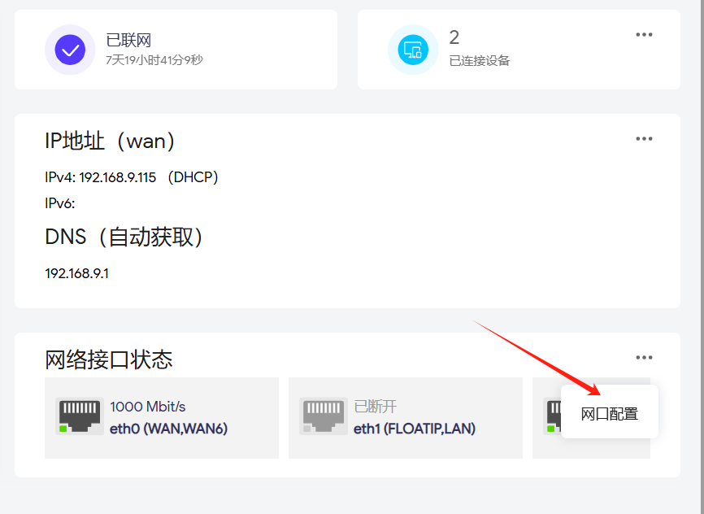
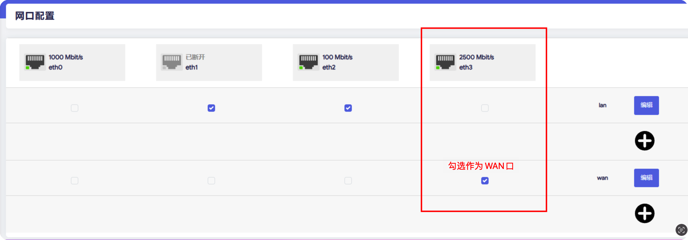
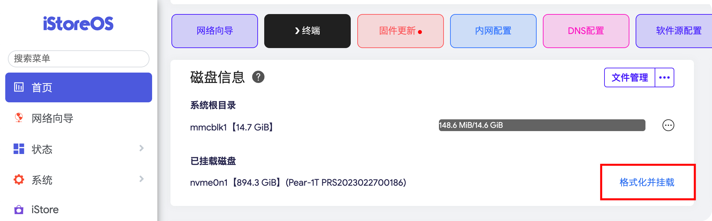
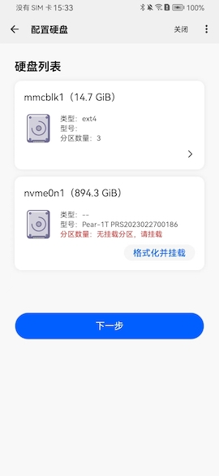
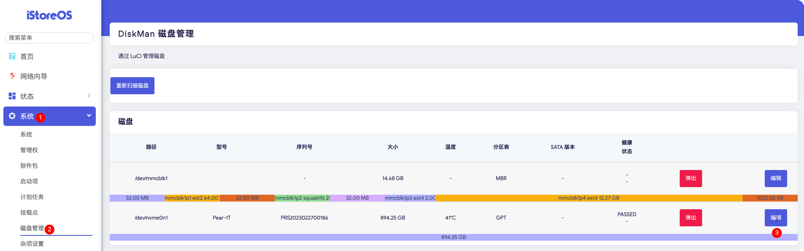
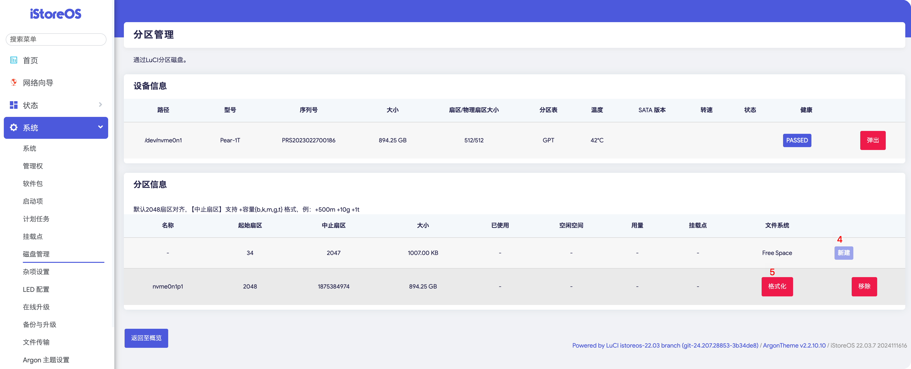
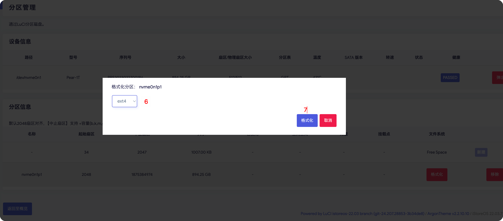

## 软件问题

## Q：手动更新Alist。

1. 到[这里](https://github.com/sbwml/luci-app-alist/releases)下载最新的插件；

根据你的CPU架构选择对应的压缩包下载，比如我的设备是Arm的可以下载下面这个：

2. 解压得到更新插件：alist_3.40.0-1_aarch64_cortex-a53.ipk

3. 手动上传安装插件；

## Q：将2.5G网口设置成WAN口。

1. 打开网口配置；

2. 将ETH2或者ETH3设置成WAN；

默认ETH2或者ETH3为2.5G口，所以你可以将任意一个设置成WAN口，右下角保存并应用即可。

## Q：硬盘格式化和挂载

为了更好的系统兼容性，建议将硬盘格式化成EXT4文件系统。
接上硬盘后，你可以通过以下方式将硬盘格式化并完成挂载。

- 方式一：首页-磁盘信息

- 方式二：易有云APP-发现设备绑定流程

- 方式三：系统-磁盘管理，按照步骤格式化完成后，回到首页-磁盘信息进行挂载。

## 硬件问题

## Q：芯片是什么架构？

A：ARM Cortex-A55。

## Q：硬盘选择什么规格？

A：M.2 NVME 2280 SSD，推荐使用容量在8T以内的硬盘以确保兼容性，大于8T的硬盘建议自行加上散热片。
群友反馈硬盘支持列表，仅供参考：[点击查看](https://doc.weixin.qq.com/smartsheet/s3_APgAFga8ADQpaUQ6q60RzWPHtieY9?scode=AO8Amwc5AA8rjPAgFQ)

