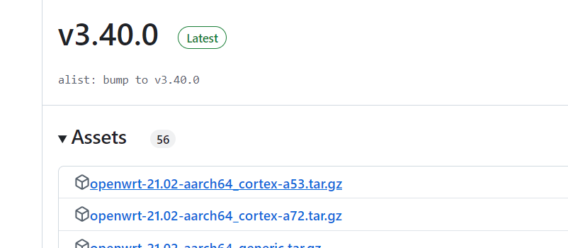
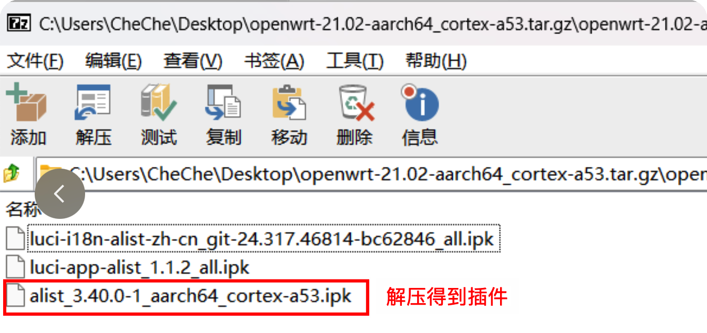
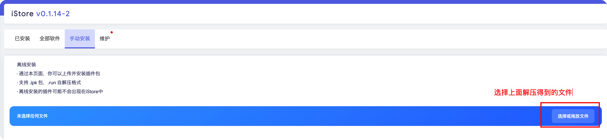

## 软件问题

### Q：手动更新Alist。

1. 到[这里](https://github.com/sbwml/luci-app-alist/releases)下载最新的插件；

根据你的CPU架构选择对应的压缩包下载，比如我的设备是Arm的可以下载下面这个：

2. 解压得到更新插件：alist_3.40.0-1_aarch64_cortex-a53.ipk

3. 手动上传安装插件；

## 硬件问题

### Q：芯片是什么架构？

A：ARM 。

