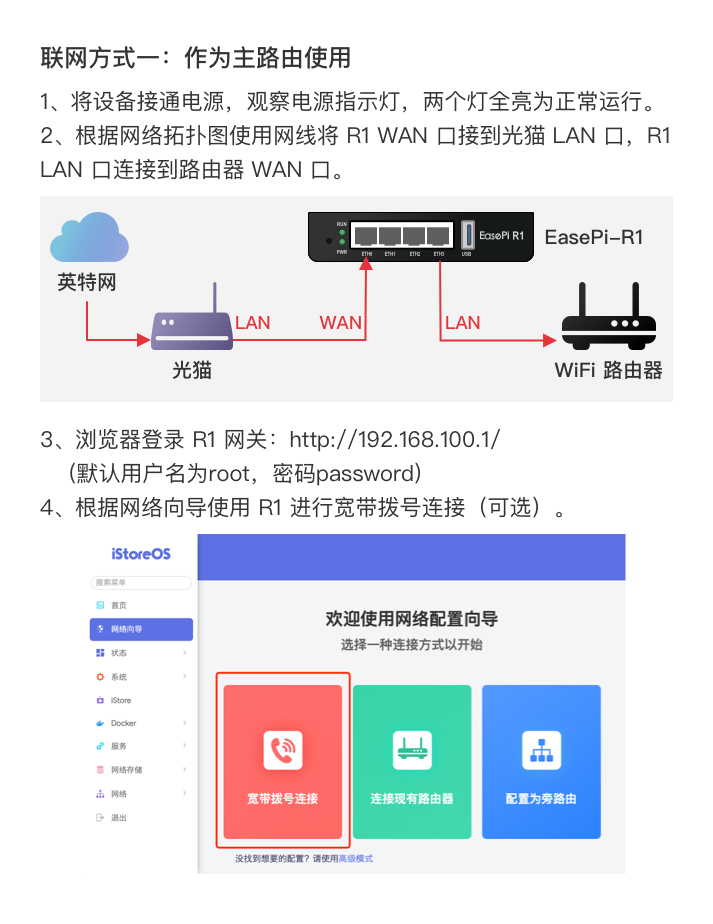
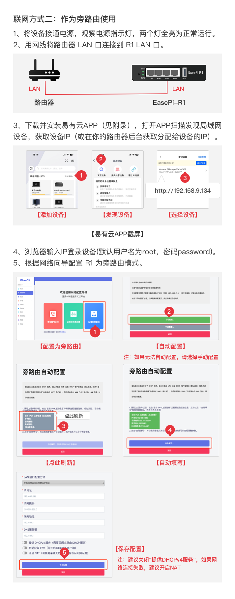
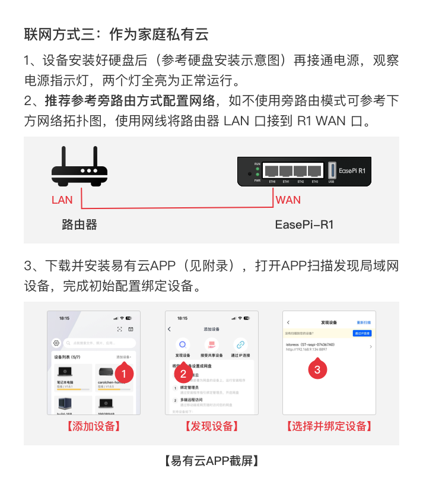
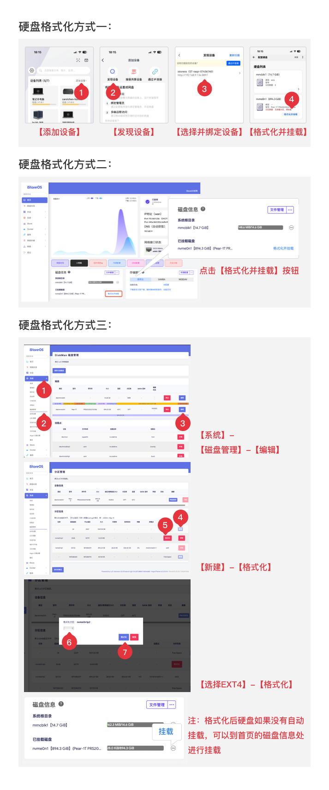

### 设备联网

如果你的硬盘还没有格式化成EXT4，可以参考下方格式化硬盘方式：

更多联网参考：

- [网络向导](/zh/guide/istoreos/basic/network_guide.html)
- [自定义网关](/zh/guide/istoreos/basic/auto_gw.html)
- [IPv6配置](/zh/guide/istoreos/basic/network_guide.html#ipv6-配置)

连接设备参考：
  
推荐使用APP来发现并绑定设备：[客户端下载](https://www.linkease.com/download/)

- [APP连接设备](https://www.bilibili.com/video/BV1JRiRYHEHg/)
- [电脑连接设备](https://www.bilibili.com/video/BV1JRiRYHEV4/)

