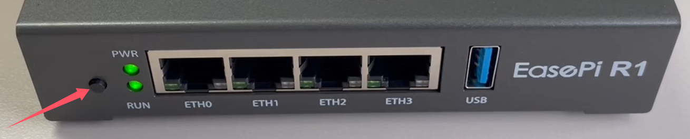

### 设备检查、开关机、重置

1. [设备配件检查-视频解析](https://www.bilibili.com/video/BV1PxidYcEoE/)

2. [开关机和重置-视频解析](https://www.bilibili.com/video/BV1FQiRYWErx/)

* EasePi-R1 通电自启动！



```
重置：长按按钮 5秒 左右，PWR 指示灯闪时松开恢复出厂设置
强制断电：长按超过 10 秒强制断电
```

* 22.03 版本及 24.10.x-20250704之前的固件版本：
```
关机：单击（短按）按钮
```

* 24.10.2-20250704 以后的固件版本：
```
关机：连续短按两次按钮
```


<!-- 3. 连接设备

    连接设备之前需要确定你的设备已经接到了你的网络中：[连接准备](https://www.bilibili.com/video/BV1cSiRYREo3/)

    你可以通过使用易有云APP或者电脑来连接你的设备：

    - [APP连接设备](https://www.bilibili.com/video/BV1JRiRYHEHg/)

    - [电脑连接设备](https://www.bilibili.com/video/BV1JRiRYHEV4/)

    推荐使用APP来发现并绑定设备：[客户端下载](https://www.linkease.com/download/) -->

