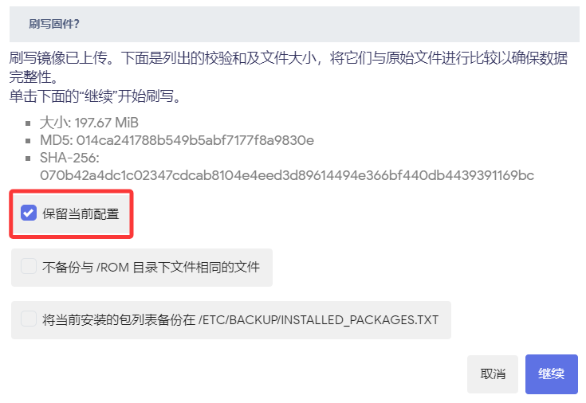

### 系统升级

[系统升级/更新/重置-视频解析](https://www.bilibili.com/video/BV1fXiRYQEok/)

[点击下载 R1 最新固件](https://site.istoreos.com/firmware/download?devicename=easepi-r1)

你可以通过以下方式升级或重置你的系统：

- **在线升级固件：** iStoreOS 首页——>「固件更新」——>「检测更新」，如果有新版固件，检测到更新，直接「下载固件」更新即可。

- **手动升级固件：** iStoreOS ——>「系统」——>「备份与升级」——>「刷写固件」——>「浏览」选择下载的固件文件，开始刷入即可（按需决定是否保留配置）。

- **系统重置：**

1.硬件重置：长按按钮 5秒 左右，PWR 指示灯闪时松开恢复出厂设置

2.网页重置：

