## 扩容Docker分区

* ARS2自带是8G EMMC，除开系统占用，会剩余6G多，自动划分到Docker数据分区，常理来说，6G是完全够运行一般的Docker项目。

* 但是docker项目大小不一，可能有些小伙伴玩的项目体积比较大，6G容量不够， 那么就需要扩容Docker数据分区。

#### 1.硬盘分区:

* #### 首先准备一块硬盘，如果有硬盘盒之类的，可以接电脑上划分一个合适的EXT4格式单独分区出来(比如一块240G硬盘，划分10G用来做docker数据，其余用来作常规存储分区)，然后接上ARS2；然后直接翻到下面的“挂载分区”教程。

* #### 若硬盘已经接上ARS2，直接在ARS2上分区(分区会清掉整个盘，注意备份)，打开“系统——磁盘管理”:

* 查看磁盘分区，然后卸载，然后点击修改；(若是新盘没分区，直接点修改。)

ps:教程演示的sda磁盘有2个分区，全部卸载。

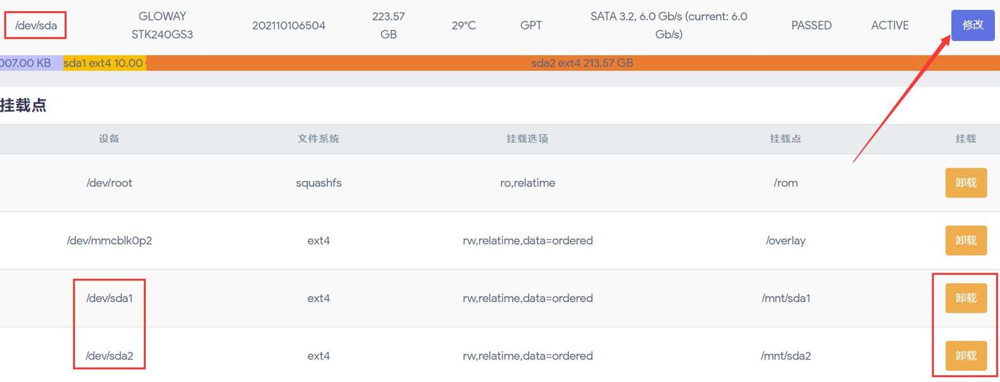

* 进入磁盘修改界面后，移除分区；(若是新盘没分区，不需要操作。)

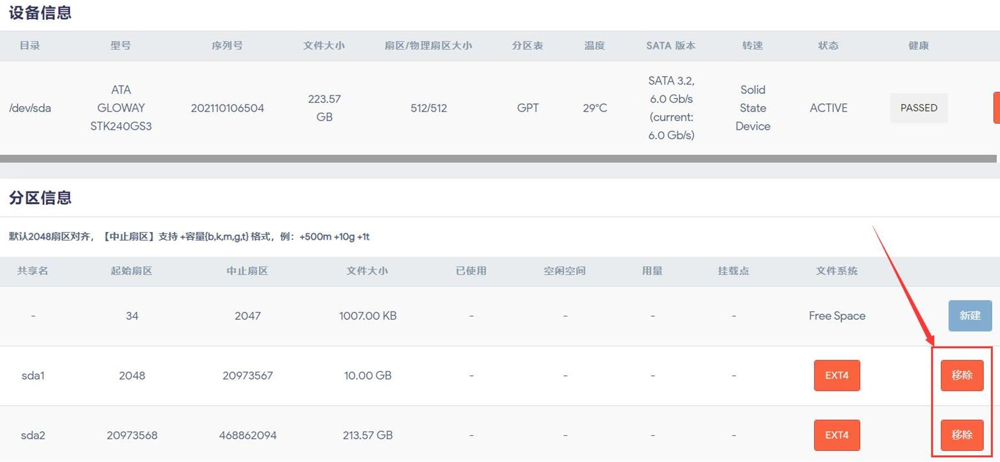

* 分区之前先改分区表，建议改成GPT。


* 开始分区：中止扇区填入希望的docker数据分区大小(比如10G，就写+10G)，然后新建；

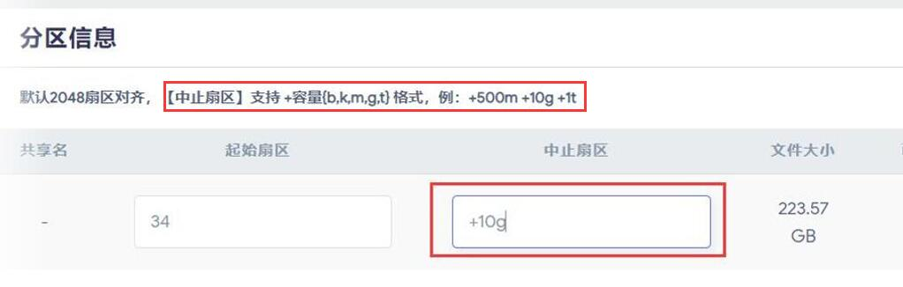

* 其余分区作为常规存储分区，中止扇区不用动，直接新建；

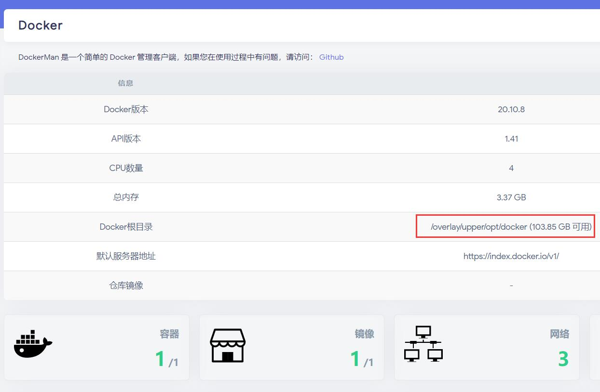

* 将2个分区都格式化为EXT4(若没自动格式化，就点击红色按钮，选择EXT4手动格式化)；

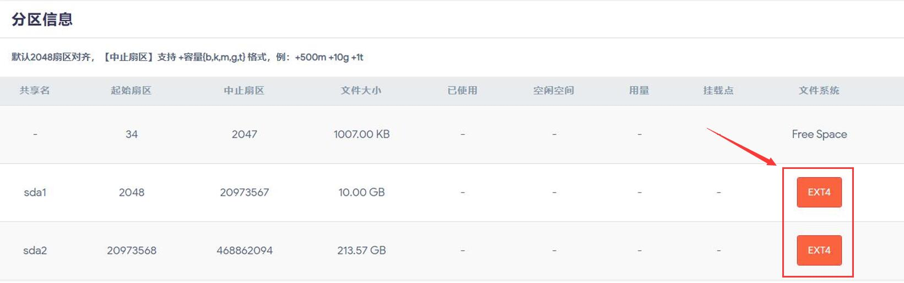

* #### 这样就将sda磁盘分为sda1和sda2两个分区，下面进行挂载。

#### 2.挂载分区：

* 打开“系统——挂载点”，点击添加：

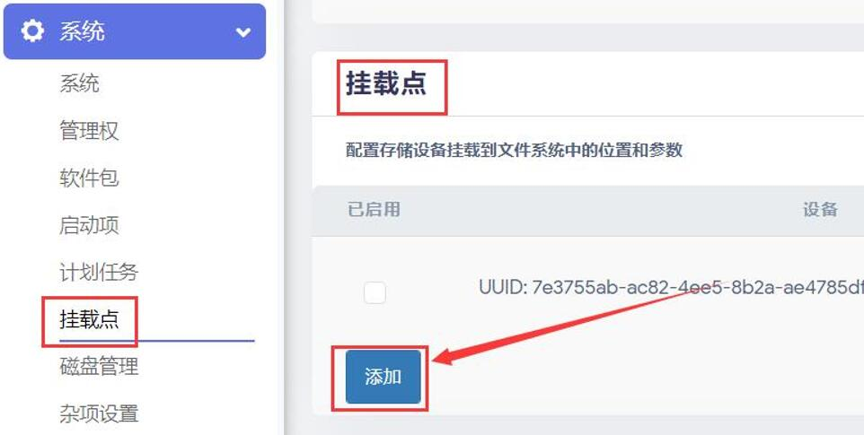

* 挂载docker数据分区：
```
启用挂载点
UUID选择sda1 10G
挂载点自定义为：/overlay/upper/opt/docker
然后保存应用
```
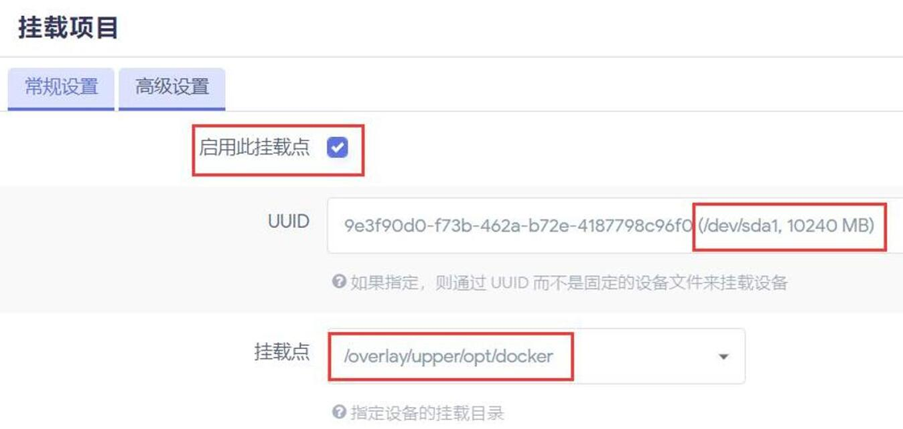

* 挂载常规存储分区：
```
启用挂载点
UUID选择sda2
挂载点自定义为：/mnt/sda2  (常规存储分区，都是挂载在/mnt下)
然后保存应用
```
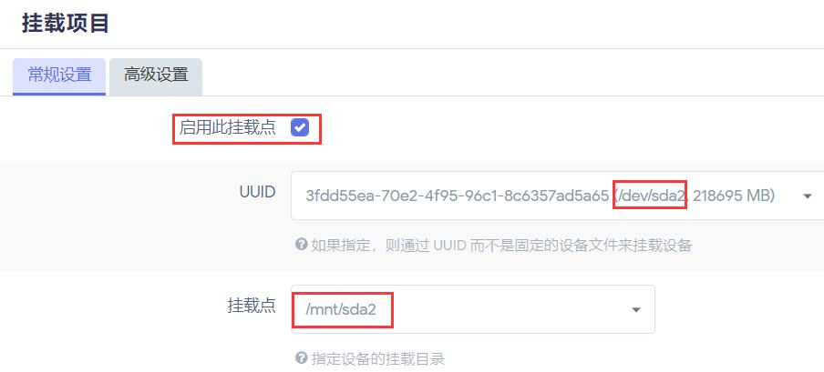

* 分区挂载完成，然后重启ARS2以便完整挂载分区。。

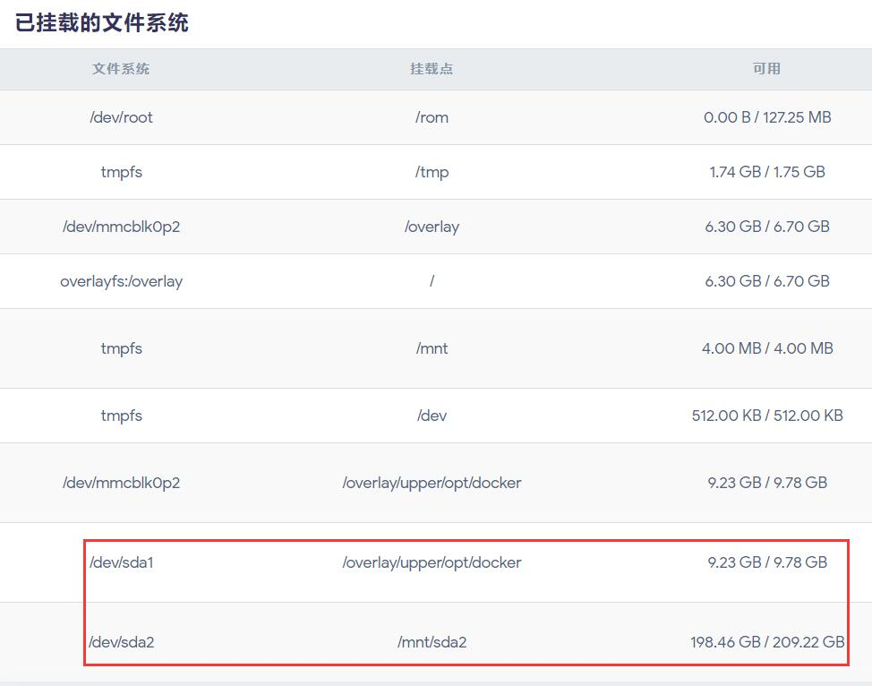


#### 3.扩容完成

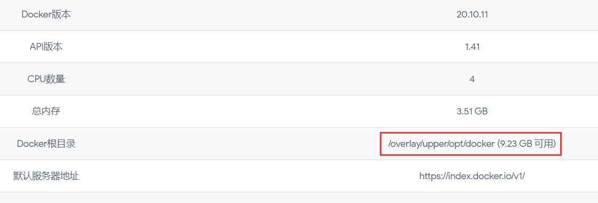


## 玩转影音

### Jellyfin安装

Jellyfin是一个优秀的家庭影院平台，而ARS2支持4K H265（HEVC），H264等格式硬解，这样我们就可以把ARS2打造成您的私人家庭影院。

#### 1.ARS2上安装硬盘，或者移动硬盘；

#### 2.进入ARS2的管理界面—系统—挂载点，挂载好硬盘，记住路径；

比如教程演示机的路径挂载点是：/mnt/sda1


#### 3.iStore安装Jellyfin，安装完成打开;

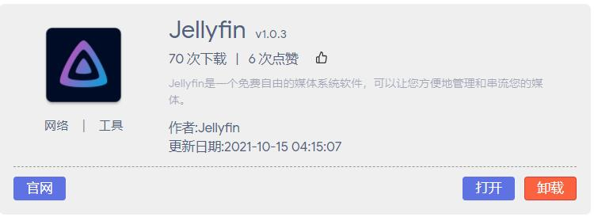

#### 4.配置Jellyfin(建议先看说明)，配置完成后点击安装：

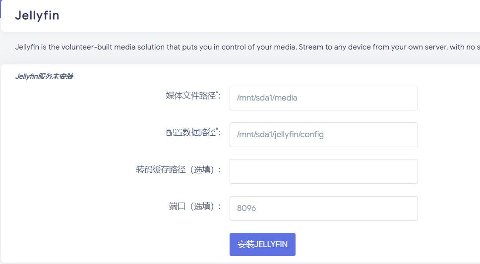

**说明：**

* 媒体文件路径：Jellyfin媒体库路径，按需修改。可指定文件夹，例如：/mnt/sda1/media。

* 配置数据路径：Jellyfin的配置路径，默认/root/jellyfin/config，按需修改。

* 转码缓存路径：可不设置，按需修改。例如：/mnt/sda1/jellyfin/cache。

* 端口：默认8096，按需修改。

* 有些伙伴网络不佳，所以提供离线镜像下载。[离线镜像下载](https://www.aliyundrive.com/s/HMGeGTqsnU8)

下载想要的镜像压缩包，然后解压得到镜像：
```
解压出来的镜像：jellyfin-rtk.tar
```
然后把镜像放入ARS2的磁盘，比如/mnt/sda2/下；

然后终端执行命令导入离线镜像：

```
docker load -i /mnt/sda2/jellyfin-rtk.tar
```


#### 5.安装Jellyfin完成后，打开Jellyfin，即可进入Jellyfin视界(首次进入需要设置)。 [配置教程](https://doc.linkease.com/zh/guide/easepi/advanced.html#jellyfin简易配置) -->

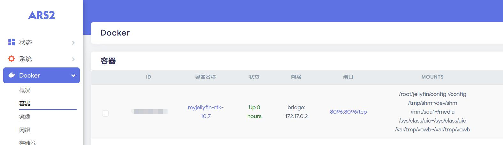

* #### 易有云两大拳头产品，助力Jellyfin随时随地远程在线观影。

* #### [DDNSTO远程观影教程](https://doc.linkease.com/zh/guide/ddnsto/scene.html#远程穿透jellyfin) -->

* #### [易有云App远程观影教程](https://doc.linkease.com/zh/guide/linkease_app/tutorial.html#jellyfin播放) -->


### Jellyfin简易配置

#### 1.Jellyfin安装好以后，打开(设备IP+8096端口)：设置显示语言为简体中文，设置用户名和密码；


#### 2.添加媒体库：

* 选好内容类型(电影、节目(电视剧)、音乐等);

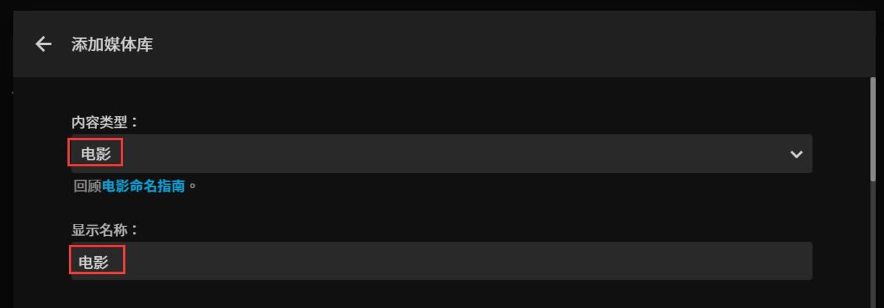


* 选择媒体库路径：

* 前面我们安装的时候“媒体文件路径”，是映射到了Jellyfish的/media路径，所以选择/media；

* 如果我们在“媒体文件路径”下创建了任何文件夹，也能直接在/media选到文件夹；

* 如果是比较新的固件和jellyfin插件，还可以直接使用/mnt下挂载的磁盘。


* 设置首选下载语言(中文)和国家(中国)；


* 下面的刮削器设置默认，然后保存确定，下一步；

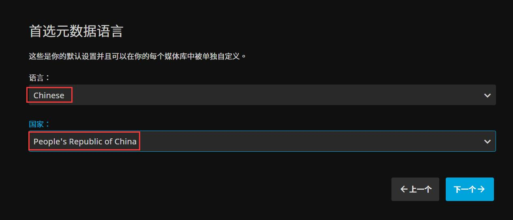


#### 3.设置完成，登录框，填入之前设置的用户名和密码即可进入Jellyfish视界。


#### 4.进入Jellyfin视界后，无需去动硬件加速选项。

* 因为Jellyfish镜像的安装过程中已经配置好硬解，无需再去设置。


### Jellyfin豆瓣刮削器

众所周知，Jellyfin自带刮削器受限于网络，可能不是很好刮削，所以添加国内的豆瓣刮削。

#### 1.Jellyfin控制台——插件——存储库——添加：


#### 2.新建存储库，存储库URL填入下列地址，名称随意；
```
https://raw.githubusercontent.com/Libitum/jellyfin-plugin-douban/master/manifest.json
```

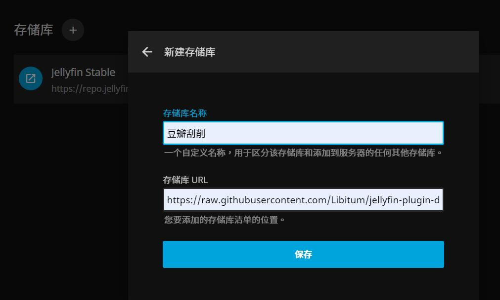

#### 3.添加完成后，目录——元数据——Douban，点击安装；安装完成后，重启Jellyfish。

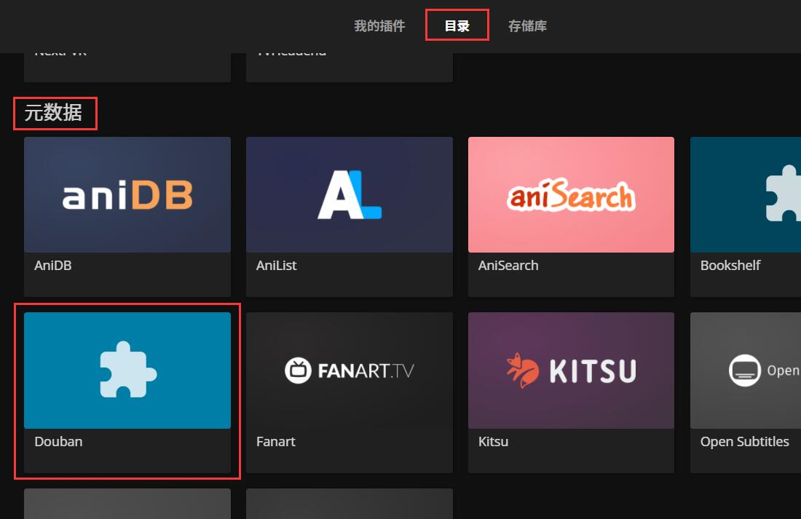

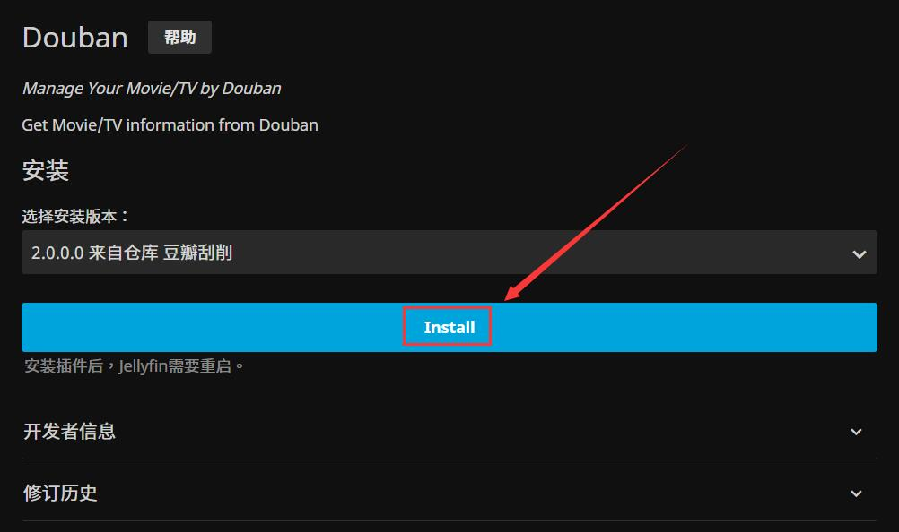

#### 4.重启后，在媒体库——管理媒体库中，在元数据/图片等勾选"Douban"，并置顶为第一位。

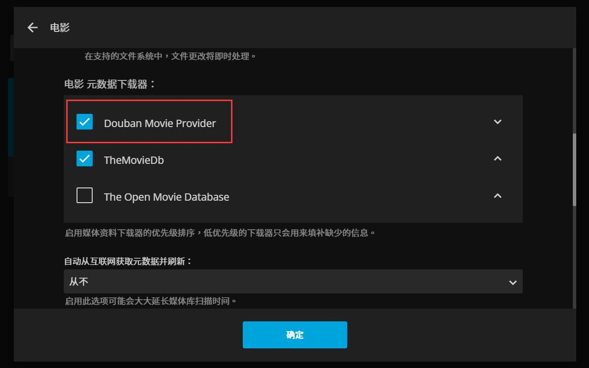


#### 5.这样就能享受豆瓣的刮削了。


### CloudDrive

CloudDrive 是一个将云存储(阿里云盘、115网盘等)服务挂载为本地文件的系统。

* 利用CloudDrive可将网盘的影视资源挂载到ARS2，然后利用Jellfin加载这些影视资源，搭建强大的家庭影院。
* 为简化配置，请将固件升级到**19.07.8 r11804**以后版本。

#### 现在开始安装CloudDrive：

#### 1.安装Docker版CloudDrive，终端运行如下命令(先别直接复制输入，下方有说明)：
```
docker run -d \
  --name clouddrive \
  --privileged \
  --restart=unless-stopped \
  --dns=172.17.0.1 \
  --device /dev/fuse:/dev/fuse \
  -v /mnt/CloudNAS:/CloudNAS:rshared \
  -v /mnt/sda1/CloudNAS/config:/Config \
  -p 9798:9798 \
  cloudnas/clouddrive
```

**说明：**
```
-v /mnt/CloudNAS:/CloudNAS:rshared \      ##CloudDrive 磁盘映射挂载点，无需修改
-v /mnt/sda1/CloudNAS/config:/Config \    ##CloudDrive 配置文件夹，/mnt/sda1/CloudNAS/config可改成其他合适的文件夹
```

* 如果启动失败，请将固件升级到**19.07.8 r11804**以后版本。


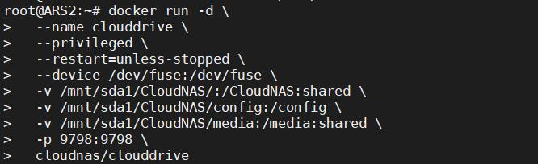

#### 2.上面2条命令完成以后，管理界面—Docker—容器，就能看到CloudDrive已经运行起来了；


#### 3.浏览器打开设备对应IP加上9798端口，例如 [http://ars2.lan:9798/](http://ars2.lan:9798/) 或者 [http://192.168.100.1:9798/](http://192.168.100.1:9798/) ，即可进入CloudDrive界面。

ps：CloudDrive是需要注册登录，没帐号的，请注册。


#### 4.进入CloudDrive界面后，开始添加网盘帐号(阿里云、115网盘等)。

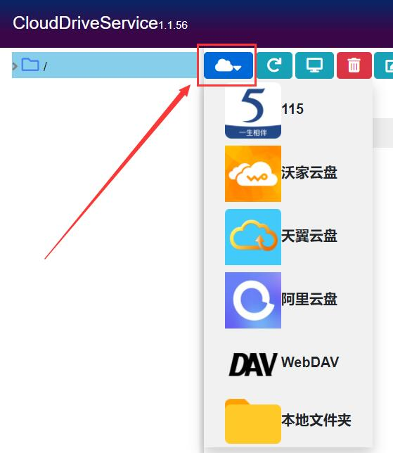

添加完阿里云盘后，内容就加载出来了：

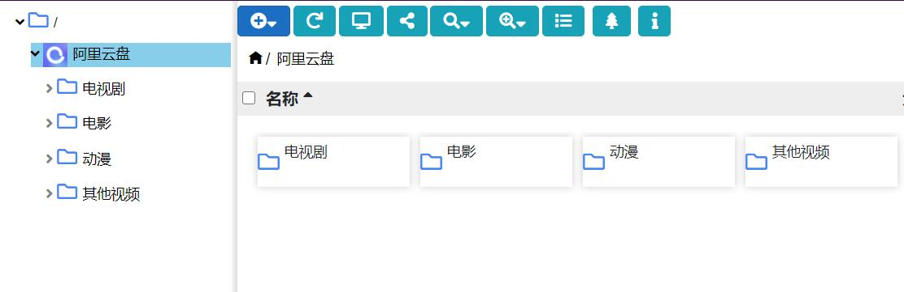

#### 5.回到管理界面，打开系统——挂载点，已经挂载CloudDrive，相当于多了一个CloudDrive硬盘；

* 挂载点路径是：/mnt/CloudNAS/CloudDrive。

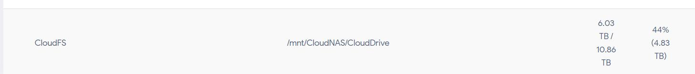

#### 6.可将CloudDrive盘利用Samba等协议共享出去，其他设备就能直接访问CloudDrive盘。

**至此CloudDrive这边设置就到此完成。下面开始将如何利用Jellyfin加载网盘的影视资源。**


### Jellyfin加载网盘资源

#### 1.进入到Jellyfin界面添加媒体库，网盘资源路径是`/mnt/CloudNAS/CloudDrive`，应该已经加载出来了：

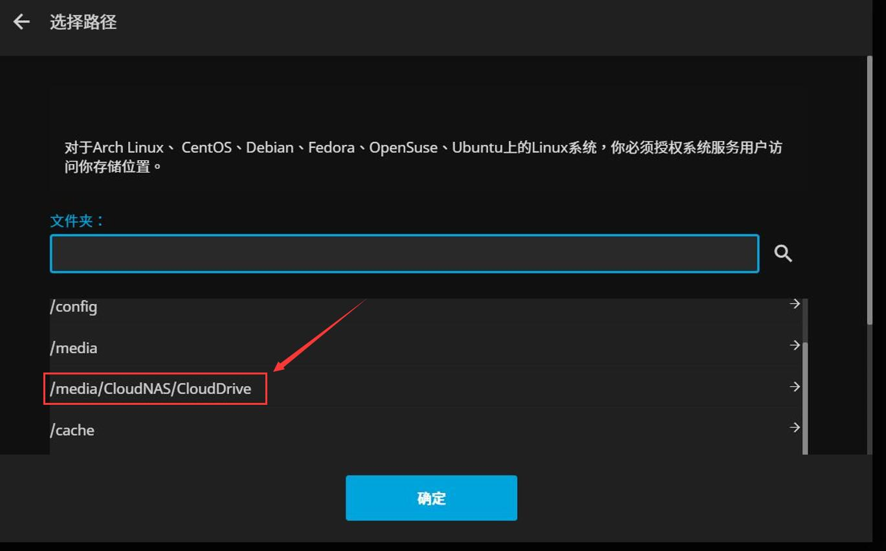

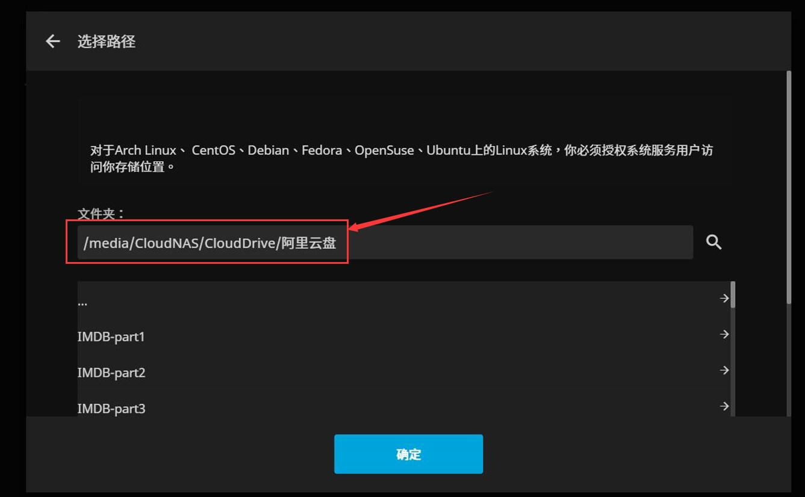

#### 2.可以直接将`/mnt/CloudNAS/CloudDrive`添加，也可以选择下一级合适的文件夹；

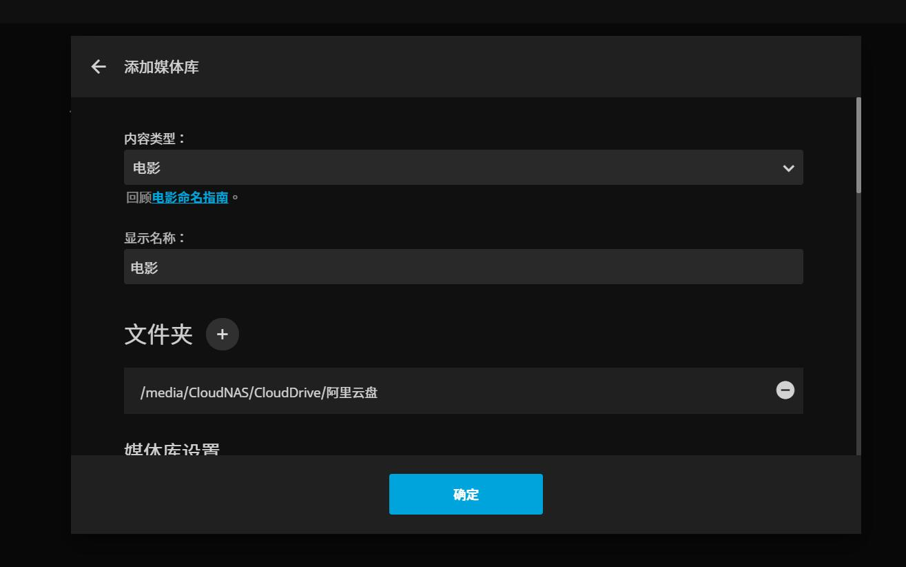

#### 3.添加完媒体库，等待扫描刮削完成。(若选择文件夹资源很多，扫描刮削就比较慢，慢慢等就成)。

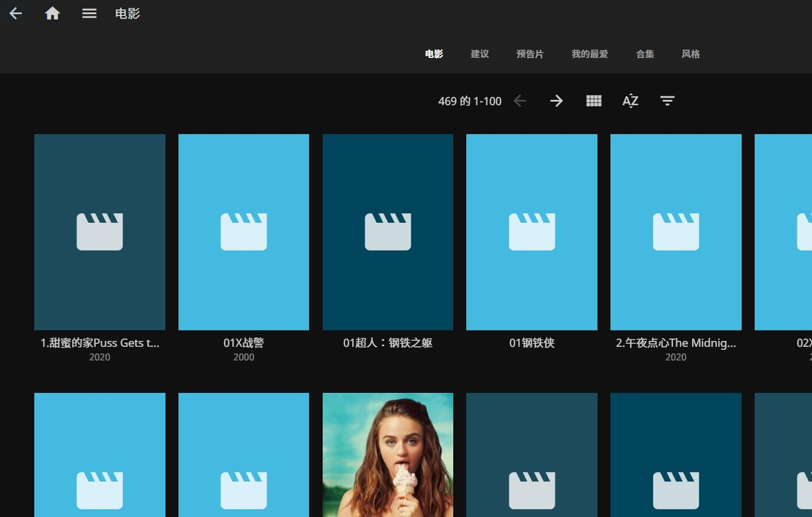


## Ubuntu

带Web远程桌面的Docker版Ubuntu，纯英文系统，欢迎各位极客体验。

#### 1.首先准备一块硬盘，然后扩容Docker数据分区。

* 起码10G起步，Ubuntu镜像很大。[扩容Docker分区教程](https://doc.linkease.com/zh/guide/easepi/advanced.html#扩容docker分区)

#### 2.应用商店里安装Ubuntu;


#### 3.获取镜像；

* 方法一：终端输入下列命令获取镜像：


自行选择全量版本或者标准版本，二选一。

全量版本：(包含WPS、中文输入法等，镜像3.5G左右。)
```
docker pull linkease/desktop-ubuntu-full-arm64:latest
```

标准版本：(单纯的系统，镜像1.6G左右。)
```
docker pull linkease/desktop-ubuntu-standard-arm64:latest
```

* 方法二：下载离线镜像导入；

有些伙伴网络不佳，所以提供离线镜像下载。[离线镜像下载](https://www.aliyundrive.com/s/HMGeGTqsnU8)

下载想要的镜像压缩包，然后解压得到镜像：
```
标准版本解压出来的镜像：desktop-ubuntu-standard-arm64.tar
全量版本解压出来的镜像：desktop-ubuntu-full-arm64.tar
```
然后把镜像放入ARS2的磁盘，比如/mnt/sda2/下；

然后终端执行命令导入离线镜像：

```
标准版本：
docker load -i /mnt/sda2/desktop-ubuntu-standard-arm64.tar
```

```
全量版本：
docker load -i /mnt/sda2/desktop-ubuntu-full-arm64.tar
```


#### 4.然后打开Ubuntu，进行配置；


* 端口：默认6901，可自定义；密码：默认password，可自定义；

* 系统版本：上一步拉取的啥版本镜像，就选择啥版本。

* 设定好以后，点击“安装ubuntu”。

* 点击“安装ubuntu”提示“docker not in disk”，请参考第一步扩容Docker分区。


#### 5.安装完成以后，点击“打开ubuntu”，进入web远程桌面。输入用户名和密码进入ubuntu系统。


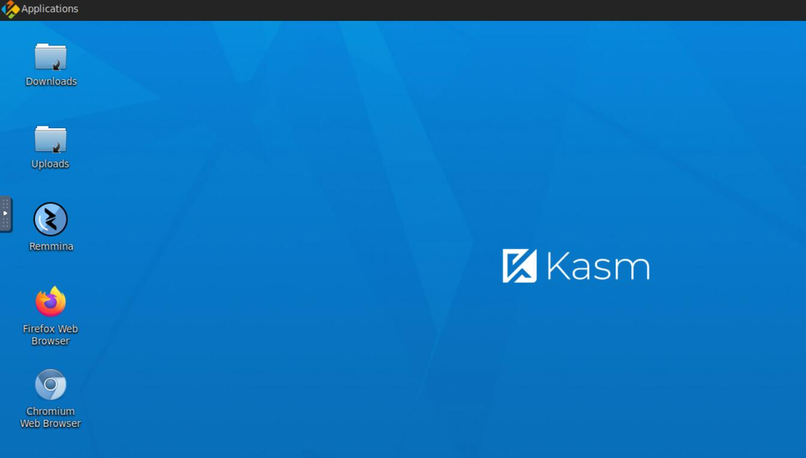


## Home Assistant

一款优秀的家庭自动化平台，您的智能家居好帮手。

#### 1.Docker拉取homeassistant镜像，进入终端，输入下面的命令并回车运行;
```
docker pull homeassistant/home-assistant:latest
```


#### 2.接着继续输入如下命令并回车运行，创建homeassistant容器(先别直接复制输入，下方有说明)；
```
docker run -d \
  --name homeassistant \
  --privileged \
  --restart=unless-stopped \
  -e TZ="Asia/Shanghai" \
  -v /root/homeassistant/config:/config \
  --network=host \
  homeassistant/home-assistant:latest
```

**说明：**

/root/homeassistant/config 用来存放homeassistant的配置文件，按需修改。


#### 3.上面2条命令完成以后，管理界面—Docker—容器，就能看到homeassistant已经运行起来了；


#### 4.浏览器打开设备对应IP加上8123端口，例如 [http://ars2.lan:8123/](http://ars2.lan:8123/) ，即可进入homeassistant控制台。


## Node-RED

Node-RED，这个项目是由IBM新兴技术服务团队构建的可视化物联网编排工具，可基于浏览器的流程编辑器连接设备、服务器和API应用。可以将Home Assistant接入Node-Red实现自动化。

#### 1.Docker拉取node-red镜像，进入终端，输入下面的命令并回车运行;
```
docker pull nodered/node-red
```


#### 2.接着继续输入如下命令并回车运行，创建node-red容器(先别直接复制输入，下方有说明)；
```
docker run -d --name="nodered" \
  --net=bridge \
  --restart unless-stopped \
  -e TZ="Asia/Shanghai" \
  -p 1880:1880/tcp \
  -v /root/node-red/nodered:/data:rw \
  nodered/node-red
```

**说明：**

/root/node-red/nodered 用来存放node-red的数据文件，按需修改。

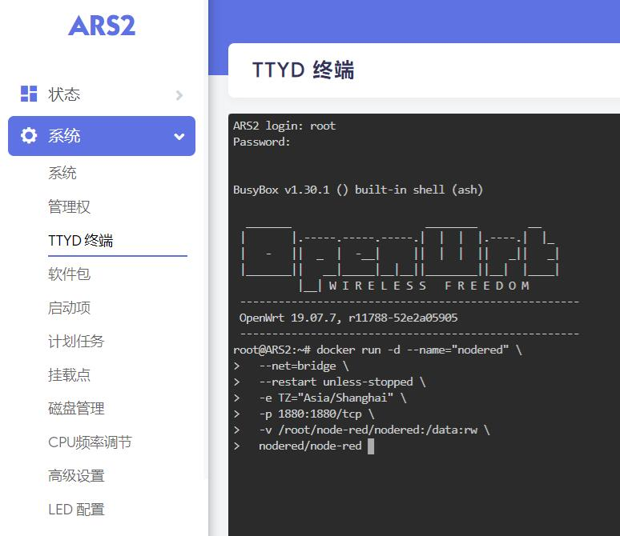

#### 3.接着输入以下命令(解决node-red容器启动不了的bug)；

```
chmod -R 777 /root/node-red/nodered
```


#### 4.上面3条命令完成以后，管理界面—Docker—容器，找到node-red重启，然后node-red就运行起来了；

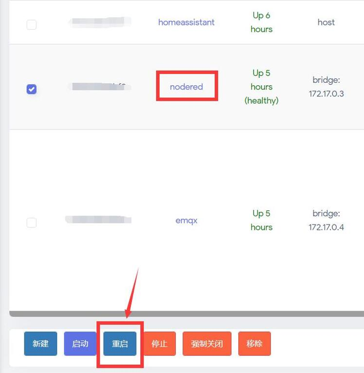

#### 5.浏览器打开设备对应IP加上1880端口，例如 [http://ars2.lan:1880/](http://ars2.lan:1880/) ，即可进入node-red控制台。


## MQTT-EMQX

EMQX基于Erlang/OTP平台开发的MQTT消息服务器，是开源社区中最流行的MQTT 消息服务器，支持丰富的物联网协议，包括 MQTT、LwM2M、MQTT-SN、CoAP、 LoRaWAN、 HTTP和WebSocket等。

#### 1.Docker拉取emqx镜像并创建容器，进入终端，输入下面的命令并回车运行;
```
docker run -d --name emqx --restart unless-stopped -p 1883:1883 -p 8081:8081 -p 8083:8083 -p 8883:8883 -p 8084:8084 -p 18083:18083 emqx/emqx
```


#### 2.上面命令完成以后，管理界面—Docker—容器，就能看到emqx已经运行起来了；


#### 3.浏览器打开设备对应IP加上18083端口，例如 [http://ars2.lan:18083/](http://ars2.lan:18083/)，即可进入eqmx控制台。

**说明：**

初始帐号：admin  

初始密码：public  

连接端口是1883


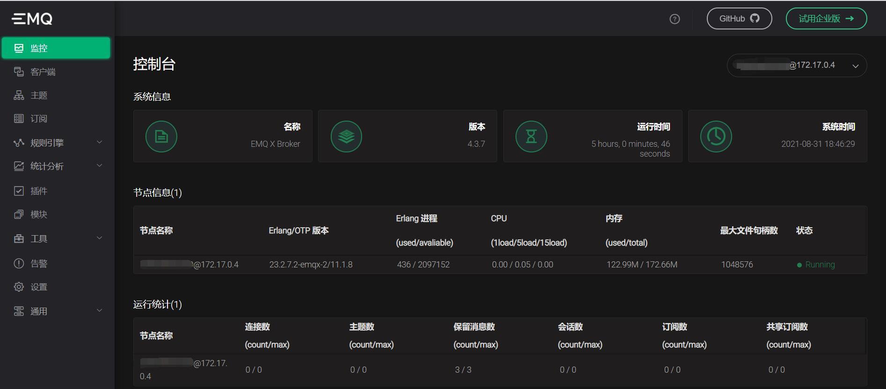


## 内网测速

HomeBox是一款优秀轻量的本地内网测速工具。

#### 1.从iStore安装HomeBox插件；

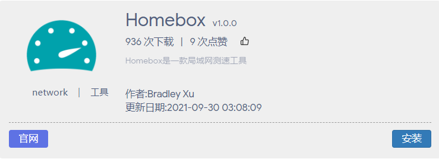

#### 2.安装以后，启用后并“打开HomeBox”；

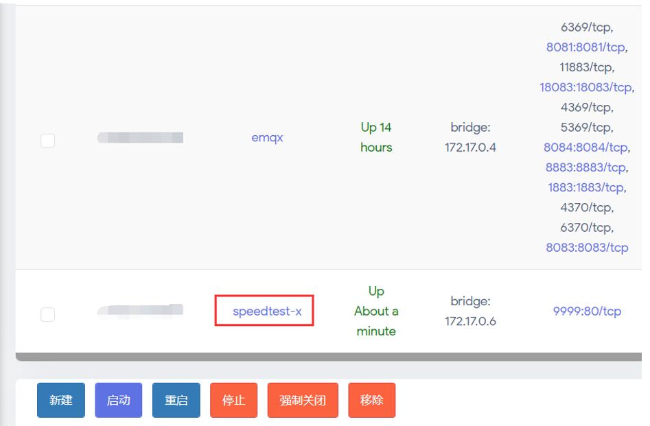

#### 3.在Download(下载)和Upload(上传)项目下，点击“Start”即可进行内网测速。

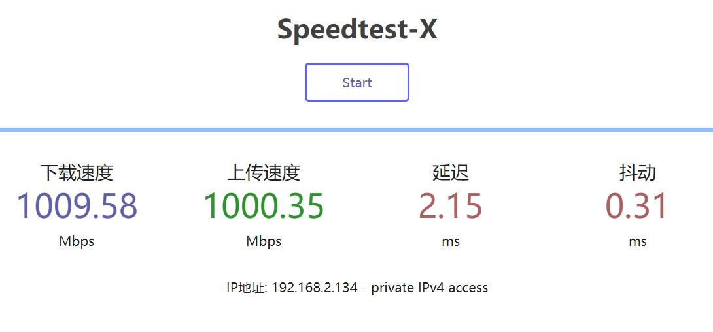


## Nextcloud

Nextcloud是一款开源免费的私有云存储网盘项目，可以让你快速便捷地搭建一套属于自己或团队的云同步网盘，从而实现跨平台跨设备文件同步、共享、版本控制、团队协作等功能。它的客户端覆盖了Windows、Mac、Android、iOS、Linux 等各种平台，也提供了网页端以及 WebDAV接口，所以你几乎可以在各种设备上方便地访问你的云盘。

#### 1.先安装数据库mariadb：Docker拉取mariadb镜像并创建容器，进入终端，输入下面的命令并回车运行(先别直接复制输入，下方有说明);
```
docker run -d --name mariadb \
  -p 3344:3306 \
  -e MYSQL_ROOT_PASSWORD=123456 \
  -v /root/nextcloud/mariadb:/var/lib/mysql \
  --restart unless-stopped \	
  mariadb:10.5.12
```

**说明：**

MYSQL_ROOT_PASSWORD=123456 设置数据库root账户密码，设置为123456，按需修改。

3344:3306 将mariadb数据库的3306端口映射为3344，按需修改。


#### 2.再安装Nextcloud：Docker拉取nextcloud镜像并创建容器，进入终端，输入下面的命令并回车运行(先别直接复制输入，下方有说明);
```
docker run -d --name nextcloud \
  -p 3333:80 \
  -v /root/nextcloud/html:/var/www/html \
  -v /root/nextcloud/data:/var/www/html/data \
  -v /root/nextcloud/apps:/var/www/html/custom_apps \
  -v /root/nextcloud/config:/var/www/html/config \
  --restart unless-stopped \
  nextcloud
```

**说明：**

/root/nextcloud/html Nextcloud主文件夹的映射目录，按需修改。

/root/nextcloud/data 实际数据的映射目录，按需修改。

/root/nextcloud/apps 安装/修改的应用程序的映射目录，按需修改。

/root/nextcloud/config 本地配置文件的映射目录，按需修改。

3333:80 将nextcloud的访问端口映射为3333，按需修改。


#### 3.上面2条命令完成以后，管理界面—Docker—容器，就能看到mariadb和nextcloud运行起来了；

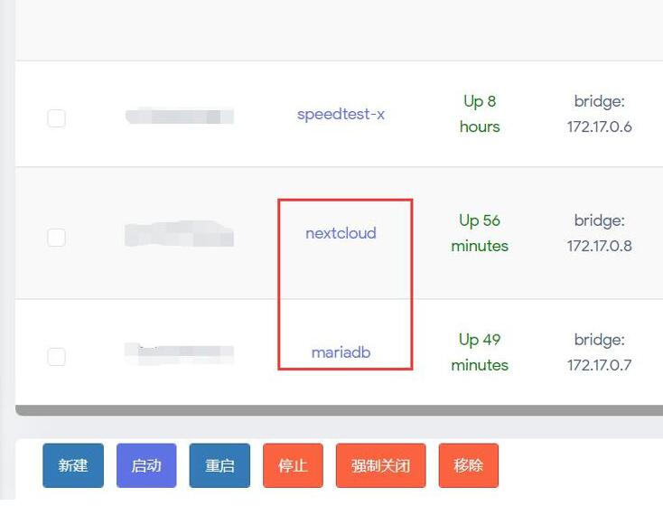

#### 4.浏览器打开设备对应IP加上端口3333，例如 [http://ars2.lan:3333/](http://ars2.lan:3333/) ，访问nextcloud进行配置(建议稍微等几分钟再配置，等待数据库完全运行。)。


**说明：**

管理员帐号和密码，自行设置，按自己喜好。

存储与数据库设置：

1.数据目录不用管

2.配置数据库——选择“MySQL/MariaDB”

数据库用户名：root

数据库密码：123456 (前面设置为123456，若自己修改了填写为修改的)

数据库名字：mariadb (默认就是这个)

数据库地址：设备ip+3344 (前面设置为3344，若自己修改了填写为修改的)

3.安装推荐应用，看自己需求。

4.最后就是安装，等待安装完成，就会自动进入Nextcloud界面。


## 阿里云WebDav

阿里云盘WebDAV服务，主要使用场景为配合支持WebDAV协议的客户端(App如:Infuse、nPlayer)等实现直接观看云盘视频内容，支持上传文件，但受限于WebDAV协议不支持文件秒传。

#### 1.从iStore安装阿里云WebDav插件；

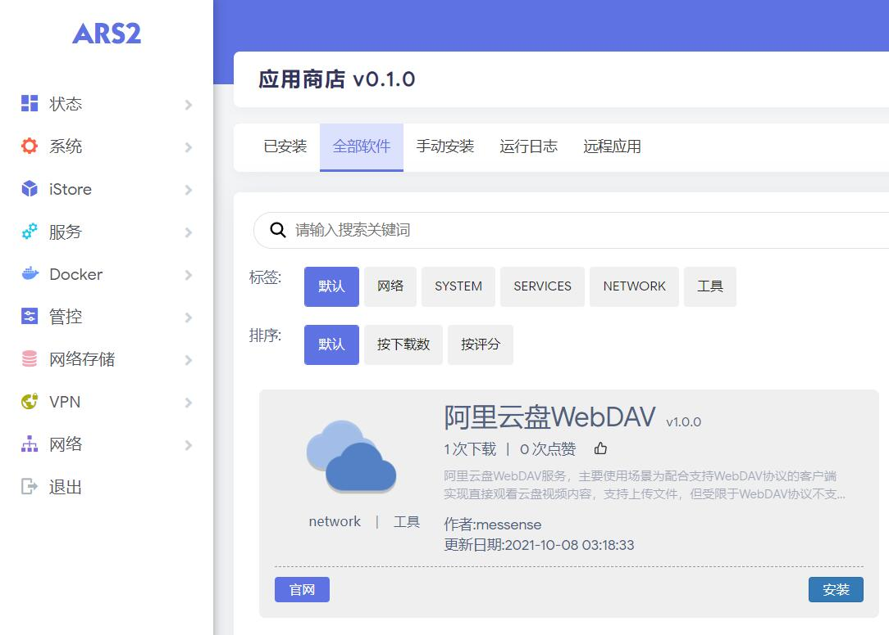

#### 2.打开服务——阿里云盘WebDav：

```
Refresh Token：根据教程获取Token，并填入

启用：勾选

主机：即ARS2的IP，默认情况下填192.168.100.1，演示机为192.168.2.100

端口：随意，只要不冲突，这里假设使用8888

用户名和密码：一般自动默认为ARS2的登录密码，也可以自行更改

其余选项默认，然后保存应用
```


#### 3.阿里云盘WebDav运行起来后，就可以访问了，比如浏览器打开 [http://ars2.lan:8888/](http://ars2.lan:8888/)：


输入用户名和密码，就直接访问阿里云盘了。

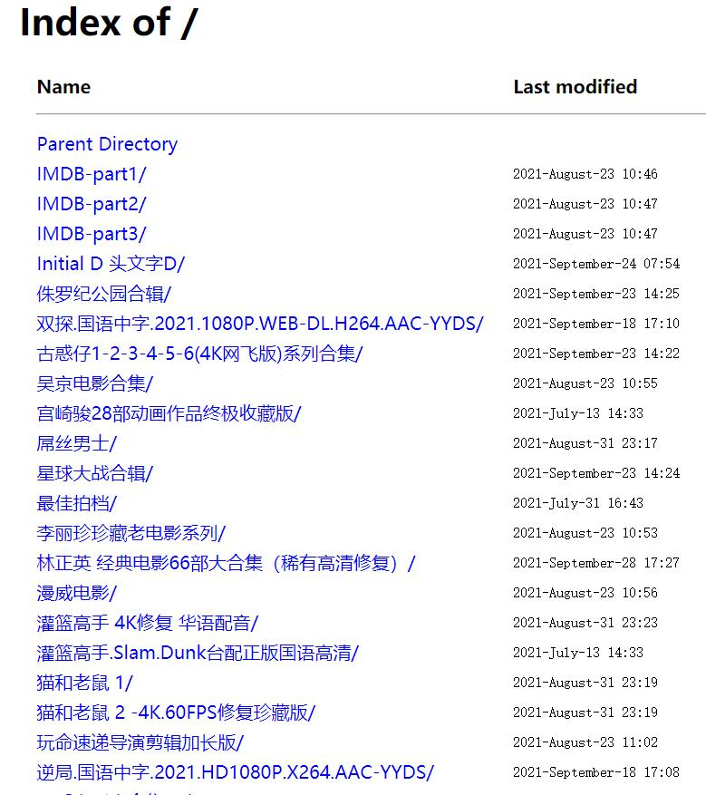

其他支持WebDav的客户端同理。


## Portainer-CE

Portainer-CE是docker的图形化管理面板，提供一个后台页面方便操作docker。

#### 1.终端输入命令，一键安装Portainer-CE中文版；

```
docker run -d --restart=always --name="portainer" -p 9000:9000 -v /var/run/docker.sock:/var/run/docker.sock -v portainer_data:/data 6053537/portainer-ce:linux-arm64
```


#### 2.安装完毕，浏览器打开设备对应IP加上9000端口，例如 [http://ars.lan:9000/](http://ars.lan:9000/)， 进入Portainer-CE；

* 创建用户名和密码，即可进入到Portainer-CE界面。


## 混杂模式MACVLAN
Linux原始的macvlan没有混杂模式，打开混杂模式也会过滤掉不是发给自己的报文。

ARS2的内核改变了这个行为，混杂模式的macvlan可以接收到宿主接口的所有报文，除了单播给宿主接口的报文。

应用场景：使用混杂模式macvlan，将WAN口的报文转发到一个网桥中，加入此网桥的虚拟网卡即可加入宿主机WAN口所在的局域网，获得局域网IP。以Docker为例：

```
HOST_WAN=eth0

ip link add macv-docker-wan link $HOST_WAN type macvlan mode private
ip link set dev macv-docker-wan promisc on

ip link add br-docker-wan type bridge

ip link set dev macv-docker-wan master br-docker-wan
ip link set dev macv-docker-wan up

docker network ls -f "name=docker-wan" | grep -q docker-wan || \
    docker network create -d bridge -o "com.docker.network.bridge.name=br-docker-wan" docker-wan

echo "0" > /proc/sys/net/bridge/bridge-nf-call-iptables
```

创建容器并加入docker-wan网络：
```
docker run --net=docker-wan debian
```

Docker会给容器分配IP，但这里用不上，容器内执行以下命令获得局域网IP：
```
ip addr flush dev eth0 && udhcpc
```
