## 挂载硬盘

1.首先在ARS2上接上SATA硬盘；

2.开机后，进入管理界面，打开系统——磁盘管理；

**A：如果是已经是NTFS或者ext4格式的硬盘，开机就自动挂载了，在磁盘管理和挂载点，能看到硬盘，可以直接使用。**

* 如果是USB接口的移动硬盘/U盘或者硬盘仓，直接接上ARS2的USB口，就能用。

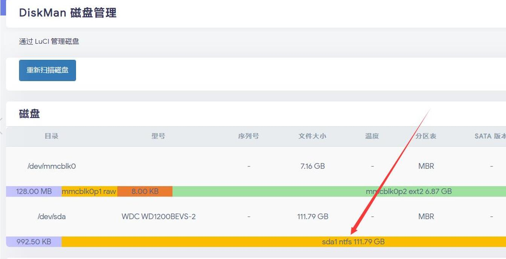

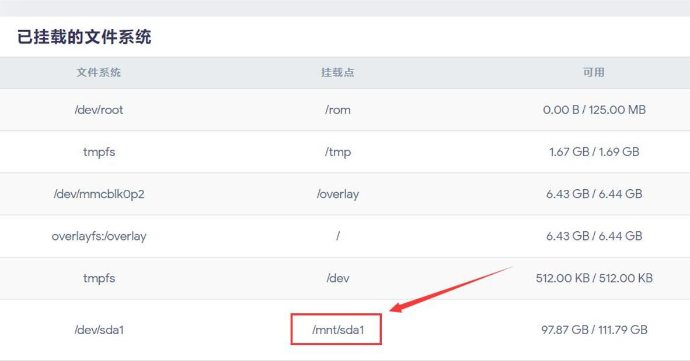

**B：如果是新硬盘：**

* 磁盘管理会发现一块空盘，点击空盘右边的“修改”按钮；


* 先修改分区表，改成GPT，提示覆盖提示，点击确定；

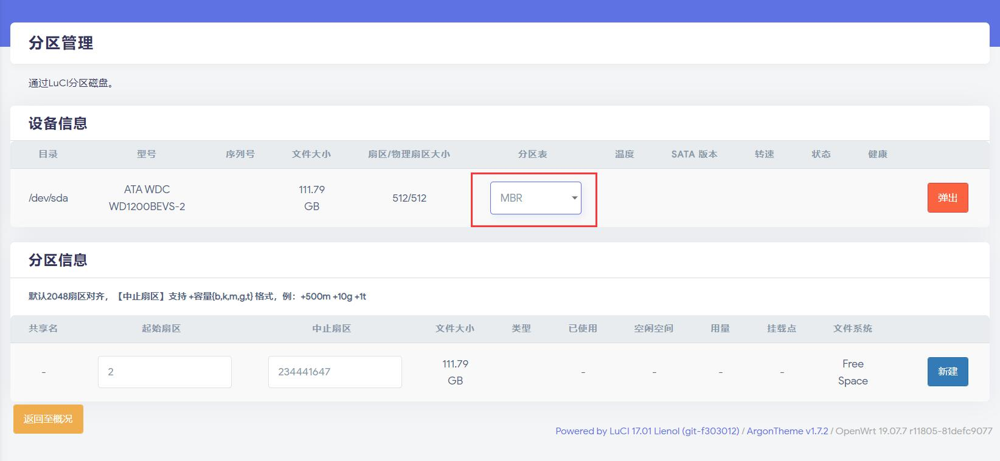

* 然后下方分区信息，点击新建就会出现盘符；

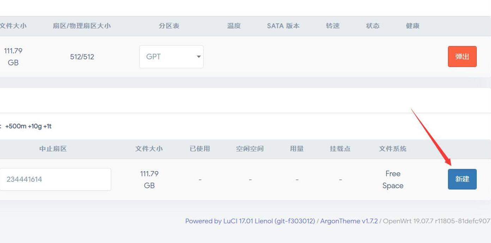

* 然后点击格式化，选择磁盘格式(推荐ext4或者NTFS)，然后格式化，就创建好硬盘了；

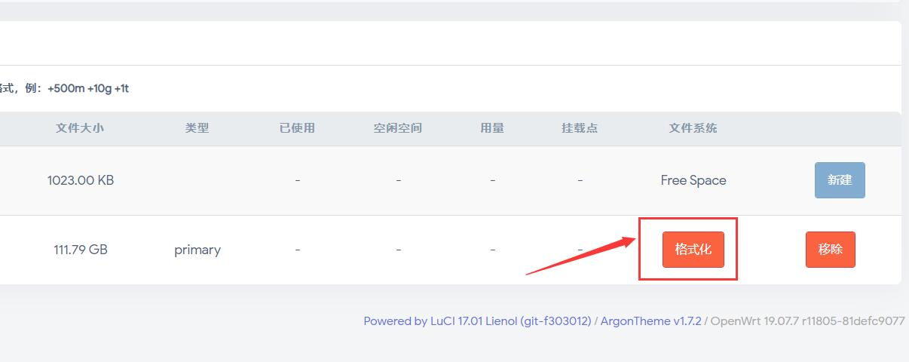


* 格式化完成后返回，新盘已经创建完成。建议重启下机器，就可以使用硬盘了。


3.硬盘的选择：

* SATA接口硬盘，一般常见希捷、西数等品牌的2SATA接口硬盘，一般常见希捷、西数等品牌的2.5寸、3.5寸都成；

* M.2 SATA硬盘可以考虑：“三星SSD固态硬盘M.2接口(SATA总线)860EVO系列”或者“金士顿SSD固态硬盘M.2接口(SATA总线)A400系列”。


## 变身NAS

EasePi默认系统已经内置易有云(NAS插件)存储端，还有配套的APP和PC客户端。

1.首先在EasePi上安装硬盘，SATA接口或者M.2 SATA接口，或者移动硬盘都成。然后在EasePi管理界面，打开系统——挂载点，挂载好硬盘。


2.打开易有云插件，按照[易有云绑定教程](https://doc.linkease.com/zh/guide/linkease_storage/bind.html)设置完成即可。

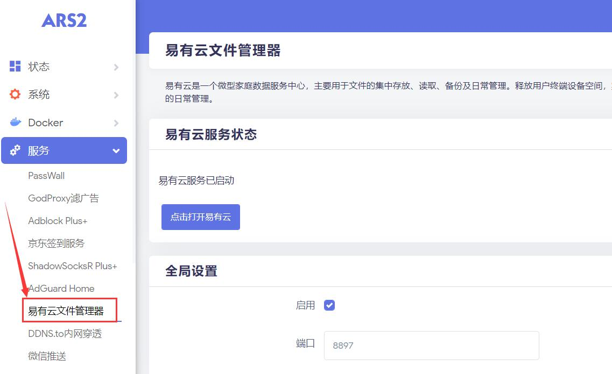

3.点击[易有云客户端下载](https://doc.linkease.com/downloads/)，下载易有云各种客户端，畅快体验NAS。

4.[易有云手机端玩法](https://doc.linkease.com/zh/guide/linkease_app/tutorial.html)和[易有云PC端玩法](https://doc.linkease.com/zh/guide/linkease_app/pc.html)，详细的介绍了如何玩转易有云。


## 远程穿透

 * EasePi默认系统已经内置DDNSTO远程穿透插件，按照[DDNSTO获取Token](https://doc.linkease.com/zh/guide/ddnsto/koolshare_merlin.html#获取token)，然后[设置穿透](https://doc.linkease.com/zh/guide/ddnsto/koolshare_merlin.html#穿透设置)，配置完成即可。

 * 当然DDNSTO还有更多很好玩的教程。[DDNSTO玩转远程应用中心](https://doc.linkease.com/zh/guide/ddnsto/cloudapp.html)及[更多玩法](https://doc.linkease.com/zh/guide/ddnsto/scene.html)。

 


## 更新固件

 * 进入EasePi的管理界面，打开系统——备份升级，“选择文件”选中EasePi的固件，然后“刷写固件”。

 * PS：若刷入第三方定制的固件，刷入时不要保存配置。

 * [官方固件](https://fw.koolcenter.com/binary/ars2/) -->

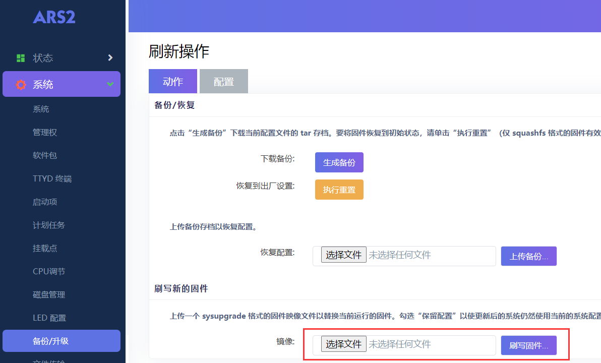


## Aria2下载

1.首先从iStore中安装Aria2；

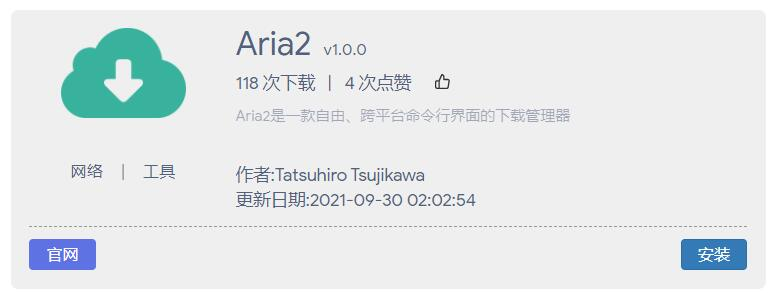

2.安装完成后打开Aria2，开始配置：
```
常规设置：

已启用：勾选

RPC认证方式：切换成令牌

RPC令牌：可自定义，随意的英文数字组合就成，例如：aa1111bb2222

其他设置按需修改
```


3.设置Aria2下载目录，文件和位置：

ps：下载目录指定到哪个文件夹，必须这个路径存在这个文件夹，不然不会运行。


4.其他设置不用管，直接保存应用。Aria2已经运行，点击“打开AriaNg”，在AriaNg界面就可以下载。

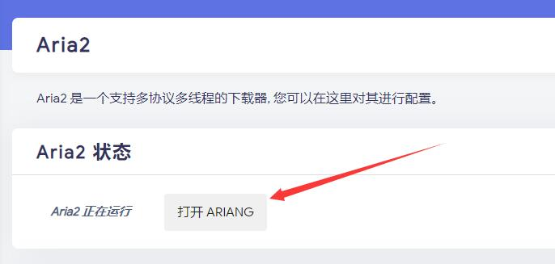


* #### 想要一站式离线下载+随时随地在线观看？请使用易有云APP[安装易有云App](https://doc.linkease.com/downloads/)。

* #### [易有云App远程下载教程](https://doc.linkease.com/zh/guide/linkease_app/tutorial.html#远程下载) -->


5.如果AriaNg界面进去，提示“未连接”，如下图找到位置，在Aria2 RPC密钥处填入之前设置的RPC令牌；


填写完成后右上角点击“重载AriaNg”即可连接。

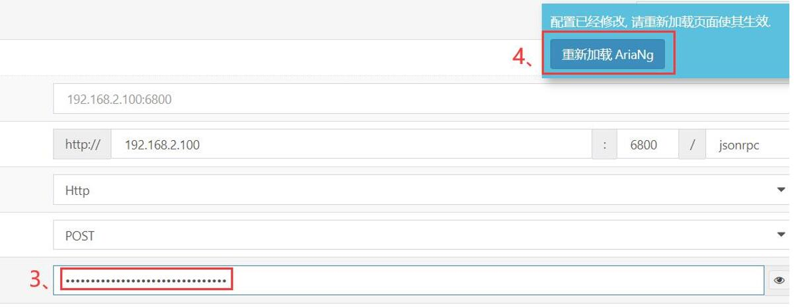


## qBittorrent下载

1.首先从iStore中安装qBittorrent；


2.安装完成后打开qBittorrent，开始配置：

* 勾选“已启用”

* 配置文件存放路径/下载文件存放目录：建议改到硬盘路径
```
例如：

配置路径：/mnt/sda1/qb 具体路径按需修改

下载目录：/mnt/sda1/downloads 具体路径按需修改
```
* 取消“启用临时目录”，不然产生大量临时文件

* 其他设置按需修改

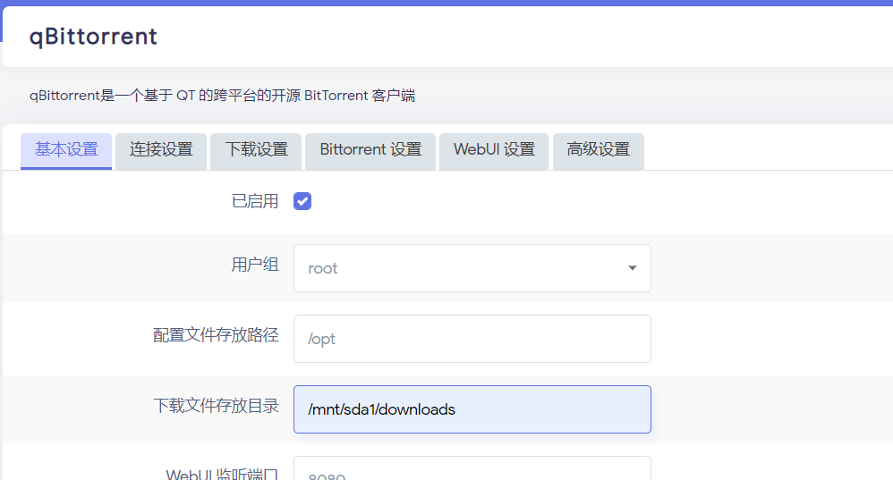

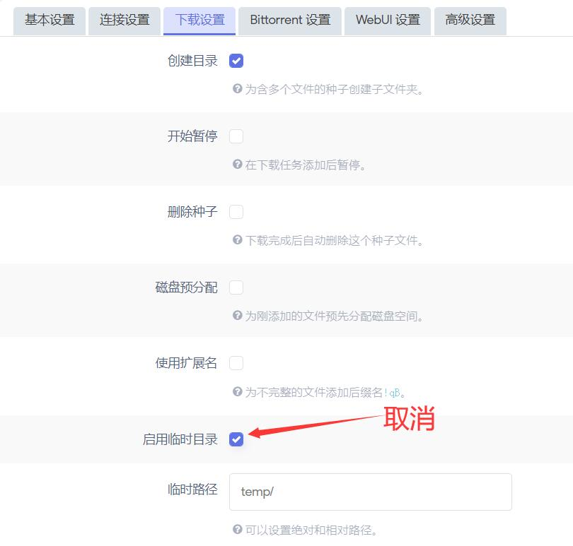

3.qBittorrent已经运行，点击“打开WEB管理界面”就能进入qBittorrent界面。


* qBittorrent默认登陆用户名：admin，密码：adminadmin。

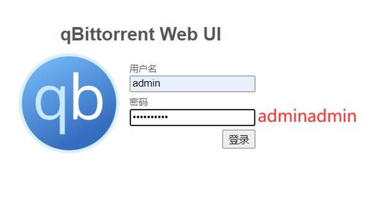

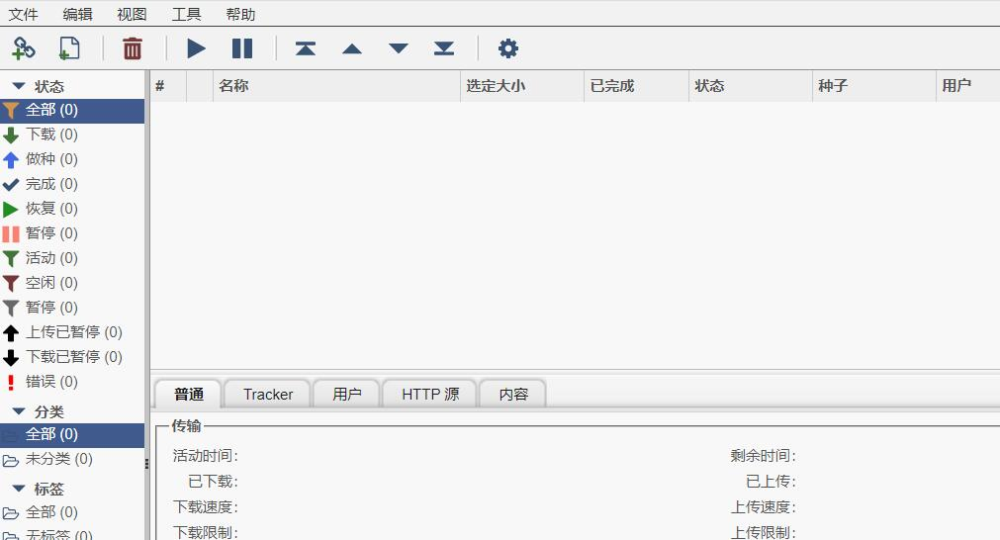

* #### 配合DDNSTO可实现远程下载。[qBittorrent远程下载教程](https://doc.linkease.com/zh/guide/ddnsto/scene.html#qbittorrent远程下载) -->


## Transmission下载

1.首先从iStore中安装Transmission；

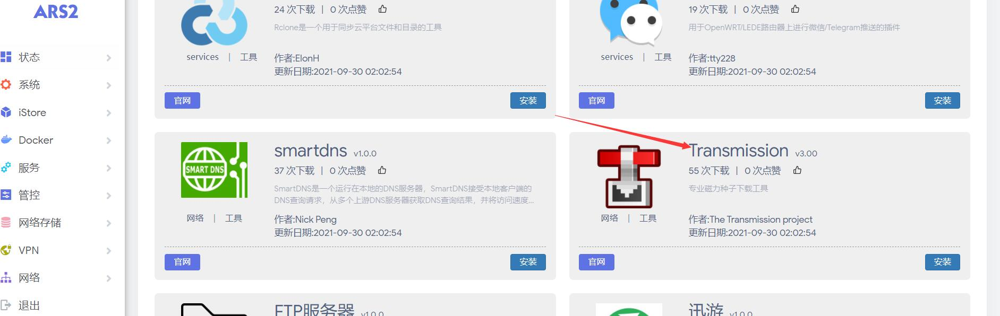

2.安装完成后打开Transmission，开始配置：

* 勾选“已启用”

* 配置文件的目录/下载目录：建议改到硬盘路径
```
例如：

配置目录：/mnt/sda1/transmission 具体路径按需修改

下载目录：/mnt/sda1/downloads 具体路径按需修改
```
* 其他设置按需修改

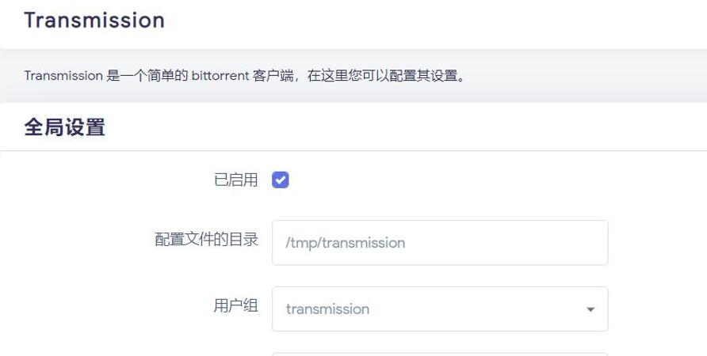

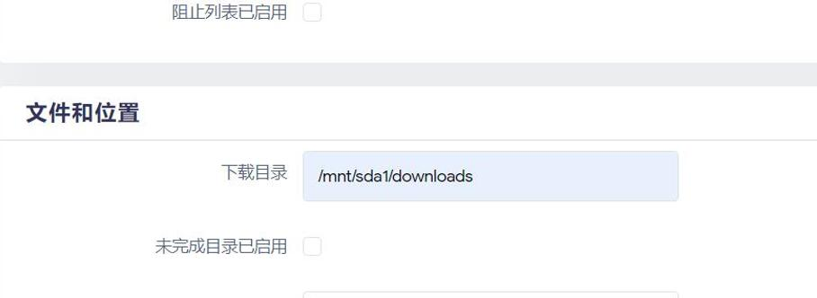

3.Transmission已经运行，浏览器输入ARS2网关地址+9091端口(例如：http://192.168.2.100:9091/) 进入Transmission界面。

* 若进不去Transmission界面，重启设备即可。

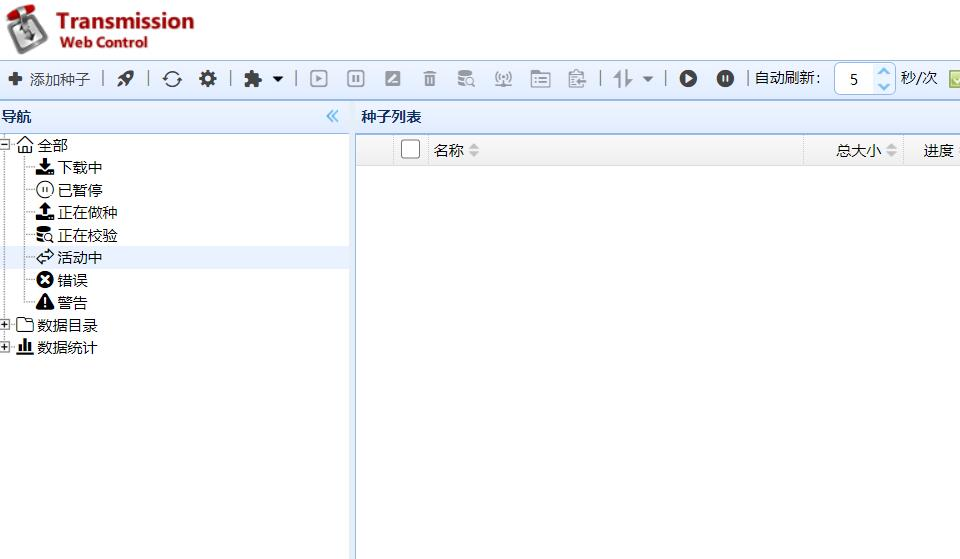

* #### 配合DDNSTO可实现远程下载。[Transmission远程下载教程](https://doc.linkease.com/zh/guide/ddnsto/scene.html#transmission远程下载) -->


## Samba共享

ARS2上挂载了硬盘，然后通过Samba协议共享出去，在局域网内的其他设备可以通过Samba协议访问。

1.进入管理界面，打开系统——挂载点，找到硬盘的挂载点：

比如教程演示的硬盘挂载点：/mnt/sda1


2.打开服务——网络共享，勾选已启动，主机名随意(如ARS2)，然后共享目录，点击左下角“添加”，然后开始配置参数：

```
共享名：随意，可根据盘符来，比如sda1

目录：硬盘的挂载点，/mnt/sda1

可浏览：勾选

只读：别勾选，勾选后，不能写入数据

强制ROOT：勾选

允许用户：可留空

允许匿名用户和继承所有者：勾选

仅来宾用户：不勾选

创建权限掩码和目录权限掩码：0777

```

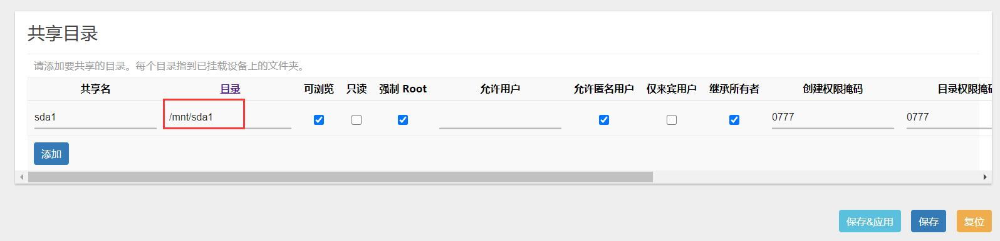

3.Samba配置完成且已经运行，其他设备可通过Samba协议访问ARS2。比如电脑：

打开电脑的资源管理器，输入：

```
\\192.168.2.100
```
ps：演示机ARS2的IP是192.168.2.100，根据实际情况填写IP。


然后回车就看到samba共享出来的硬盘sda1了。


## WebDav共享

可在ARS2上开启WebDav服务端，通过此协议把ARS2上的磁盘空间共享出去，方便访问。

1.首先从iStore中安装GO-WebDav；


2.安装完成后打开GO-WebDav，开始配置：
```
勾选“启用”

监听端口：WebDav的访问端口，按需修改

用户名/密码：其他设备通过WebDav访问ARS2需要输入的用户名和密码，按需修改

开放目录：其他设备能通过WebDav访问ARS2的目录，默认/mnt，即为硬盘挂载路径，按需修改

允许从外网访问：若要外网穿透访问，建议开启

其他设置按需修改
```


3.GO-WebDav配置完成且已经运行，其他设备可通过WebDav协议访问ARS2。比如电脑：

浏览器输入ARS2网关和WebDav访问端口(如：http://192.168.2.3:6086/)，弹出密码框，输入即可访问：

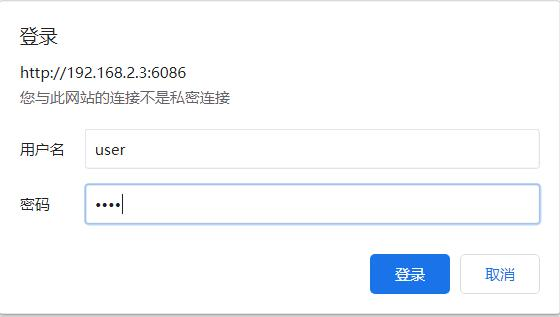

然后回车就看到/mnt下的硬盘sda1了。


* #### 可配合易有云App远程WebDav访问ARS2哟。[访问教程](https://doc.linkease.com/zh/guide/linkease_app/tutorial.html#web-dav)


## LED灯控制

LED指示灯控制，可以关闭灯光。

* 进入管理界面，打开系统——LED配置——添加：

```
共享名：随意；

LED名称：选择灯，red 红灯，green 绿灯；

默认状态：不勾选；

触发器：选择oneshot。
```

* 如下图保存应用，即可关闭绿灯。

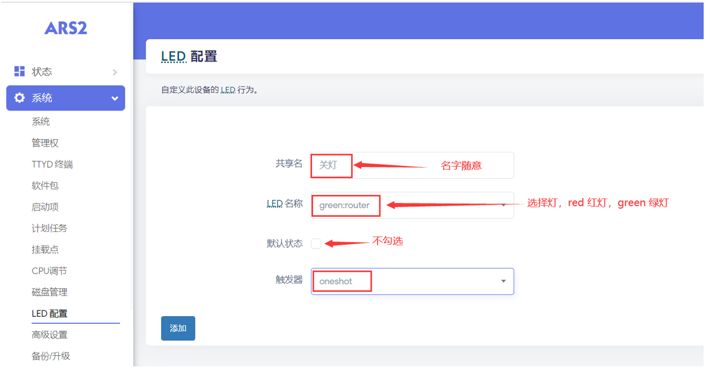


## 加装风扇

一些小伙伴对温度有要求，需要加装风扇，我们是预留了风扇电源接口的。


1.购买风扇：

建议风扇体积，30x30x7mm，如图这种涡轮小风扇(注意电源接口是1.25端子)，将机器内部热量吹出去。

不恰饭推荐：[图中风扇连接](https://m.tb.cn/h.f4unOTi?sm=ef253c)，5v的就成，电源接口是1.25端子(直接发图给客服)。网购平台很多，搜索关键字“3007涡轮”。

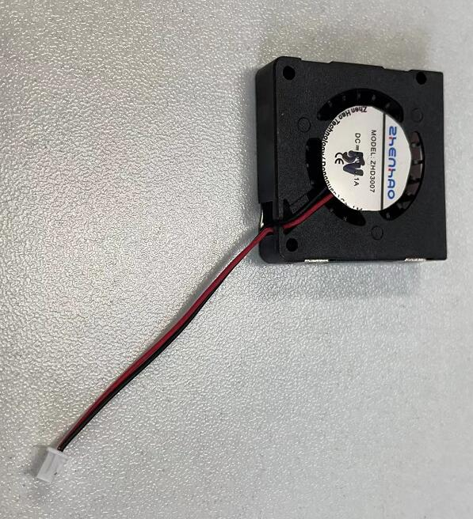

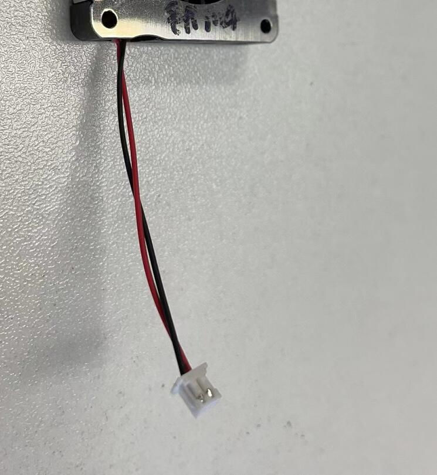

2.安装风扇：

将风扇用双面胶贴在如图位置，风口向外，插好电源。通电后就能将机器内部的热空气吹到外面。


## 旁路由模式

* 旁路由模式，即为单臂路由，上一级路由拨号，由ARS2负责一部分功能。

1.首先关闭主路由LAN口的DHCP服务，假设主路由的LAN口IP是192.168.2.1；

2.进入ARS2网口设置，网络——接口——LAN——修改：

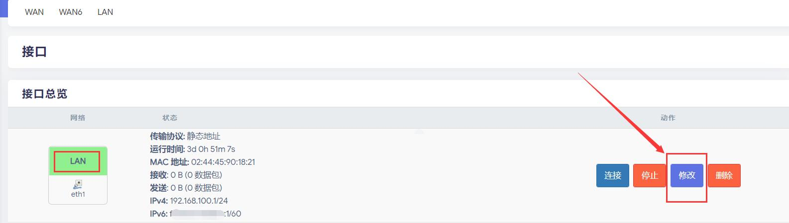
```
传输协议：静态IP

IPv4地址：和主路由同IP段，比如192.168.2.10

IPv4网关：必须为主路由IP：192.168.2.1

DNS服务器：设为主路由IP：192.168.2.1 (可设为公共DNS，若不清楚就写主路由IP)
```


3.如图将主路由和ARS2的LAN口连接即可。


## 纯主机模式

* 何为纯主机模式，就是有些伙伴不想用ARS2的路由功能，不负责网络相关的功能，只是把ARS2用作纯NAS、下载机等。

* ARS2默认WAN口传输协议是DHCP，若改过，请改回DHCP，然后如下图连接：


## 终端模式

何为终端模式，就是进入路由器的终端，能输入一些命令进行操作，比如安装Docker项目。

* #### 若不清楚此模式能干嘛，建议不要进入操作，以免损坏系统。

1.登录系统管理界面，打开系统——TTYD终端，提示“ARS2 login”时输入“root”，回车；

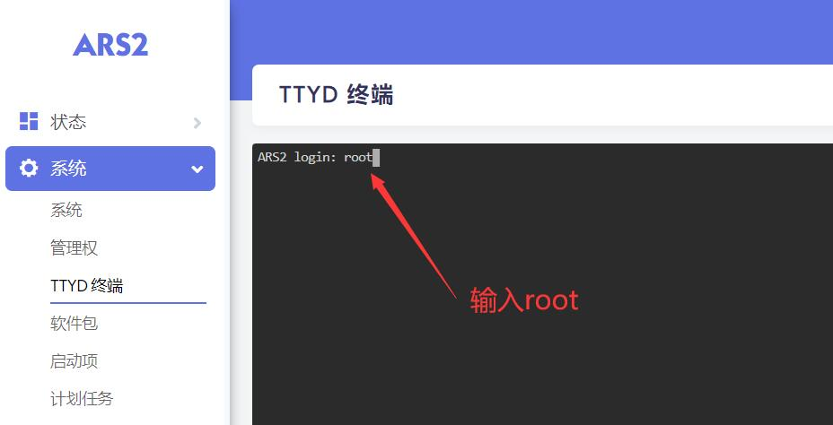

2.提示“Password”时输入“登录密码”，输入后并不会显示，直接回车，如果正确就会出现终端界面。

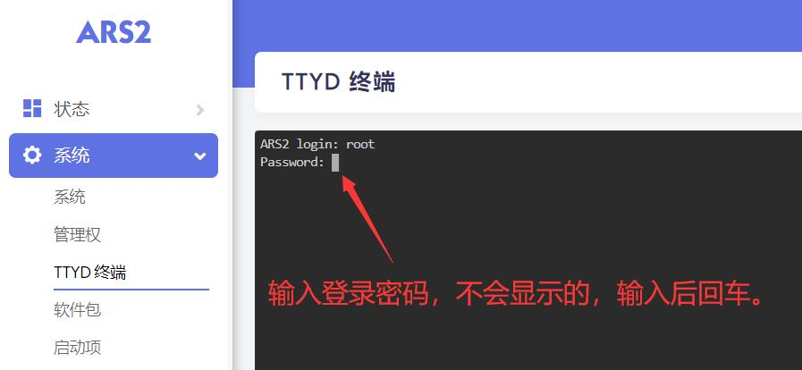


3.进入到终端界面，就可以输入一些命令，操作。比如[Docker安装Jellyfin](https://doc.linkease.com/zh/guide/easepi/advanced.html#玩转影音)。


## 救援模式

* 救援模式与主系统独立，不会因为正常的刷机或者主系统配置错误而失效。

* 由于救援模式运行在内存盘里，除了刷机，重置，导入配置等操作外，都不会影响到主系统，并且所有配置都不会保留。

* 适合操作错误导致系统进不去的伙伴来“救砖”。


#### A.进入救援模式

1.断电状态下，按住开机键再通电，当红灯亮起时松开开机键，即可进入救援模式。

2.救援模式启动完毕以后，绿灯会常亮，红灯为心跳模式。

3.电脑网线连接ARS2的LAN口，浏览器http://192.168.100.1进入救援模式(确认电脑是自动获取IP)。


#### B.救援模式使用

1.救援模式的WAN口是DHCP客户端，LAN口是DHCP服务端，LAN网段是192.168.100.1/24，救援模式下防火墙不可用。

2.救援模式下的操作与正常的OpenWRT大同小异，并集成了LUCI以方便在浏览器中进行操作。

3.在救援模式中可以执行刷机，重置，导入配置等操作，以此恢复主系统的工作状态。(你甚至可以在救援模式中安装软件包。)

