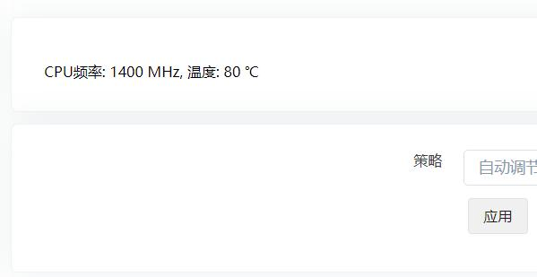
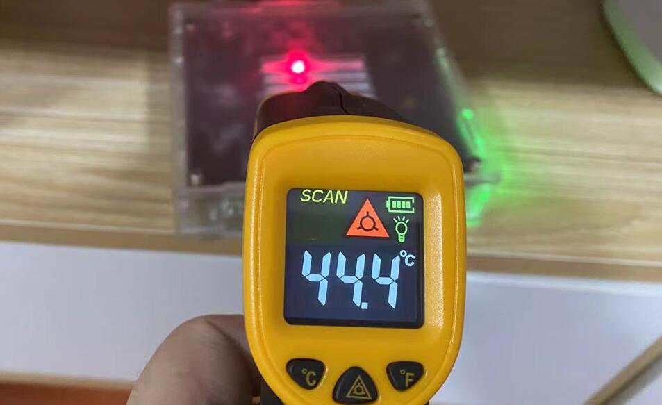

## 硬件

### 芯片

#### Q：芯片是什么架构？

A：ARM Cortex-A53。

### 外壳

#### Q：开发板和外壳尺寸？

裸板：115mm x 105mm

外壳：127mm x 115mm x 30mm

### 接口

#### Q：网口是螃蟹还是Intel？

A：网卡是和CPU集成在一个SOC芯片，无具体品牌。

### 附件

#### Q：带WiFi功能吗？

A：不带。

#### Q：支持USB WiFi吗？

A：暂不支持。

### 功耗

#### Q：功耗如何？

A：待机功耗低至3瓦。

### 温度

#### Q：ARS2运行温度差不多60度，需要加风扇吗？

A：CPU有温度保护机制。根据我们测试，高强度压测半小时后，核心温度达到115度时会自动降频到1.3Ghz，温度自然会下降，所以不需要担心温度过高。

* 如果对温度有要求可以安装风扇，ARS2也提供了风扇接口。[加装风扇教程](https://doc.linkease.com/zh/guide/easepi/common.html#加装风扇) -->

#### Q：ARS2运行时机身温度情况？

实测，全速满载时核心温度到达80℃，机身温度才44℃。

### 硬盘

#### Q：是否内置硬盘位？

A：内部可加装一个2.5寸 SATA硬盘和一个M.2 SATA硬盘。

#### Q：是否支持M.2 NVME硬盘？

A：不支持NVME硬盘，仅支持M.2 SATA硬盘。

* M.2 SATA和NVME两者的接口和硬盘外观都很相似，但是数据通道不一样，SATA走的是SATA通道，NVME走的是PCIE通道，两个通道的最高速度差距较大，SATA通道最高600MB/s，PCIE通道普遍都能达到2GB/s以上。

#### Q：USB接口最大支持多大容量？

A：最大支持16T，建议USB使用外接电源大容量硬盘。

#### Q：SATA硬盘最大支持多大容量？

A：最大支持16T。

#### Q：M.2 SATA最大支持多大容量？

A：支持8T。

#### Q：是否支持3.5寸硬盘？

A：支持。

#### Q: 有没有推荐的硬盘？

A：推荐下面两款M.2接口(SATA总线)SSD固态硬盘： 

* 三星(SAMSUNG)SSD固态硬盘 M.2接口(SATA总线) 860 EVO系列
[京东链接](https://item.jd.com/6435501.html)

三星250G硬盘，写速度约350MB/s，读约500MB/s。

* 金士顿(Kingston)SSD固态硬盘 M.2接口(SATA总线) A400系列
[京东链接](https://item.jd.com/100004004230.html)

金士顿250G硬盘，写速度约300MB/s，读约500MB/s。

## 软件

### 性能

#### Q：网速怎么样？

我们测试：ARS2的WAN口接一个服务器，LAN口接一个PC机。ARS2上运行iperf3客户端测试WAN口速度，测得下载速度935Mbps，上传速度881Mbps。PC上运行iperf3客户端测试NAT速度，测得下载速度931Mbps，上传速度880Mbps。

| 网速 | 收(下载) | 发(上传) |
| :----: | :----: | :----: |
| WAN口 | 935Mbps | 881Mbps |
| NAT | 931Mbps | 880Mbps |
| Samba | 80Mb/s | 40Mb/s |

#### Q：AES性能？

跑分仅作参考，可能存在误差！

| AES | 跑分(block 16k) |
| :----: | :----: | 
| 单核aes-256-gcm | 501590.70k |
| 四核aes-256-gcm | 1975058.43k |

#### Q：RTD1296是否支持AES？

A：支持。

#### Q：稳定性怎么样？

A：前面所说压测网速半小时没出现任何故障。也运行过过某心云的Docker版，不间断运行一周也没崩溃。

### 插件

#### Q：需要某个插件，可以定制吗？

A：暂不接受定制。

#### Q：Docker可否支持“青某龙”面板，有无教程？

A：类似功能请在技术交流群里交流经验。

#### Q：是否支持“某心云”或“星际”？

A：类似功能请在技术交流群里交流经验。

#### Q：是否支持WebDav？

A：暂不支持。

#### Q：ARM架构下使用Docker会不会很不方便？

A：基本上开源软件都有ARM64的Docker镜像，仅少部分闭源软件只有x86镜像。其他功能与x86架构无异。

### 固件

#### Q：是否支持定制固件？

A：暂不接受定制。有动手能力小伙伴可以参考[构建固件教程](https://doc.linkease.com/zh/guide/easepi/opensource.html) -->

#### Q：是否可以自己定制固件？

A：可以。有动手能力小伙伴可以参考[构建固件教程](https://doc.linkease.com/zh/guide/easepi/opensource.html) -->

#### Q：是否支持群晖系统？

A：不支持。

#### Q：是否支持别的NAS系统？

A：目前仅支持OpenWrt，自带易有云轻NAS。

## 使用

#### Q：购买收到后，可直接使用吗？

A：可以直接使用。[快速使用](https://doc.linkease.com/zh/guide/easepi/quick.html) -->

#### Q；机器出现故障，无法启动怎么办？

A：不要担心，机器有救援模式，可以“救砖”。 [救援模式使用教程](https://doc.linkease.com/zh/guide/easepi/common.html#救援模式) -->

## 其他

#### Q：ARS2性价比怎样？

A：4G内存，我们起点高，毕竟要接SATA、玩docker等，别的同款CPU的机器，4G内存都不会比我们的便宜。
 
* R4S-4G内存版，搭配电源数据线TF卡，价格和我们差不多，何况我们还支持SATA。

* X86低功耗的，价格也没有这个低的，并且我们支持视频硬解码；群晖搭载Rtd1296主芯片的价格都是2000+。

* 喜欢玩Docker的，目前有这个机器带硬盘，省电，价格不高，性能足够。

