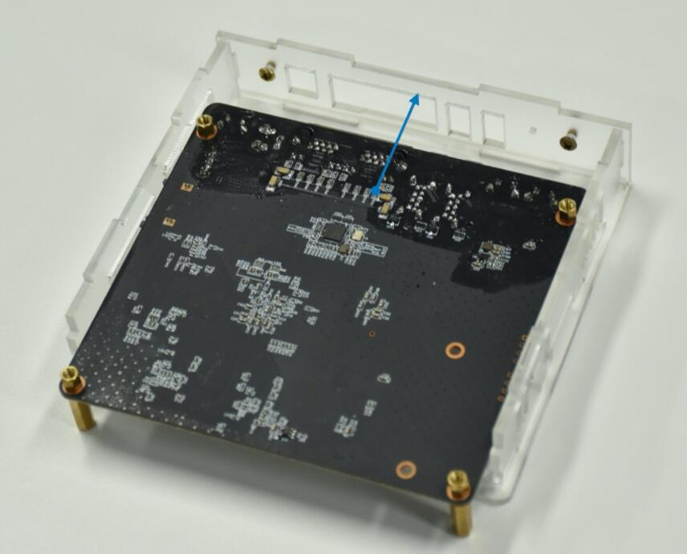

## 1.组装

收到EasePi，我们需要简单的组装下，拆开包裹，我们会得到一些配件。

按照如下图摆放好，便于安装!

 

### A.安装螺柱

 * 主板上四个角都有固定孔，都拧上螺柱，只需拧到底，但不需要拧紧。

 

 

### B.安装挡光板

 * 拿出2号和7号亚克力板；

 

 * 按下图所示方向将7号板插入2号板；

 

 * 将7号板向上提，使其固定在2号板上；

 

 * 挡光板安装完成，从另一边看应该是这样。

### C.外壳组装

 * 取出6号板，并翻转到背面；
 
 

 * 将4号板固定到6号板；

 

 * 将2号板固定到6号板；

 

 * 将3号板固定到6号板，并与4号和2号接合；

 * 将两个螺丝装到3号板，作为按钮；

 * 将主板翻转后放进外壳，往前推使其与外壳契合；

 * 将1号板翻转后装好；

 * 将5号板盖上；

 * 拧上4个螺丝；

 * 捏住上下板，翻转过来，使整体正面朝上。

### D.硬盘安装

#### 如果不需要安装硬盘可跳过这一步，直接在上盖拧好四颗螺丝即可！

 * 打开上盖，准备好SATA硬盘(M.2固态这里不演示)；

 * SATA硬盘螺丝孔朝上，贴住上盖，硬盘数据和电源接口对应上盖缺口，对准螺丝孔位，用螺丝固定；

 * 将上盖放回外壳，螺丝拧好，检查按钮机械性能是否正常；

 * 至于安装硬盘线，也非常简单，拿出包装内的硬盘电源一体线，按图插入机器接口；

 * 另外一端插入硬盘，即可安装完成。
 

## 2.开机

 * EasePi设备，出厂自带了定制的OpenWrt路由系统，所以开箱即用。

 * #### 电源适配器接通电源(默认来电自启)，用网线将“EasePi的Lan口——电脑网口(自动获取IP)”连接，浏览器登录 http://192.168.100.1/ 进入管理界面。

 

## 3.使用

#### 1.默认WAN口是DHCP协议，若是光猫拨号，用网线直接将“光猫——EasePi的Wan口”，“EasePi的Lan口——无线WiFi路由”连接，即可使用。

#### 2.若需要EasePi拨号上网，浏览器登录192.168.100.1进入管理界面，网络——接口——WAN——修改；

 

 * 协议切换成PPPoE，PAP/CHAP用户名：填入宽带帐号；PAP/CHAP密码：填入宽带密码，然后保存应用。

 

 * 然后用网线将“光猫——EasePi的Wan口”，“EasePi的Lan口——无线WiFi路由”连接，即可使用。

 * 如果是PPPoE拨号上网，建议把防火墙的WAN口入站设置成拒绝或者丢弃，以免被攻击。
 
  

## 4.救援

何为救援，就是误删系统文件导致进不去系统，需要“救砖”。

 * [救援模式使用教程](https://doc.linkease.com/zh/guide/easepi/question.html#救援模式) -->
