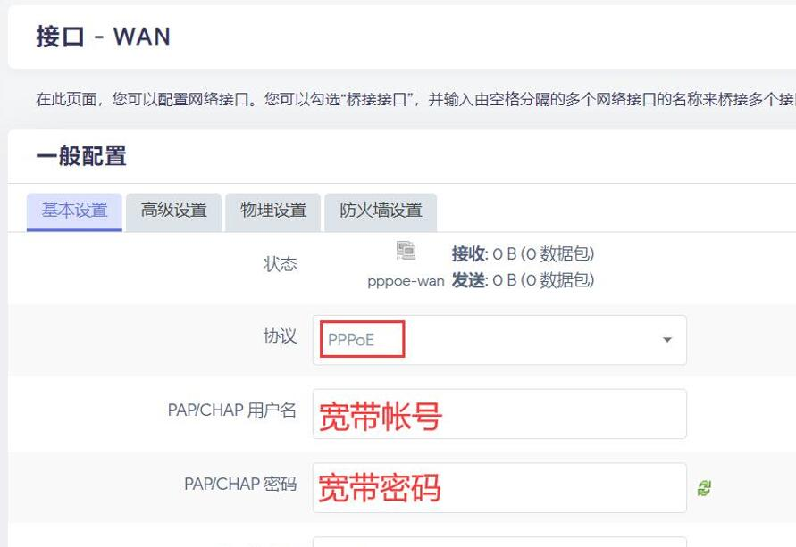

## 1.组装

收到EasePi，安装外壳，组装成成品。

## 2.开机

EasePi设备，出厂自带了定制的OpenWrt路由系统，所以开箱即用。

电源适配器接通电源，用将“EasePi的Lan口——电脑网口(自动获取IP)”连接，浏览器登录 http://192.168.100.1/ 进入管理界面。

 

## 3.使用

1.默认WAN口是DHCP协议，若是光猫拨号，用网线直接将“光猫——EasePi的Wan口”，“EasePi的Lan口——无线WiFi路由”连接，即可使用。

2.若需要EasePi拨号上网，浏览器登录192.168.100.1进入管理界面，网络——接口——WAN——修改；

 

协议切换成PPPoE，PAP/CHAP用户名：填入宽带帐号；PAP/CHAP密码：填入宽带密码，然后保存应用。

 

然后用网线将“光猫——EasePi的Wan口”，“EasePi的Lan口——无线WiFi路由”连接，即可使用。
