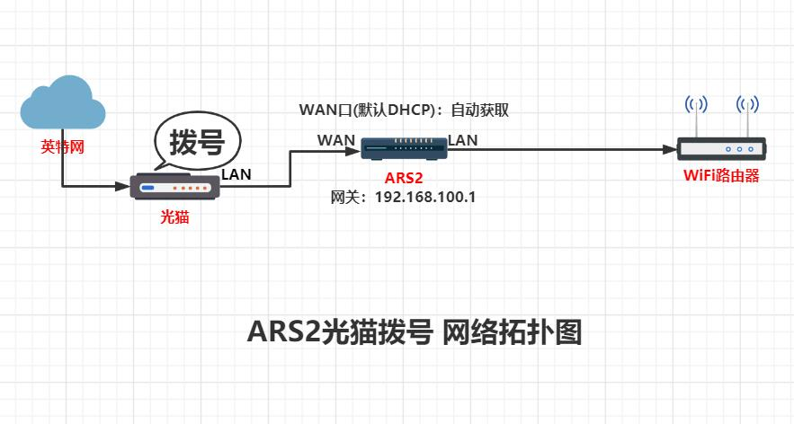
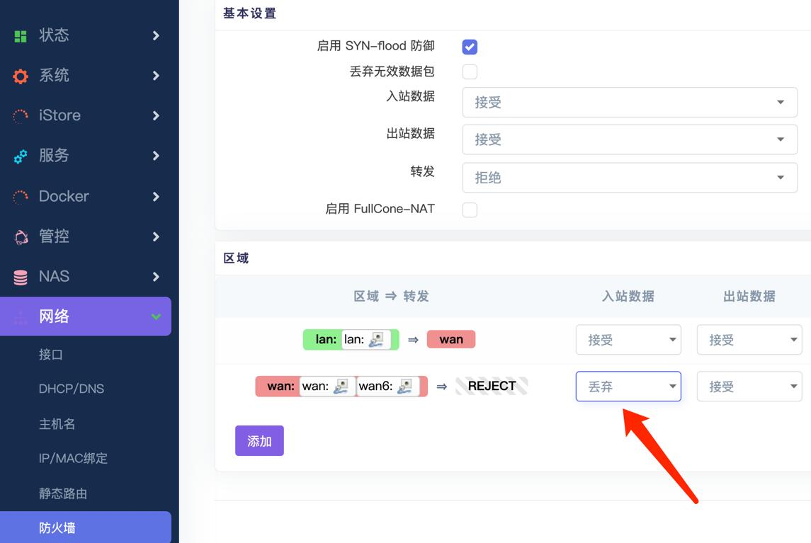
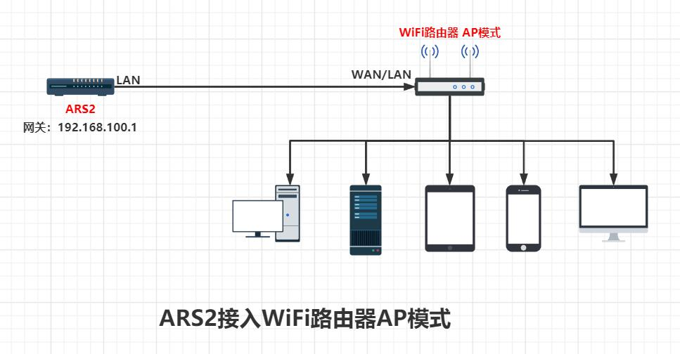
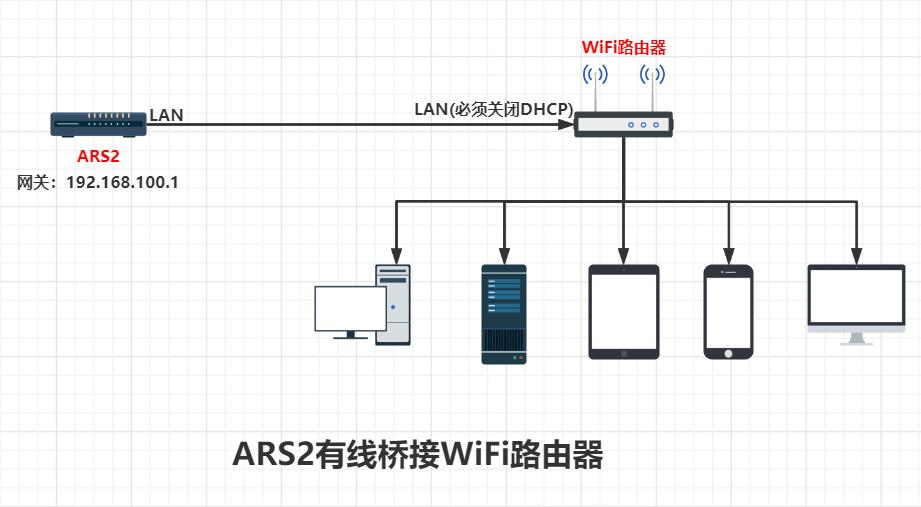
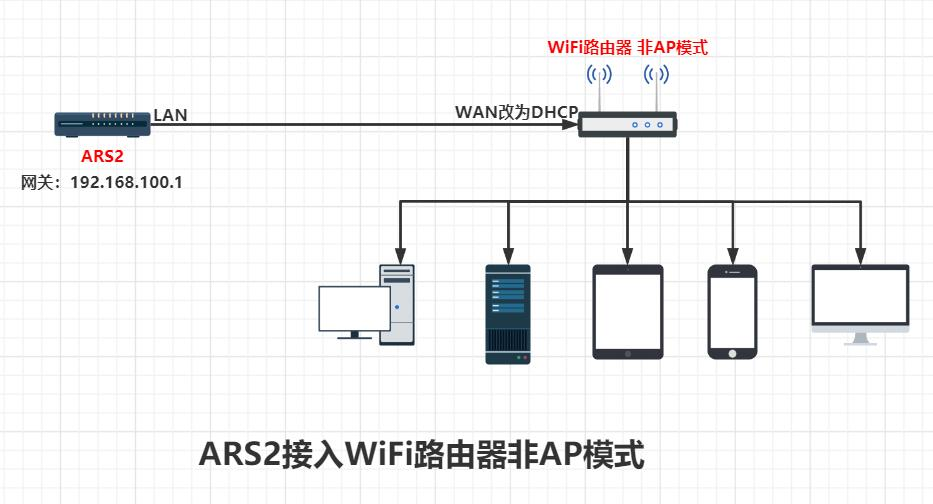

## 1.开机

 * EasePi设备，出厂自带了定制的OpenWrt路由系统，所以开箱即用。

 * 默认来电自启，WAN口靠近电源接口那个网口。

 * 接着请看下面的拨号联网教程。
 
 

## 2.拨号

### 光猫拨号

 * 若是光猫拨号，ARS2默认WAN口是DHCP协议，如下图连接就可以直接使用；

 * 然后浏览器登录ARS网关 http://192.168.100.1/ (默认用户名为root，无密码)开始体验ARS2：

 

### ARS2拨号

若需要ARS2拨号，如下图连接，然后电脑浏览器登录ARS网关 http://192.168.100.1/ (默认用户名为root，无密码)：

ps：友情提示，光猫需要改桥接模式，通常是宽带师傅帮忙设置。

 

#### 拨号教程：

1.进入ARS2管理界面，网络——接口——WAN——修改；

 

2.协议切换成PPPoE，PAP/CHAP用户名：填入宽带帐号；PAP/CHAP密码：填入宽带密码，然后保存应用。

 

3.建议把防火墙的WAN口入站数据成“拒绝”或者“丢弃”，以免被攻击。
 
  

## 3.接AP

前面我们设置好拨号连接了网络，现在说怎么连接WiFi路由器，分三种模式，WiFi路由器AP模式、桥接模式、非AP模式。

### AP模式

* 现在很多新款WiFi路由器是支持AP模式的，首先将WiFi路由器切换成AP模式，然后如下图连接：

ps：一般路由器的AP模式，是自动识别WAN/LAN口，所以网线接WAN或者LAN口都成。若有特殊，请参考路由器厂商说明。

### 桥接模式

* 桥接模式比较方便，我们可以将ARS2和WiFi路由器有线桥接。

* 首先关闭WiFi路由器LAN口的DHCP，然后如下图连接：

### 非AP模式

* 最常见的二级路由连接方式，连接WiFi路由器的WAN口(DHCP)。

* 此连接模式有缺点：跟ARS2不在同一网段，不能自动发现ARS2提供的服务。

* 首先将WiFi路由器的WAN口改成DHCP协议，然后如下图连接：

 

## 4.救援

何为救援，就是误删系统文件导致进不去系统，需要“救砖”。

 * [救援模式使用教程](https://doc.linkease.com/zh/guide/easepi/common.html#救援模式) -->
