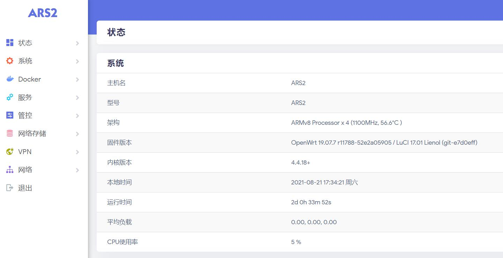
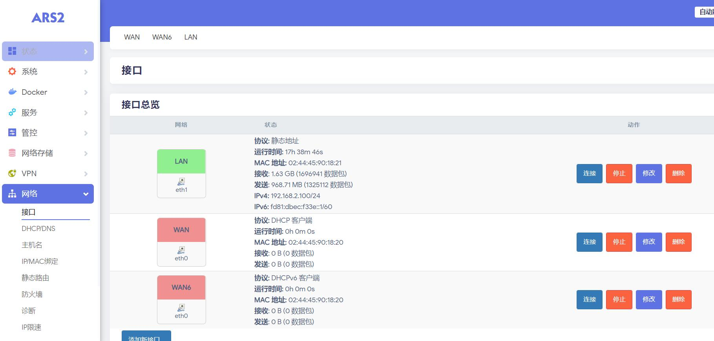
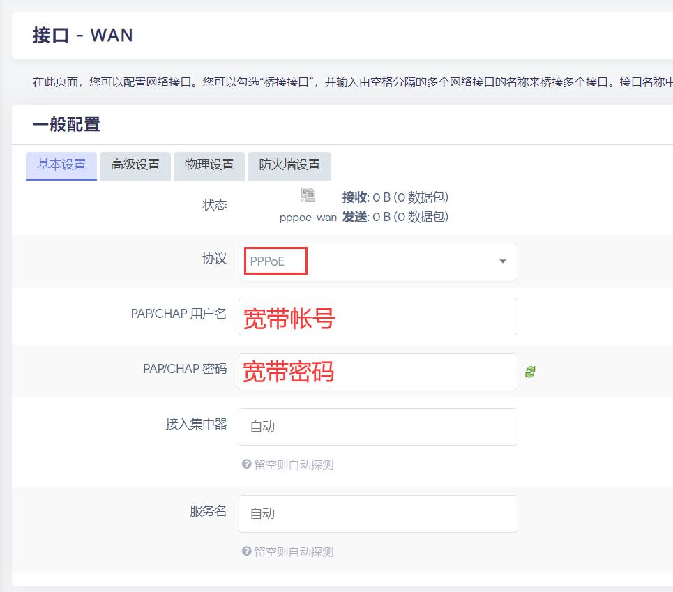
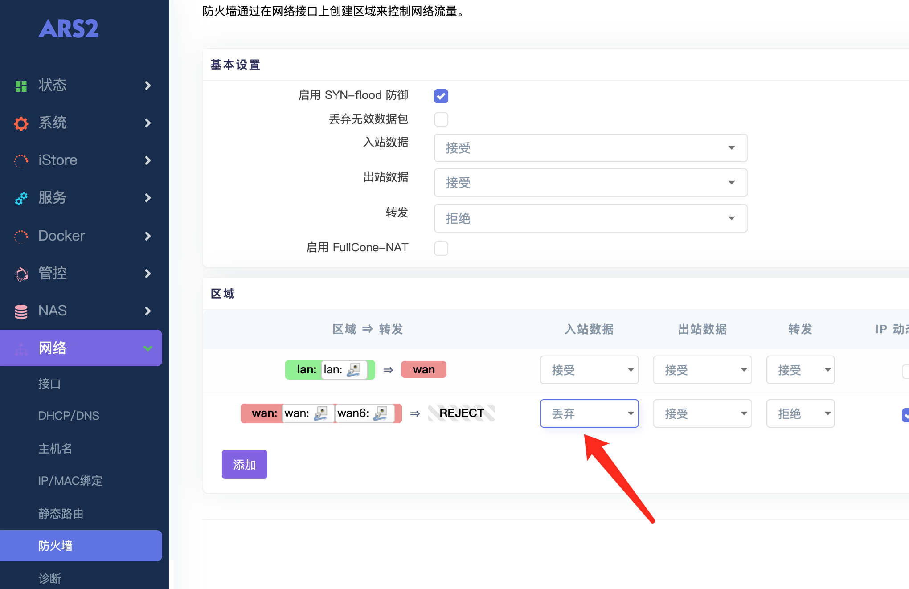

## 1.开机

 * EasePi设备，出厂自带了定制的OpenWrt路由系统，所以开箱即用。

 * #### 电源适配器接通电源(默认来电自启)，用网线将“EasePi的Lan口——电脑网口(自动获取IP)”连接，浏览器登录 http://192.168.100.1/ 进入管理界面。

 

## 2.网络

#### 1.默认WAN口是DHCP协议，若是光猫拨号，用网线直接将“光猫——EasePi的Wan口”，“EasePi的Lan口——无线WiFi路由”连接，即可使用。

#### 2.若需要EasePi拨号上网，浏览器登录192.168.100.1进入管理界面，网络——接口——WAN——修改；

 

 * 协议切换成PPPoE，PAP/CHAP用户名：填入宽带帐号；PAP/CHAP密码：填入宽带密码，然后保存应用。

 

 * 然后用网线将“光猫——EasePi的Wan口”，“EasePi的Lan口——无线WiFi路由”连接，即可使用。

 * 如果是PPPoE拨号上网，建议把防火墙的WAN口入站设置成拒绝或者丢弃，以免被攻击。
 
  

## 3.救援

何为救援，就是误删系统文件导致进不去系统，需要“救砖”。

 * [救援模式使用教程](https://doc.linkease.com/zh/guide/easepi/question.html#救援模式) -->
