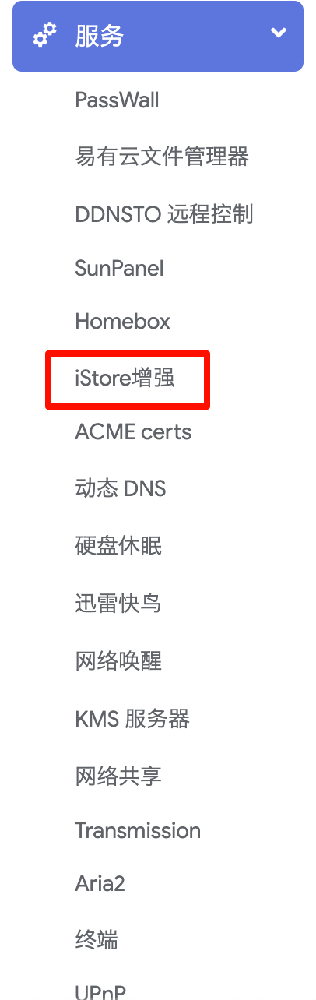

### iStore增强插件


* [酷友社：【全新、全网独家的Docker镜像下载，多镜像并发下载】](https://www.bilibili.com/video/BV1GvQWYZEt9/)

<iframe src="//player.bilibili.com/player.html?bvid=BV1GvQWYZEt9&autoplay=0"
 scrolling="no" border="0" frameborder="no" framespacing="0" allowfullscreen="true"></iframe>

### iStore增强软件教程指导

#### 一、简介
iStore增强是一款优化Docker镜像下载速度的软件，通过多镜像源并发下载、断点续传、动态负载均衡等技术，显著提升下载速度。本教程将指导您如何安装、配置和使用iStore增强。

#### 二、安装步骤
1. **下载iStore增强**
   - 在iStore的全部软件中搜索“iStore增强”
    
2. **安装软件**
   - 点击安装安装，等待插件安装完成

3. **启动软件**
   - 安装完成后，在已安装中找到iStore增强，点击打开
   
   - 在服务中找到iStore增强
   

#### 三、配置iStore增强
1. **设置管理端口**
   - 用于访问web管理界面，默认端口为5003：

2. **设置转发端口**
   - 用于访问Docker转发服务，默认端口为5443：

3. **设置缓存路径**
   - 用于支持断点续传

#### 四、使用iStore增强
1. **启动软件**
   - 勾选启用，点击保存
   - 启动后会自动在docker中配置镜像源
   - 验证
   ```bash
   
   docker info | grep "registry.linkease.net"
   
   ```

2. **查看镜像源状态**
   - 打开浏览器，访问`http://localhost:5003`（或您设置的管理端口），进入iStore增强的管理界面。在管理界面中，您可以查看当前配置的镜像源状态，包括下载速度、可用性等。

3. **下载Docker镜像**
   - 在终端中使用`docker pull`命令下载Docker镜像，命令示例如下：
   ```
   docker pull nginx:latest
   ```
   - 在iStore中安装依赖docker的插件

4. **断点续传**
   - 如果下载过程中网络中断，重新启动下载时，iStore增强将从上次中断的位置继续下载，无需重新开始。

5. **团队共享加速**
   - 如果您的团队中有多个成员需要下载相同的Docker镜像，可以配置路由器将域名指向iStore增强的IP地址。这样，当团队成员下载相同的镜像时，iStore增强将优先从本地缓存中读取数据，进一步提升下载速度。

#### 五、其他功能
1. **动态负载均衡**
   - iStore增强会根据各个镜像源的下载速度动态调整下载任务，确保从速度最快的镜像源下载更多的数据。

2. **安全性验证**
   - iStore增强通过内置节点验证下载的Docker镜像的哈希值，确保镜像未被篡改，保障下载的安全性。

3. **未来支持**
   - iStore增强未来计划支持Windows、Mac、NAS和Linux服务器等更多操作系统，敬请期待。

#### 六、总结
通过安装和配置iStore增强，您可以显著提升Docker镜像的下载速度，享受多镜像源并发下载、断点续传、动态负载均衡等高级功能。希望本教程能帮助您更好地使用iStore增强，提升工作效率。


我有更好的教程要投稿：
[](/zh/guide/istore/software/post-my-tutorial.html)

