### Jellyfin家庭影音

Jellyfin是一个优秀的家庭影院平台，这样我们就可以把你的设备打造成您的私人家庭影院。

#### 1.在你的设备上安装硬盘，或者移动硬盘；

#### 2.进入设备的管理界面—系统—挂载点，挂载好硬盘，记住路径；

比如教程演示机的路径挂载点是：/mnt/sda1

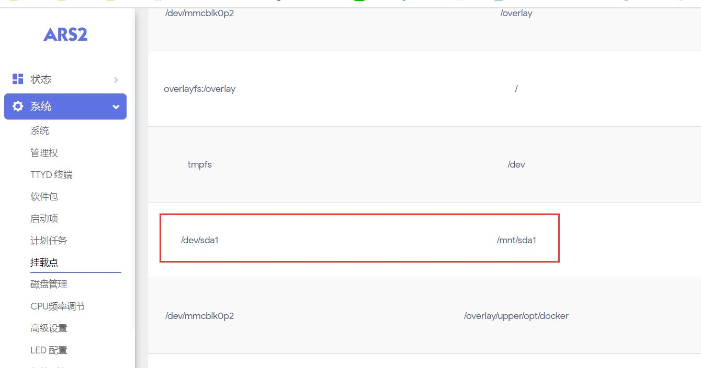

#### 3.iStore安装Jellyfin，安装完成打开;


#### 4.配置Jellyfin(建议先看说明)，配置完成后点击安装：


**说明：**

* 媒体文件路径：Jellyfin媒体库路径，按需修改。可指定文件夹，例如：/mnt/sda1/media。

* 配置数据路径：Jellyfin的配置路径，默认/root/jellyfin/config，建议改到硬盘目录下，如：/mnt/sda1/jellyfin/config按需修改。

* 转码缓存路径：可不设置，按需修改。例如：/mnt/sda1/jellyfin/cache。

* 端口：默认8096，按需修改。

* 有些伙伴网络不佳，所以提供离线镜像下载。[离线镜像下载](https://www.aliyundrive.com/s/HMGeGTqsnU8)

下载想要的镜像压缩包，然后解压得到镜像：
```
解压出来的镜像：jellyfin-rtk.tar
```
然后把镜像放入你设备的磁盘，比如/mnt/sda1/下；

然后终端执行命令导入离线镜像：

```
docker load -i /mnt/sda1/jellyfin-rtk.tar
```


#### 5.安装Jellyfin完成后，打开Jellyfin，即可进入Jellyfin视界(首次进入需要设置)。 [配置教程](https://doc.linkease.com/zh/guide/easepi/advanced.html#jellyfin简易配置) -->

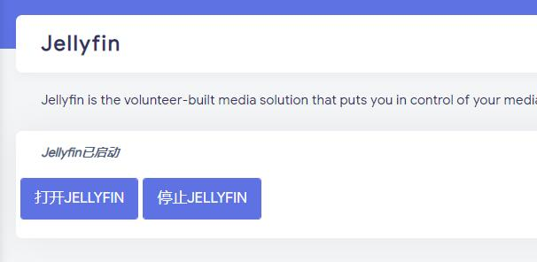

* #### 易有云两大拳头产品，助力Jellyfin随时随地远程在线观影。

* #### [DDNSTO远程观影教程](https://doc.linkease.com/zh/guide/ddnsto/scene.html#远程穿透jellyfin) -->

* #### [易有云App远程观影教程](https://doc.linkease.com/zh/guide/linkease_app/tutorial.html#jellyfin远程播放) -->


### Jellyfin简易配置

#### 1.Jellyfin安装好以后，打开(设备IP+8096端口)：设置显示语言为简体中文，设置用户名和密码；


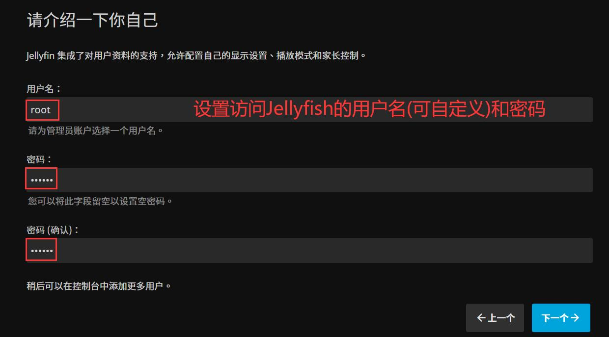

#### 2.添加媒体库：

* 选好内容类型(电影、节目(电视剧)、音乐等);


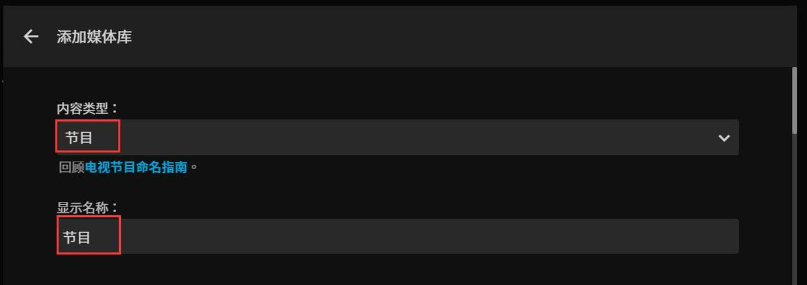

* 选择媒体库路径：

* 前面我们安装的时候“媒体文件路径”，是映射到了Jellyfish的/media路径，所以选择/media；

* 如果我们在“媒体文件路径”下创建了任何文件夹，也能直接在/media选到文件夹；

* 如果是比较新的固件和jellyfin插件，还可以直接使用/mnt下挂载的磁盘。

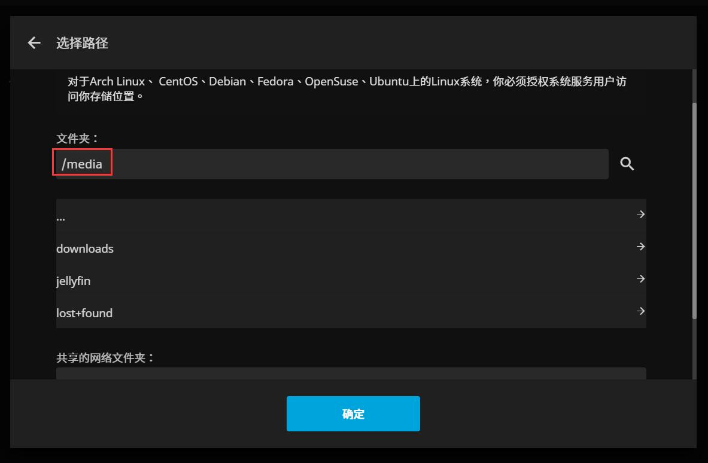

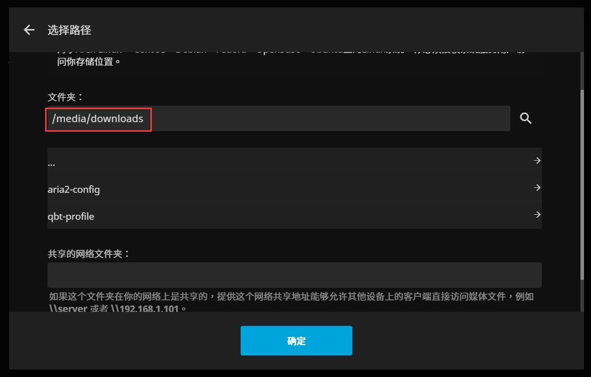

* 设置首选下载语言(中文)和国家(中国)；

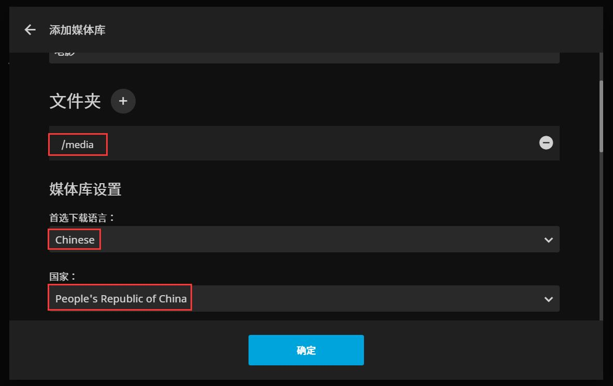

* 下面的刮削器设置默认，然后保存确定，下一步；


#### 3.设置完成，登录框，填入之前设置的用户名和密码即可进入Jellyfish视界。

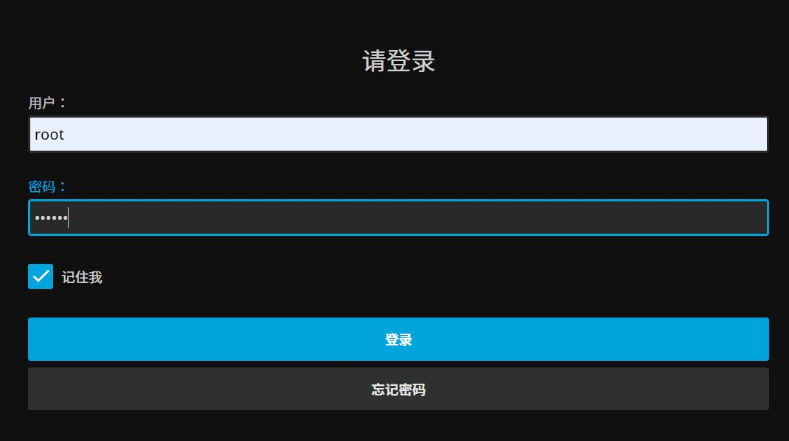

#### 4.进入Jellyfin视界后，无需去动硬件加速选项。

* 因为Jellyfish镜像的安装过程中已经配置好硬解，无需再去设置。


### Jellyfin豆瓣刮削器

众所周知，Jellyfin自带刮削器受限于网络，可能不是很好刮削，所以添加国内的豆瓣刮削。

#### 1.首先下载豆瓣刮削插件[下载地址](https://www.aliyundrive.com/s/5ZP1ymLjmSt)；


下载后解压得到插件文件夹：


#### 2.然后查看上一步安装Jellyfish的配置数据路径，比如/mnt/sda1/jellyfin/config；

* 一般来说我们都会设置samba共享，方便局域网内访问，若没设置，参考[samba共享教程](https://doc.linkease.com/zh/guide/easepi/common.html#samba共享)

* 设置好samba共享后，直接电脑进入`\\192.168.xxx.xxx`，进入设备挂载的硬盘，找到此目录`sda1/jellyfin/config/plugins`，把插件文件夹放进去，然后重启Jellyfish服务器。

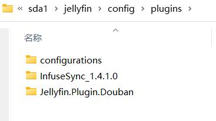


* 若有伙伴配置数据路径还是在/root/，建议改到/mnt/挂载的硬盘下。


#### 3.重启完成后，在插件里就能看到`Douban`了。

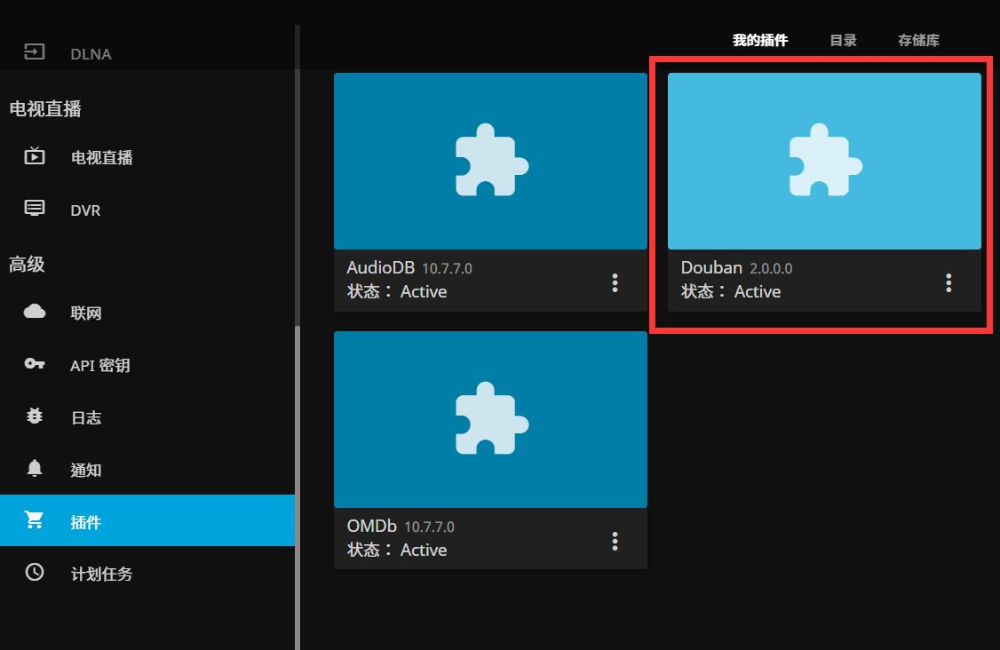

#### 4.然后，在媒体库——管理媒体库中，在元数据/图片等勾选"Douban"，并置顶为第一位。


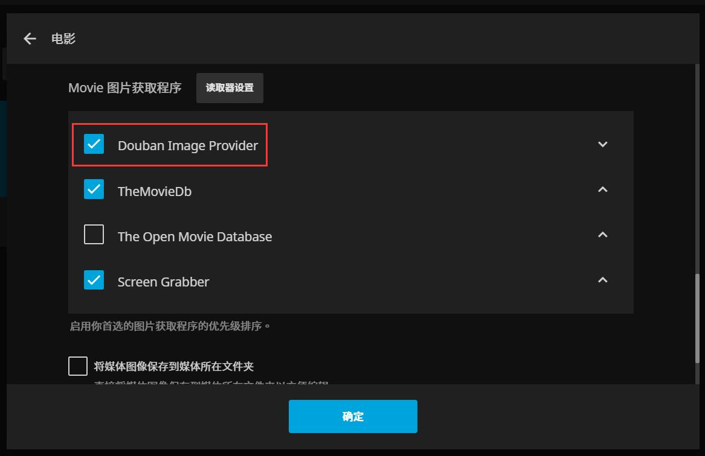

#### 5.这样就能享受豆瓣的刮削了。


