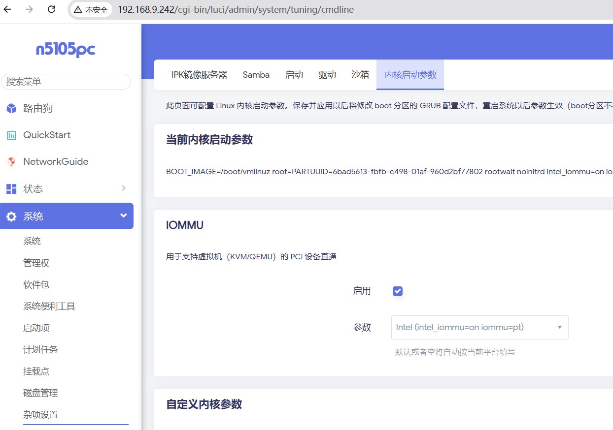

### 在 iStoreOS 显卡直通，显示到 HDMI

以 Intel N5105 为例子，介绍大概步骤：
1. 安装 iStoreOS 基于Docker开发的虚拟机插件 webvirtcloud
2. 删除 iStoreOS 自带的显卡驱动
3. 开启 vfio
4. 正常安装 windows 虚拟机
5. 在 windows 里面安装 virtio 相关驱动
6. 关闭虚拟机，在 webvirtcloud 里面设置显卡直通给 windows
7. 再 windows 显示器上安装显卡驱动，完成

#### 启动开启 iommu



#### 删除原本的显卡驱动

```
find /lib/modules -name i915.ko
find /lib/modules -name i915.ko|xargs rm -f
```

如果想恢复，可以

```
find /rom/lib/modules -name i915.ko
```
把驱动复制到正确的地方，其中把 xxx 替换之前的命令得到的内容

```
cp /rom/xxxx/i915.ko ==> /lib/modules/xxx
```

#### 找到自己的显卡设备ID：

```
lspci -n | grep 00:02.0

```
比如我得到的是：
```
00:02.0 0300: 8086:4e71 (rev 01)
```

#### vfio-pci 要改成一下内容
文件路径：/etc/modules.d/vfio-pci 自己用 vim 修改，最后得到内容参考：
cat /etc/modules.d/vfio-pci 
```
vfio-pci ids=8086:4e71 disable_vga=1
```

ids=8086:4e71 就是自己的显卡 ID

并给与权限：

```
chmod 666 /dev/vfio/vfio
```

#### 修改虚拟机 libvirt xml 文件，如下

```
<domain type='kvm' xmlns:qemu='http://libvirt.org/schemas/domain/qemu/1.0'>

( 注意开头跟结尾，中间内容省略...)

  <qemu:commandline>
    <qemu:arg value="-set"/>
    <qemu:arg value="device.hostdev0.romfile=/usr/share/OVMF/vbios_gvt_uefi.rom"/>
    <qemu:arg value="-set"/>
    <qemu:arg value="device.hostdev0.driver=vfio-pci-nohotplug"/>
    <qemu:arg value="-set"/>
    <qemu:arg value="device.hostdev0.x-igd-opregion=on"/>
  </qemu:commandline>
```

####  需要在 Windows 安装显卡驱动，然后

打好 windows 驱动之后，还需要把物理驱动加到 XML 里面

```
<hostdev mode="subsystem" type="pci" managed="yes">
  <source>
    <address domain="0x0000" bus="0x00" slot="0x02" function="0x0"/>
  </source>
  <address type="pci" domain="0x0000" bus="0x07" slot="0x00" function="0x0"/>
</hostdev>

<video>
  <model type="none"/>
</video>

```

#### 相关链接：

- [PVE显卡直通教程](https://3os.org/infrastructure/proxmox/windows-vm-configuration/)
- [INTEL GVT](https://wiki.archlinux.org/title/Intel_GVT-g)

