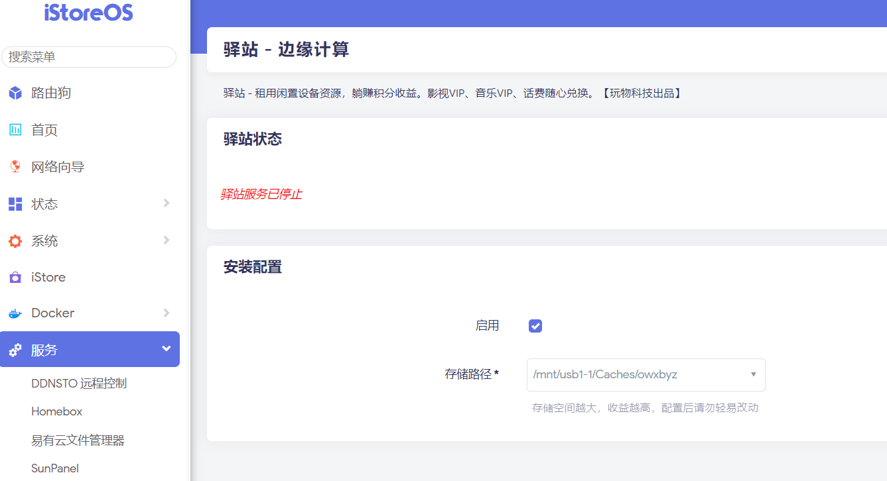

### 驿站 - 边缘计算

注意：此教程仅适用于iStoreOS系统，请先安装[iStoreOS系统](/zh/guide/istoreos/README.md)。

驿站是由【玩物科技】（[官网](https://yz.iepose.com/?from=istore)）开发的分布式共享边缘计算服务。跟 iStoreOS 的作者“小宝”没有任何关系。

驿站有官方的微信售后群，请通过二维码加入：

驿站的好处是，低端的设备也能完美运行，而且不依赖 Docker。

#### 安装

* 需要在运行 iStoreOS 的硬件上，安装 “驿站” 插件
* 还需要准备U盘，或者移动硬盘，或者硬盘（最好肯定是固态硬盘）
* 到插件也没，选择U盘/硬盘所在位置，启动
* 再到官方链接去绑定
* 插件页面如下图所示：

