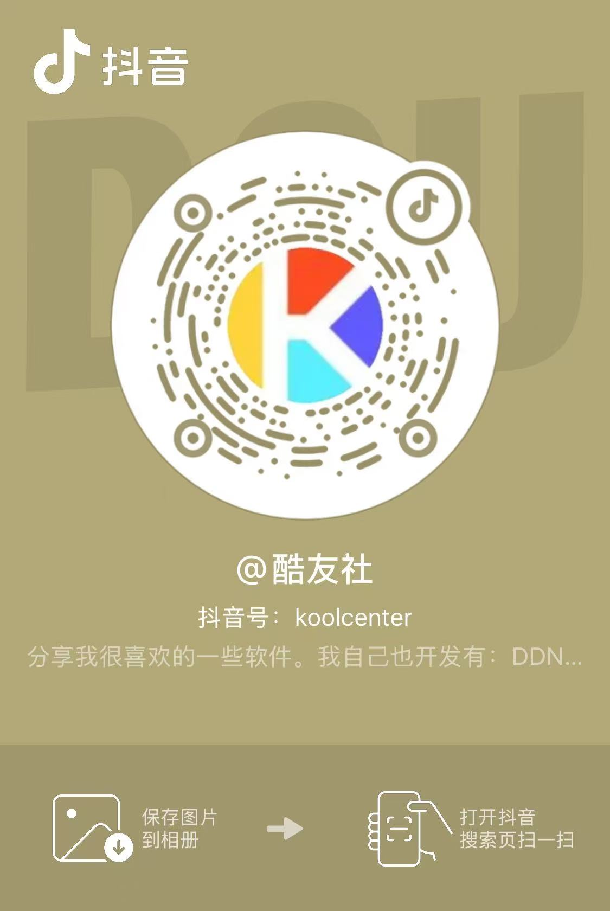
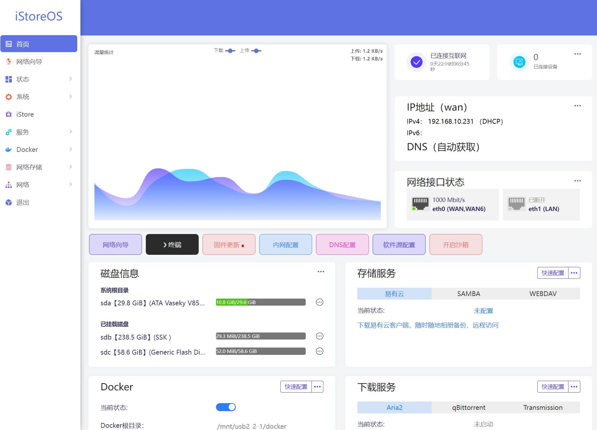
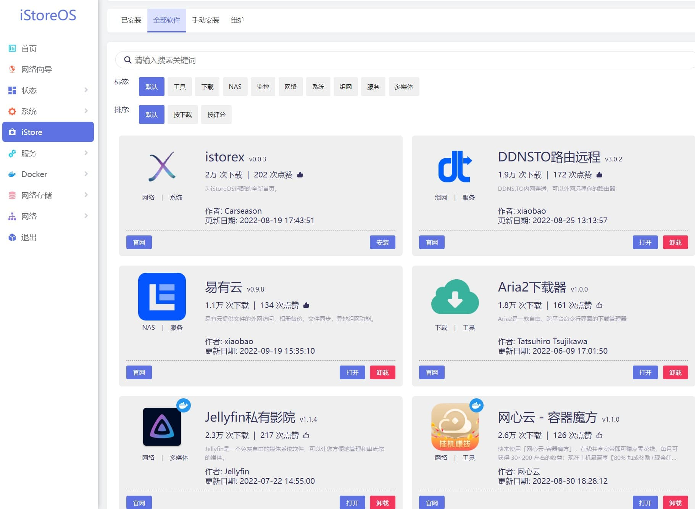

### 每周二、四 19:30，宝哥与你相约直播间！ 

[iStoreOS](https://www.istoreos.com) 是一个开源免费的路由兼存储系统，轻松管理网络与存储，享受一致的操作体验，代码完全开源，欢迎探索与贡献。
- 系统代码开源地址：[Github iStoreOS](https://www.github.com/istoreos/istoreos)。
- #### 酷友社论坛已经上线！欢迎大家[加入论坛](https://www.koolcenter.com)，交流分享，探索更多乐趣！ 

## 支持硬件

* 目前 [iStoreOS](https://site.istoreos.com/firmware) 固件支持机型一览表，附带最新固件版本号。

| 型号 | 型号 | 型号 | 型号 |
|------|------|------|------|
| [X86_64](https://site.istoreos.com/firmware/download?devicename=x86_64&firmware=iStoreOS) <small>24.10.4-2025112811</small> | [EasePi-R1](https://site.istoreos.com/firmware/download?devicename=easepi-r1&firmware=iStoreOS) <small>24.10.4-2025112811</small> | [EasePi-ARS2](https://site.istoreos.com/firmware/download?devicename=ars2&firmware=iStoreOS) <small>21.02.3-sdk</small> | [EasePi-ARS4](http://fw.koolcenter.com/iStoreOS/ars4/) <small>24.10.4-2025112811</small> | 
| [ZX3000](https://site.istoreos.com/firmware/download?devicename=zx3000&firmware=iStoreOS) <small>21.02.7-2025081108</small> | [HinLink-H88K](https://site.istoreos.com/firmware/download?devicename=h88k&firmware=iStoreOS) <small>24.10.4-2025112811</small> | [HinLink-H66/68/69K系列](https://site.istoreos.com/firmware/download?devicename=h6xk&firmware=iStoreOS) <small>24.10.4-2025112811</small> | [HinLink-H28K](https://site.istoreos.com/firmware/download?devicename=h28k&firmware=iStoreOS) <small>24.10.4-2025112811</small> |
| [NanoPi-R76S](https://site.istoreos.com/firmware/download?devicename=r76s&firmware=iStoreOS) <small>24.10.4-2025112811</small> | [NanoPi-R6S/R6C](https://site.istoreos.com/firmware/download?devicename=r6s&firmware=iStoreOS) <small>24.10.4-2025112811</small> | [NanoPi-R5S/R5C](https://site.istoreos.com/firmware/download?devicename=r5s&firmware=iStoreOS) <small>24.10.4-2025112811</small> | [NanoPi-R4S](https://site.istoreos.com/firmware/download?devicename=r4s&firmware=iStoreOS) <small>24.10.4-2025112811</small> |
| [NanoPi-R4SE](https://site.istoreos.com/firmware/download?devicename=r4se&firmware=iStoreOS) <small>24.10.4-2025112811</small> | [NanoPi-R3S](https://site.istoreos.com/firmware/download?devicename=r3s&firmware=iStoreOS) <small>24.10.4-2025112811</small> | [NanoPi-R2S/2C](https://site.istoreos.com/firmware/download?devicename=r2s&firmware=iStoreOS) <small>24.10.4-2025112811</small> | [电犀牛R66/68S](https://site.istoreos.com/firmware/download?devicename=r6xs&firmware=iStoreOS) <small>24.10.4-2025112811</small> |
| [莱因特T68M](https://site.istoreos.com/firmware/download?devicename=t68m&firmware=iStoreOS) <small>24.10.4-2025112811</small> | [Station-P2](https://site.istoreos.com/firmware/download?devicename=station-p2&firmware=iStoreOS) <small>22.03.7-2025051615</small> | [树莓派5](https://site.istoreos.com/firmware/download?devicename=rpi5&firmware=iStoreOS) <small>24.10.4-2025112811</small> | [树莓派4](https://site.istoreos.com/firmware/download?devicename=rpi4&firmware=iStoreOS) <small>24.10.4-2025112811</small> | 
| [Radxa-E54C](https://site.istoreos.com/firmware/download?devicename=e54c&firmware=iStoreOS) <small>24.10.4-2025112811</small> | [Radxa-E52C](https://site.istoreos.com/firmware/download?devicename=e52c&firmware=iStoreOS) <small>24.10.4-2025112811</small> | [Radxa-E24C](https://site.istoreos.com/firmware/download?devicename=e20c&firmware=iStoreOS) <small>24.10.4-2025112811</small> | [Radxa-E20C](https://site.istoreos.com/firmware/download?devicename=e20c&firmware=iStoreOS) <small>24.10.4-2025112811</small> |
| [SEED-AC1](https://site.istoreos.com/firmware/download?devicename=seed-ac1&firmware=iStoreOS) <small>24.10.4-2025111800</small> | [SEED-AC2](https://site.istoreos.com/firmware/download?devicename=seed-ac2&firmware=iStoreOS) <small>24.10.3-2025111800</small> | [SEED-AC3](https://site.istoreos.com/firmware/download?devicename=seed-ac3&firmware=iStoreOS) <small>24.10.4-2025111800</small> | [SEED-AC5](https://site.istoreos.com/firmware/download?devicename=seed-ac5&firmware=iStoreOS) <small>24.10.3-2025112710</small>|
| [GL-BE3600](https://site.istoreos.com/firmware/download?devicename=gl-be3600&firmware=iStoreOS) <small>22.03.7-2025112415</small> | [GL-MT3000](https://site.istoreos.com/firmware/download?devicename=mt3000&firmware=iStoreOS) <small>21.02.4-20251112415</small> |

更多设备请看[系统安装](/zh/guide/istoreos/install.html)部分。

## 前置条件

你需要有一台已经刷入iStoreOS的设备，如果你的设备还没有刷入iStoreOS，请参照[系统安装](/zh/guide/istoreos/install.html)，刷入iStoreOS系统。

## 快速上手

5分钟快速入门，通过简洁的操作向导，帮助用户快速体验系统。

- [设备联网](/zh/guide/istoreos/network/wired_connection.html)

根据使用场景将你的iStoreOS设备接入到现有网络中，可以作为主路由、旁路由、纯主机使用。

- [访问设备](/zh/guide/istoreos/network/check_connection.html)

接入网络后，通过手机扫描局域网或上级路由快速获取设备IP登陆管理后台。

- [网络配置](/zh/guide/istoreos/basic/network_guide.html)

利用网络向导帮助你快速完成网络配置，如快速拨号、旁路由模式、IPv6配置等。

- [快速装机](/zh/guide/istoreos/basic/install_guide.html)

向导式操作，快速完成常用软件安装和配置，用户无需专业知识也能轻松完成。

- [常用功能](/zh/guide/istoreos/basic/page.html)和[软件中心](https://doc.linkease.com/zh/guide/istore/)

向导式配置，便捷操作，轻松上手；丰富的软件生态支持多样化的使用场景，让您的设备功能更强大

- [应用场景](/zh/guide/istoreos/practice/homeNas.html)

更多应用场景探索。

<!-- * [固件安装](/zh/guide/istoreos/install_ars2.html)
* [更多固件下载](https://www.koolcenter.com/fw)
* [网络配置向导](/zh/guide/istoreos/basic/network_guide.html)
* [常用功能](/zh/guide/istoreos/basic/page.html) -->

## 界面导览

## 关注更新

* [酷友社 B站账号](https://space.bilibili.com/1492058311?spm_id_from=333.788.0.0)
* [酷友社 Youtube](https://www.youtube.com/channel/UCvENMyIFurJi_SrnbnbyiZw)
* [酷友社 小红书](https://www.xiaohongshu.com/user/profile/66eaa6e4000000001d0307af)
* [QQ 群](https://www.koolcenter.com/posts/117)
* [TG 群](https://t.me/+QwxW7aimSMeRdQJX)
* 微信扫码公众号：

iStoreOS 来源于 OpenWRT，重点是做了很多很多的交互简化。但是即使再简化，对于不同的用户级别，我们还是得提供了三套完全不一样的交互 UI，具体可以查看我们的[系统介绍](/zh/guide/istoreos/storeos_introduce.html)。

