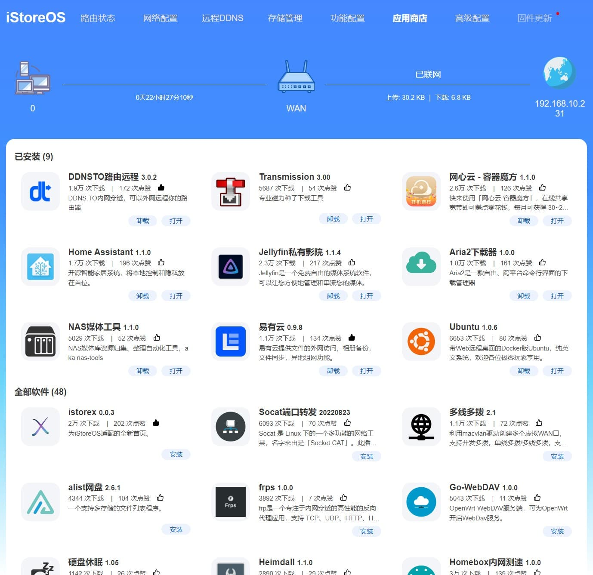
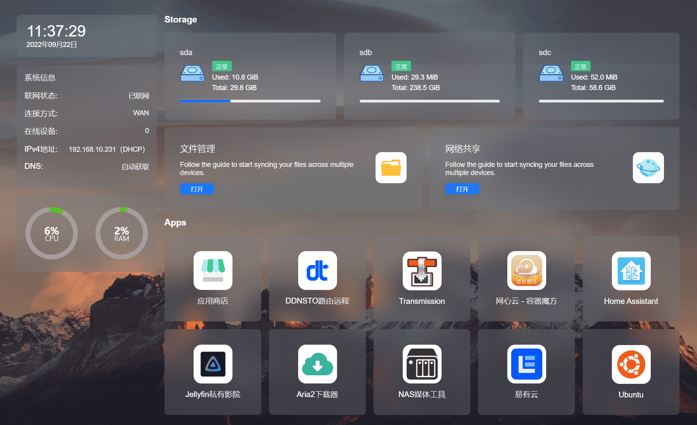
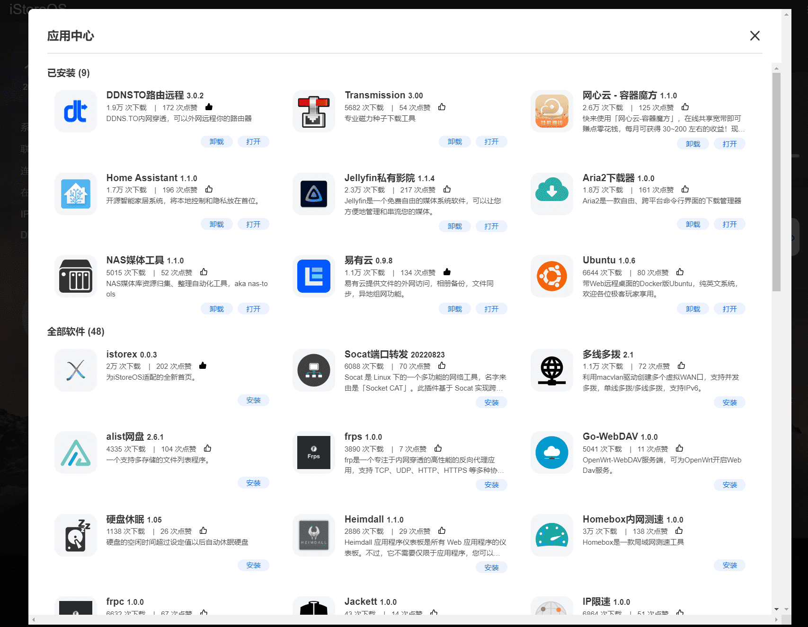

# iStoreOS 固件

iStoreOS 目标是提供一个人人会用的路由兼轻 NAS 系统，保证能运行在 200元-5000元的各种类型的硬件上，实现自己的网络存储自由。

系统本身完全免费，目前系统代码开源在：[Github iStoreOS](https://www.github.com/istoreos/istoreos)

iStoreOS 来源于 OpenWRT，重点是做了很多很多的交互简化。但是即使再简化，对于不同的用户级别，我们还是得提供了三套完全不一样的交互 UI：

## 入门极客版本 UI

iStoreOS 入门极客版本 UI 是默认的 UI，目标是提供给懂点技术的入门极客爱好者，或者偷懒极客老手，核心特性：

* 首页提供网络向导，磁盘向导，Docker 向导等等众多向导，不管是新手还是老手，都能快速配置自己想要的东西
* 修复众多 OpenWRT 不人性的小问题，比如 Samba 设置独立用户名密码很麻烦，磁盘挂载等
* 更多首页工具好帮手，比如在线升级，各种错误检测，网口图形化配置等
* 其它很多常用的，比如 DDNS 配置，Docker 配置等

iStoreOS 还提供了软件中心：[iStore](https://github.com/linkease/istore)，尽可能解决插件之间的依赖关系，可让大家自由自在安装插件。手动安装离线包也是支持的。

除此之外，为了方便大家折腾不出问题，避免掉坑里，我们还做了很多防坑操作，比如：

* 救援模式，即是固件完全刷坏，也可以进入救援模式救回来。目前仅仅自家硬件 [ARS2](https://item.taobao.com/item.htm?ft=t&id=655381846734) 支持
* 沙箱模式，通过 U 盘进入沙箱模式，后续的软件安装更新都在沙箱进行。不管如何安装插件搞坏了系统，拔掉 U 盘就回到上个状态。沙箱模式本身也是系统扩容的最简单的方法。

### 入门极客版本预览


## 小白路由版本

最标准的小白路由版本，减去了超多的复杂的眼花缭乱的功能，回归最本质的路由功能。

对于路由器硬件卖家来说，最好默认帮用户安装此版本。

安装方法：

1. 在默认的极客版本上，从软件中心，安装 iStoreX
2. 退出重新登录，就到了小白路由器版本

### 小白路由版本预览




## 轻 NAS 版本

如果你不是重度的BT下载用户，也不是重度在线看电影需要视频硬解码的用户，那么用个软路由当NAS，是完全没问题的。毕竟网络转发跟硬盘存储不冲突。

当然，iStoreOS 也会提供给你一个纯正独立的 NAS 系统，底层也完全是 OpenWRT，且软件中心完全互通，你懂的路由器的知识，也可以完全搬到 NAS 系统上。那么我们的 NAS 系统有哪些功能？

1. RAID 磁盘阵列
2. S.M.A.R.T 检测
3. 个人私有网盘，借助[易有云插件](https://app.linkease.com) 实现
4. 相册自动备份，借助[易有云插件](https://app.linkease.com) 实现
5. 异地多设备文件同步，借助[易有云插件](https://app.linkease.com) 实现
6. 异地组网，借助[易有云插件](https://app.linkease.com) 实现
7. 远程域名访问，借助[DDNSTO插件](https://www.ddnsto.com) 实现
8. 软件中心（当然软件中心有 NasTool、Jellyfin 影院、下载等等）

注意：目前此交互还在活跃开发中

### 轻 NAS 预览




## 支持硬件

* ARS2(https://item.taobao.com/item.htm?ft=t&id=655381846734) [固件最初支持的硬件，没有这个硬件，就没有这个项目]
* X86
* R2S
* R4S
* R5S
* R68S

### 功能组合

* 建议使用[易有云 APP](https://app.linkease.com) 做异地组网，相册备份，文件同步，远程应用导航等
* 建议用 [DDNSTO](https://www.ddnsto.com) 从网页域名远程访问路由器

### 固件下载

[下载地址](https://fw.koolcenter.com/iStoreOS/)

### 使用方法

* 默认IP http://192.168.100.1
* 默认密码：password
* 如果只有一个网口，默认的网口是 LAN；如果大于一个网口，默认 eth0 是 WAN 口，其它都是 LAN。
* 如果在 LAN 口修改 IP，或者任何修改之后导致无法连接路由器，都会导致刚才的修改被回滚。所以要修改 LAN/WAN 口 IP，可以选择强制应用，保证修改肯定生效。

## 定制固件

如果想自己制作固件，也是可以的。

iStoreOS 来源于官方的 OpenWRT Release 分支源码，都是通过 OpenWRT 标准组件形式实现，100% 兼容 OpenWRT 的源主干分支。我们修改或者开发的部分，都以插件形式，具体源代码如下：

* [iStoreOS 固件](https://github.com/istoreos/istoreos) 核心固件源代码
* [nas-packages-luci](https://github.com/linkease/nas-packages-luci) 我们自己开发的插件 UI 代码
* [nas-packages](https://github.com/linkease/nas-packages) 我们自己开发插件的程序代码，部分程序并不开源
* [istore](https://github.com/linkease/istore) 软件中心核心代码，包含备份插件功能等，全部开源
* [istore-packages](https://github.com/linkease/istore-packages) 软件中心的一些非 OpenWRT 官方包
* [openwrt-app-actions](https://github.com/linkease/openwrt-app-actions) 其他一些软件包

iStoreOS 就是在 OpenWRT 最基础最原始的固件基础上，加上了上面插件的能力来实现。

### 编译参考

请动手能力强的人自己编译固件，跟标准 OpenWRT 一样。

### 离线包制作

iStoreOS离线包不是一个压缩包，也没啥黑科技，而是借助第三方软件实现。原理是[makeself项目](https://github.com/megastep/makeself)：

生成方法例子：
```
./makeself.sh --nox11 ./xxx ./out/xxx_x86.run "OneClick install" ./install.sh
```

install.sh脚本内容大致为：
```
opkg update
opkg install *.ipk
```

把 ipk 跟 install.sh 结合在一起，本质会生成一个包含所有 ipk 跟 install.sh 的自解压自运行的程序。

## 更多精彩

更多iStoreOS 功能，请关注我们的账号：

* [酷友社B站账号](https://space.bilibili.com/1492058311?spm_id_from=333.788.0.0)
* [酷友社 Youtube](https://www.youtube.com/channel/UCvENMyIFurJi_SrnbnbyiZw)
* [QQ 群](https://www.koolcenter.com/posts/117)
* [TG 群](https://t.me/+QwxW7aimSMeRdQJX)

## 问题反馈

* [提交反馈](https://github.com/linkease/istoreos/issues)

大家也可以选择加入 iStoreOS 固件互助群。

* [入群](https://www.koolcenter.com/posts/117)

## 精力不足，求助一臂之力

因为各种原因，我们维护 iStoreOS 精力不足，比如 i226 的驱动移植还没空上日程。如果有大神对本项目感兴趣，欢迎联系我们加入。

## 鸣谢

* [ziguayungui](https://github.com/ziguayungui)，[jjm2473](https://github.com/jjm2473)，[Koolshare LEDE 的作者 fw867](https://github.com/fw867)，[xiangfeidexiaohuo](https://github.com/xiangfeidexiaohuo)
* [KoolCenter](https://www.koolcenter.com)，[易有云](https://www.linkease.com) 团队相关同事
* OpenWRT 官方团队
* 众多 OpenWRT 的固件或者插件开发者

