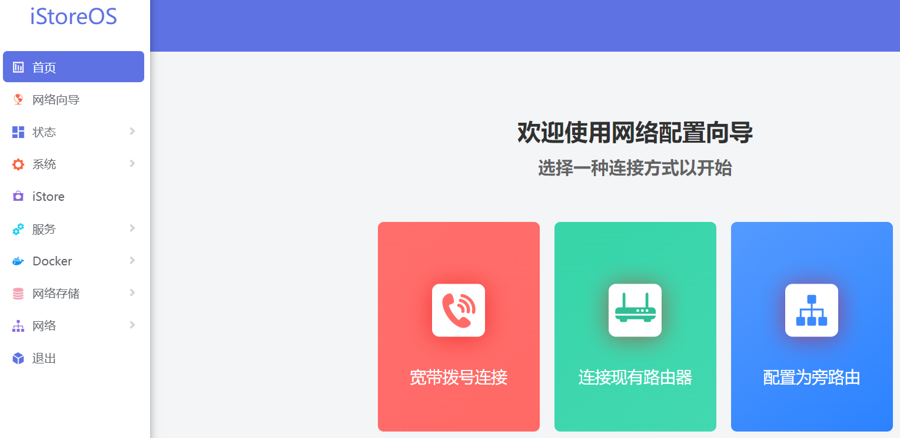
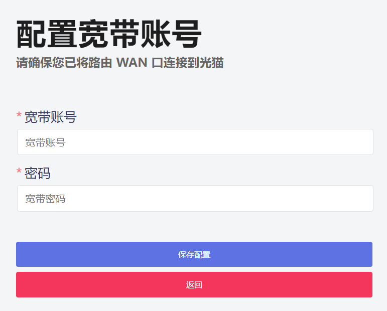
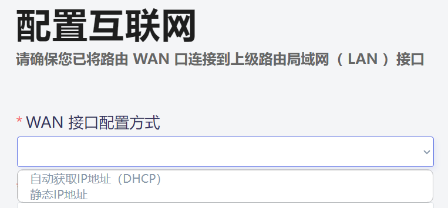
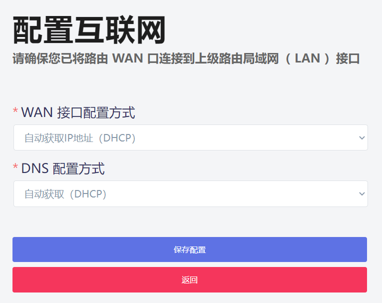
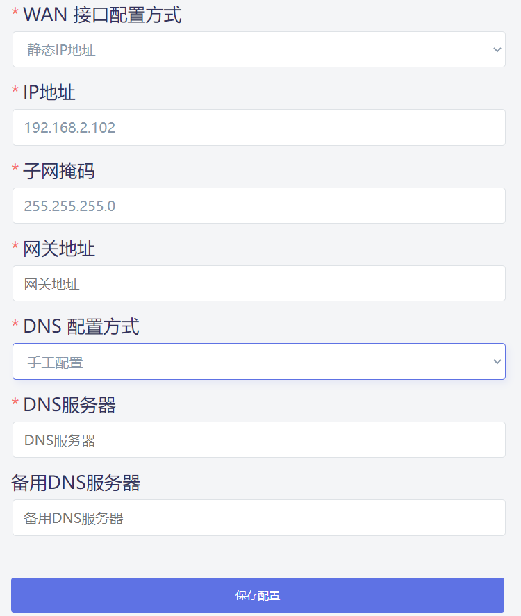
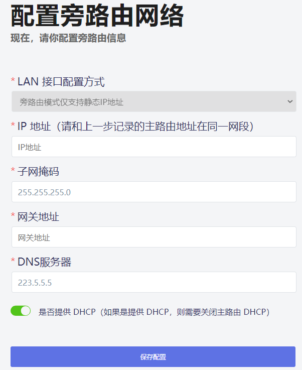

### 提供拨号向导，简化拨号流程



## 宽带拨号连接

* 点击“宽带拨号连接”，输入宽带账号和密码，保存配置即可。



## 连接现有路由器

“连接现有路由器”即为WAN口连接到上一级路由LAN口，有2种方式，一种是DHCP，另一种是静态IP。



* DHCP即为自动获取IP，路由器确保WAN口连接到上一级路由。



* 静态IP需要手动设置一些信息。
```
IP地址：上级路由IP段内且不冲突的IP，比如上一级路由是192.168.2.x，可以设置为192.168.2.102。
子网掩码：255.255.255.0
网关地址：上级路由的IP
DNS配置：手工配置
DNS服务器：可填写运营商的DNS，也可以公共DNS，比如114.114.114.114。
备用DNS服务器：同上。
```



## 配置为旁路由

旁路由即为单臂路由，LAN口连接上级路由的LAN口。即为上级路由拨号，iStoreOS设备来做一些高级功能。

视频教程：[iStoreOS 旁路由](https://www.bilibili.com/video/BV1pY411N7fX)。

* 首先要进行一些配置。

```
IP地址：上级路由IP段内且不冲突的IP，比如上一级路由是192.168.2.x，可以设置为192.168.2.102。
子网掩码：255.255.255.0
网关地址：上级路由IP
DNS配置：手工配置
DNS服务器：可为上级路由的IP，也可填写运营商的DNS，也可以公共DNS，比如114.114.114.114。
```


* 配置完成后，iStoreOS设备LAN口连接上级路由的LAN口。

## IPv6 配置

路由器拨号的视频参考：

<iframe src="//player.bilibili.com/player.html?aid=606031963&bvid=BV1g84y1r7nY&cid=916744694&page=1" scrolling="no" border="0" frameborder="no" framespacing="0" allowfullscreen="true"> </iframe>

光猫拨号的 IPv6 中继：[配置参考](/zh/guide/easepi/quick.html#ipv6透传-中继)
 