#### 首页向导

* 旨在简化使用流程，方便小伙伴们更加便捷的使用iStoreOS。

* 便捷的操作直观显示在首页。

* 系统各项信息一眼可见。

* 下面我们开始讲解“首页”的各项功能。

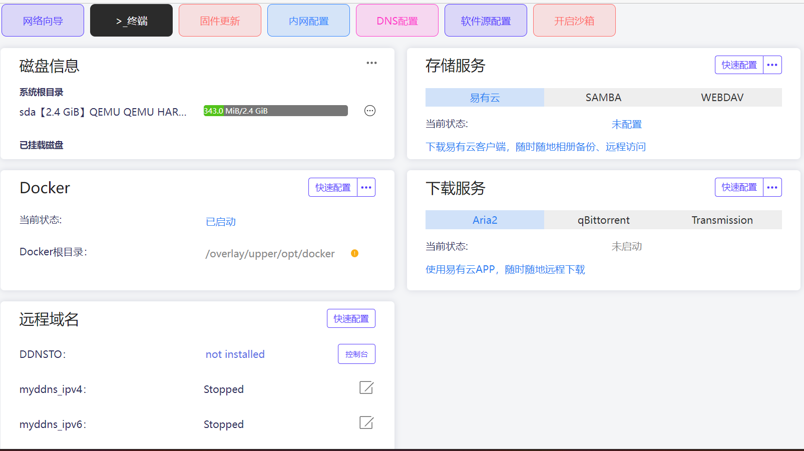


## 固件更新

iStoreOS固件一大特色功能：支持在线更新，可检测/刷入新固件。

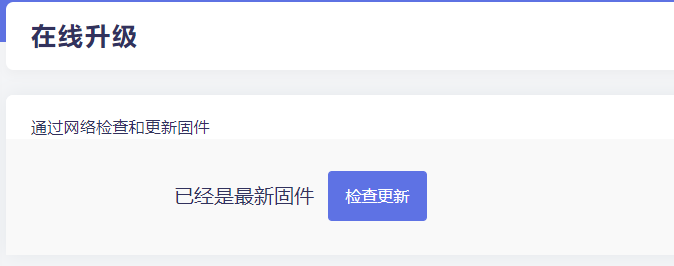


## 内网配置

* 点击“内网配置”，可设置设备的IP地址和子网掩码，也能设置DHCP服务的IP池。

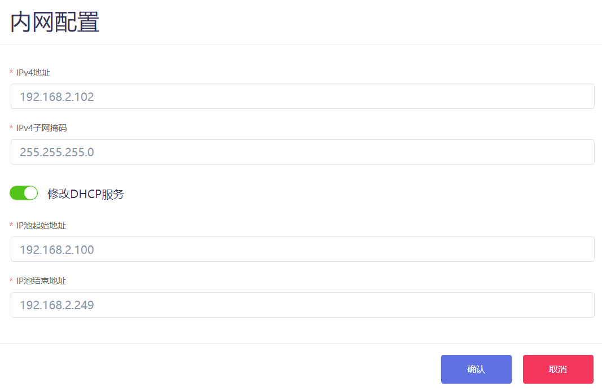


## DNS配置

* 点击“DNS配置”，有2种方式获取DNS，一种是自动获取运营商的DNS。


* 一种是手动设置DNS，可为公共DNS。

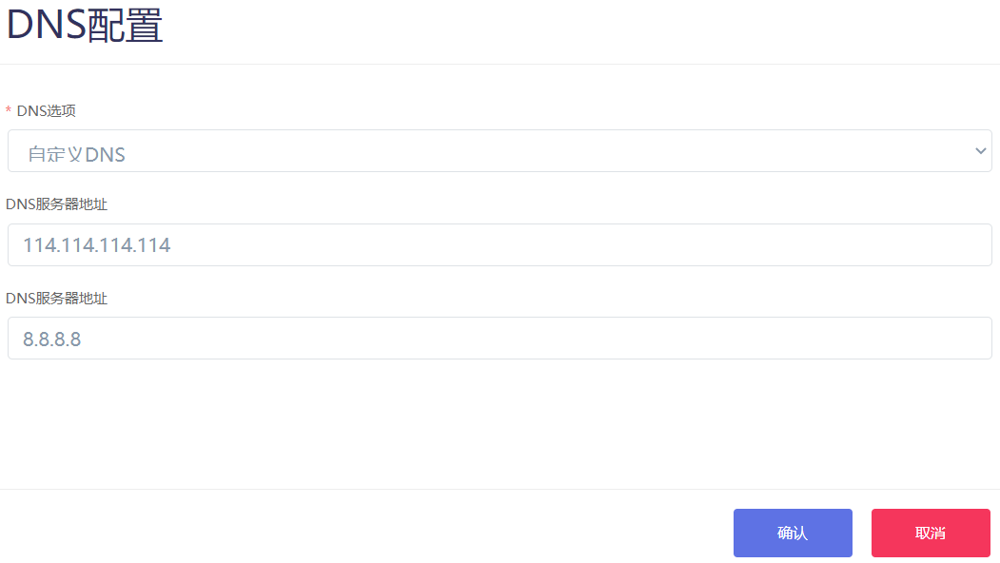


## 软件源配置

* 切换OpenWrt软件源。

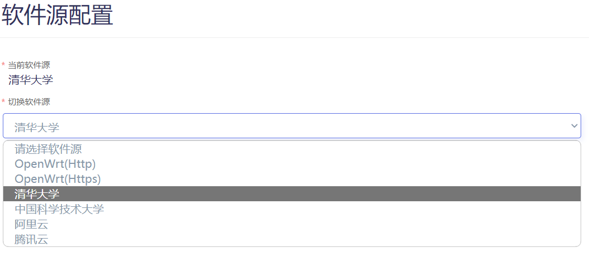


## 沙箱模式

* 沙箱实际是多层OverlayFS，方便用来实验系统配置和程序，方便开发未完成的软件，但不保护Docker和硬盘的数据。

* 开启沙箱准备工作：
```
1. 准备一个U盘或者移动硬盘，方便装卸
2. 分区格式化成ext4
3. 在挂载点页面配置此分区，其中 “挂载点” 选项选择 “作为外部 overlay 使用”
4. 重启即可进入沙箱环境
```
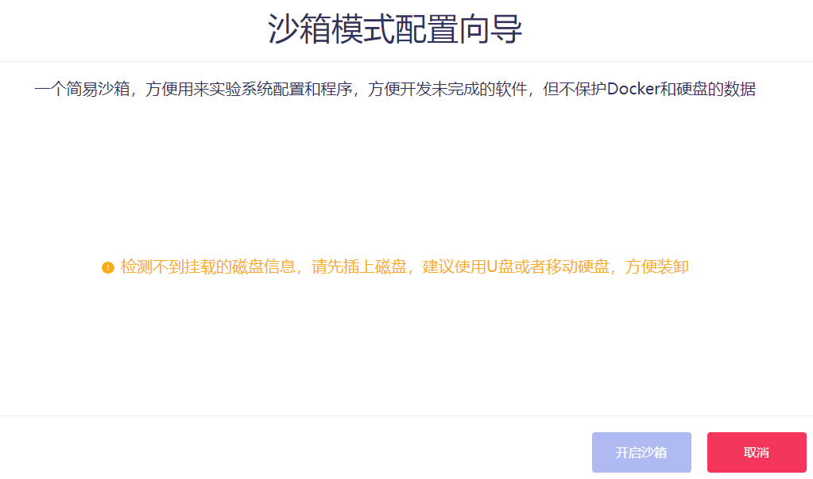


## 磁盘信息

* 直观的显示磁盘信息。

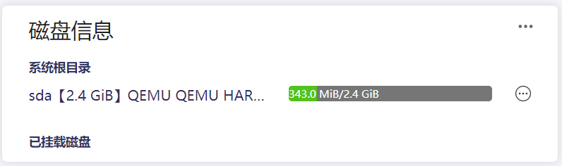

* 磁盘信息右边图标可进入磁盘详情。

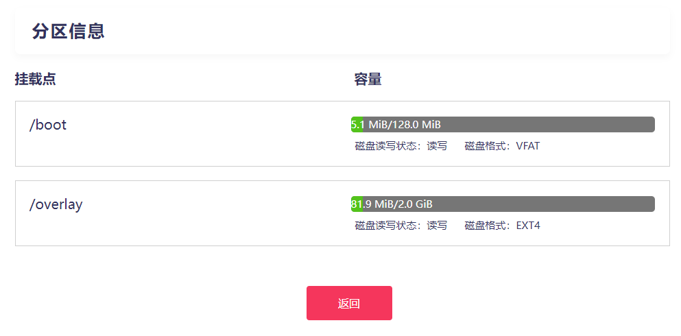

* 右上角三个点可便捷进入到“磁盘管理”或者“挂载点”。

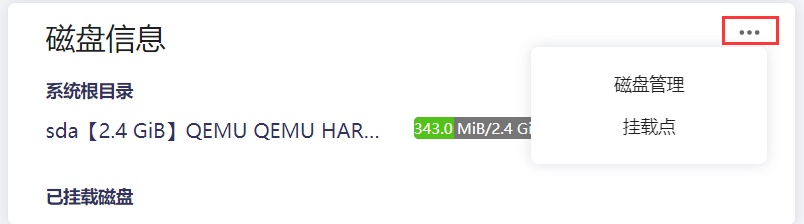


## 存储服务

* 快速配置易有云/samba共享/WebDav共享。

* 需要自行在iStore软件中心，安装易有云和Go-WebDav插件。

* [易有云详细配置教程](https://doc.linkease.com/zh/guide/istoreos/software/linkease.html)

* [samba共享详细配置教程](https://doc.linkease.com/zh/guide/easepi/common.html#samba共享)

* [WebDav详细配置教程](https://doc.linkease.com/zh/guide/easepi/common.html#webdav共享)

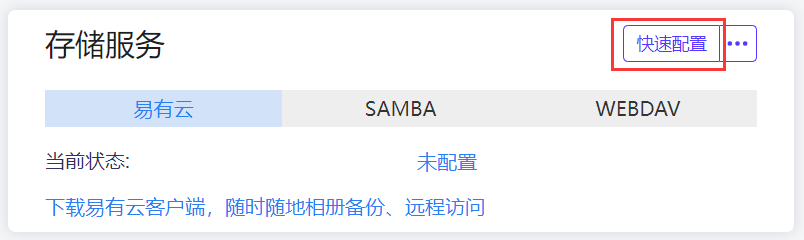

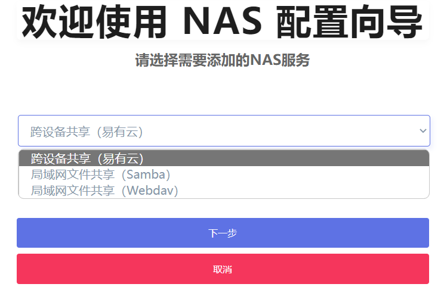


## Docker

* 显示Docker根目录，可快速迁移Docker根目录。

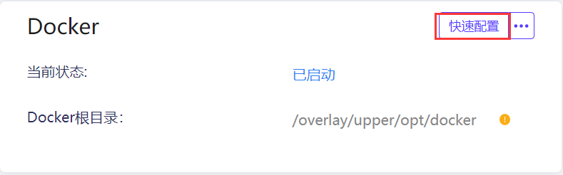

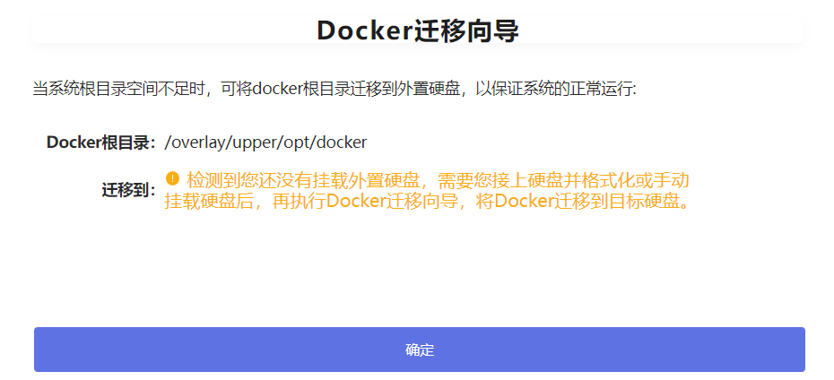


## 下载服务

* 快速配置Aria2/qBittorrent/Transmission下载目录等。

* 需要自行在iStore软件中心，安装Aria2/qBittorrent/Transmission插件。

* [Aria2详细使用教程](https://doc.linkease.com/zh/guide/easepi/common.html#aria2下载)

* [qBittorrent详细使用教程](https://doc.linkease.com/zh/guide/easepi/common.html#qbittorrent下载)

* [Transmission详细使用教程](https://doc.linkease.com/zh/guide/easepi/common.html#transmission下载)

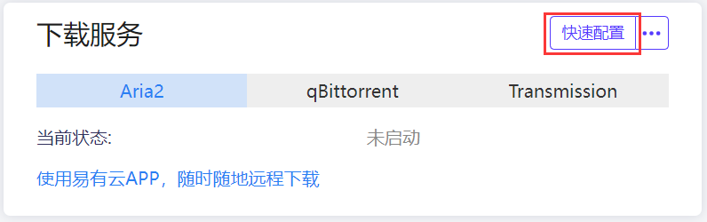

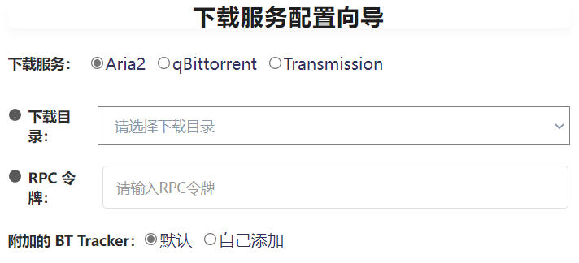


## 远程域名

* 快速配置DDNSTO或者动态DNS。

* 要配置DDNSTO，需要自行在iStore软件中心安装DDNSTO。

* [DDNSTO详细配置教程](https://doc.linkease.com/zh/guide/istoreos/software/ddnsto.html)

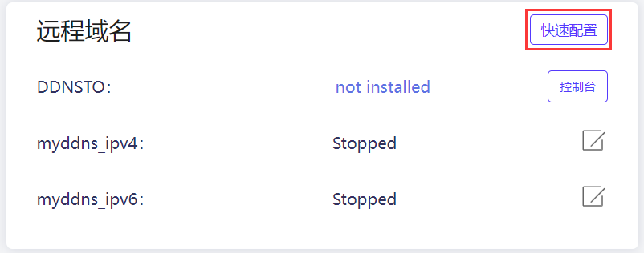

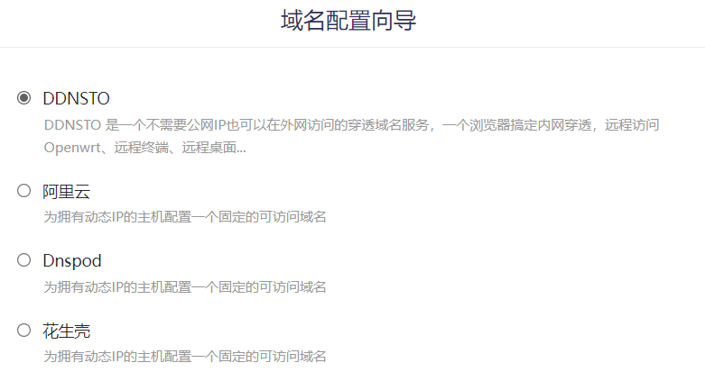
