# 小米AX9000 安装教程

## 1.解锁SSH

* #### 确认AX9000的官方固件版本

1.进入AX9000的Web管理后台，查看底部的固件版本是不是1.0.140开发版；

2.若不是，进入[小米路由器官网](http://www.miwifi.com/miwifi_download.html)下载AX9000的开发版ROM；

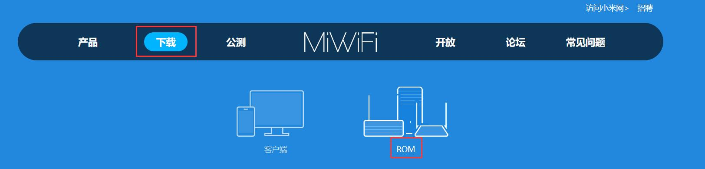

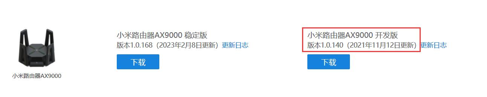

3.进入AX9000的Web管理后台，升级到开发版系统；

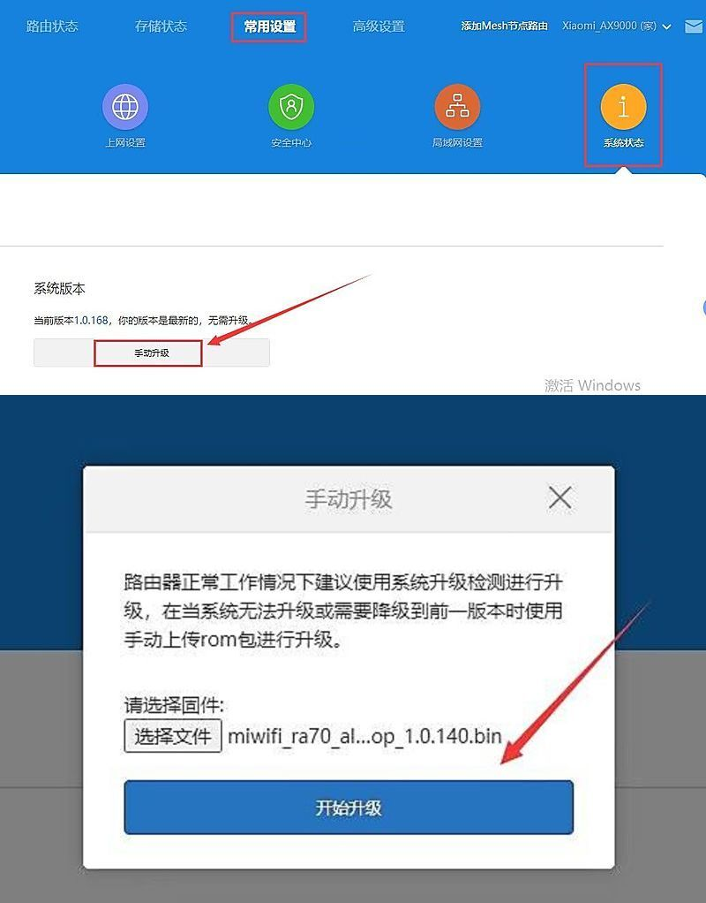

升级到开发版系统，建议勾选“清楚当前所有用户配置”；

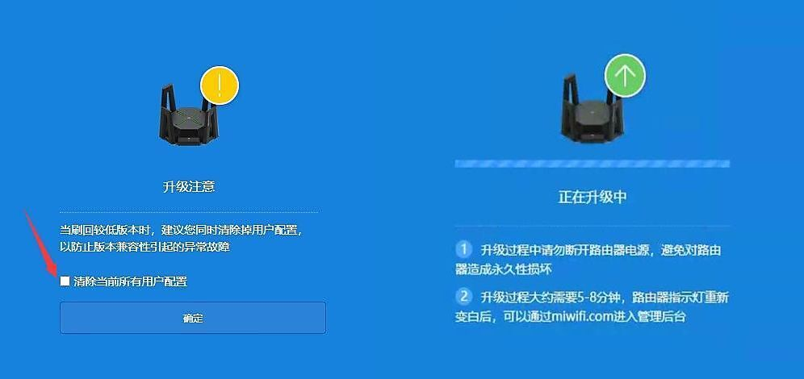

4.等待升级完成后，设置好联网，再次进入到Web管理后台。

* #### 安装官方固件的Docker

1.进入Web后台——高级设置——docker；

准备一个 64G U盘，并格式化成 ext4 格式，插在 AX9000 路由器上；

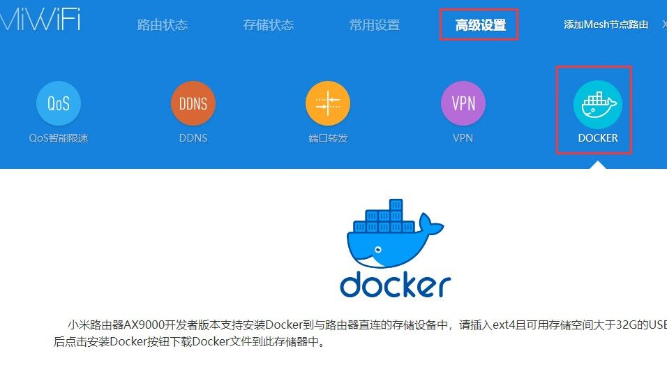

2.安装Docker；

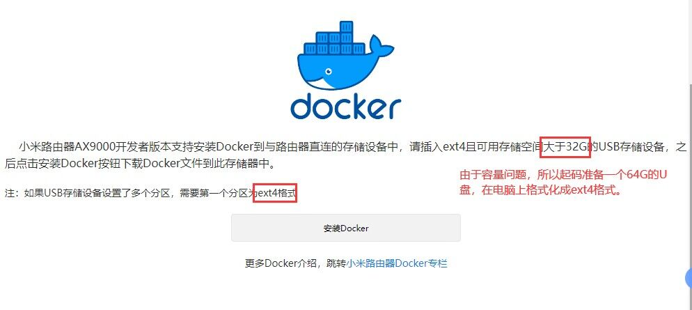

等待安装完成；

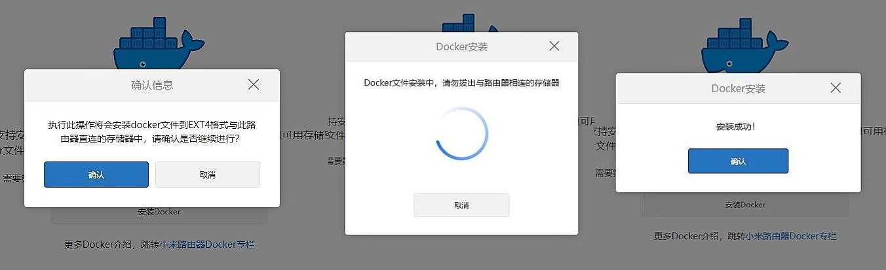

3.启动Docker，并安装第三方管理，等待安装完；

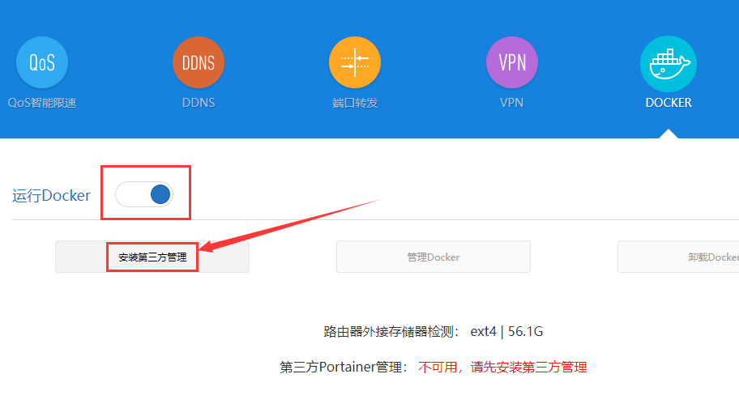

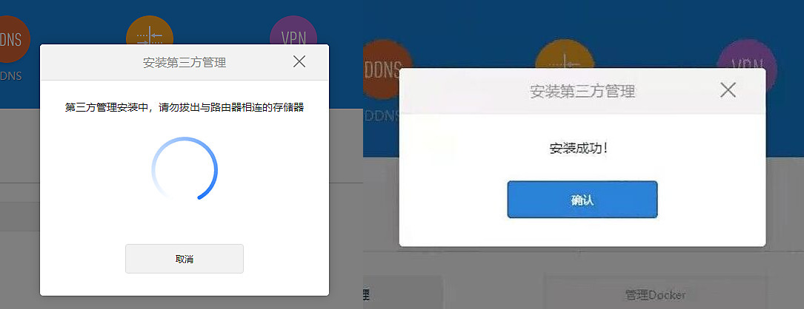

4.管理Docker；

点击 "管理Docker" ，进入 Portainer 登录界面(用户名和密码都是 admin )；

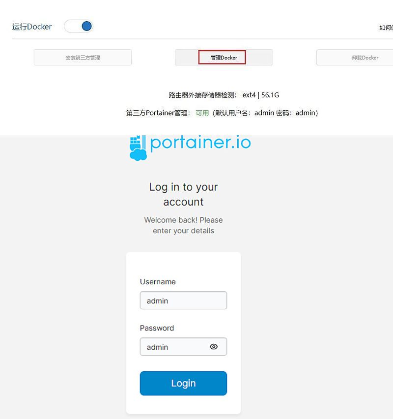

5.首次进入 Portainer 会提示更新密码(12位)；

输入一个12位的密码(比如：abcd12345678)，点击升级密码，最后 “change”；

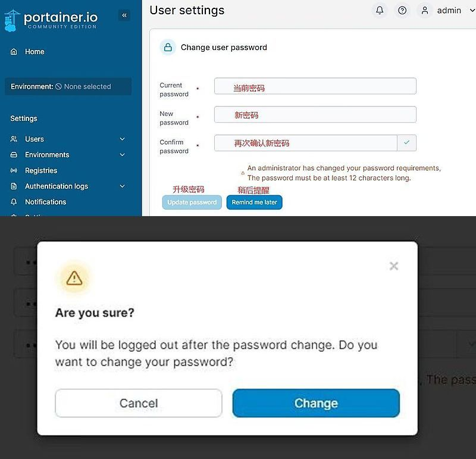

更改完成会要求重新登录，请问新密码登录 Portainer 。

* #### Docker创建Busybox容器

1.在 Portainer 首页，点击 “Live connect” 进入面板界面；

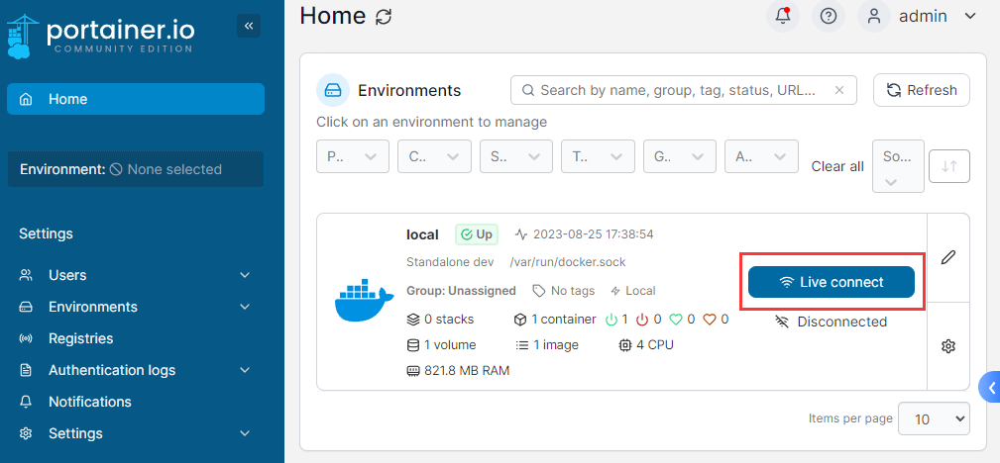

再点击 “Container” ，进入容器界面；

然后点击右上角 “Add container” ，新建容器；

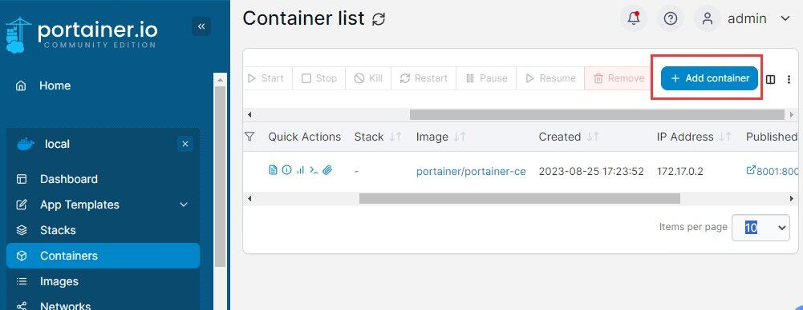

2.创建Busybox容器；

只管红框部分，其余默认；

~~~
Name：容器名字，随意
Image：填写 busybox:latest
~~~

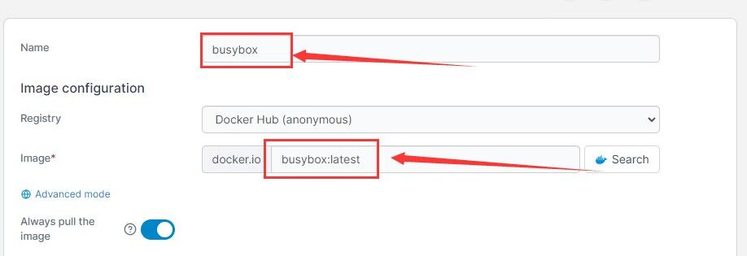

如图选择，开启 TTY，其余默认；

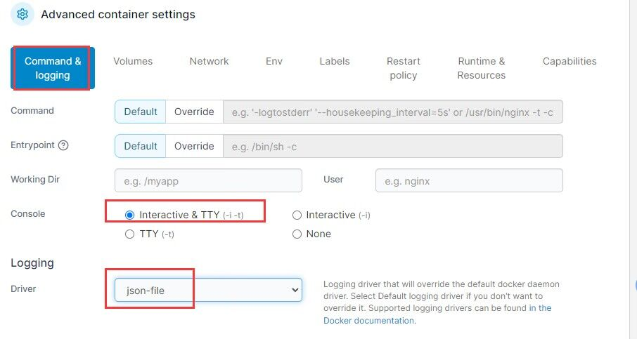

配置挂载，先点击 “+ map additional volume” ，然后根据下列提示填写；

~~~
container：填写 /mnt ，然后选择 Bind；
host： 填写 /
~~~

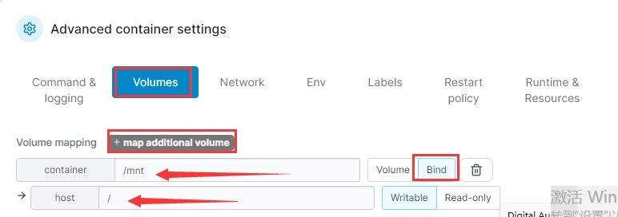

然后点击 “Deploy the container” 创建容器，网络决定是否能快速完成；

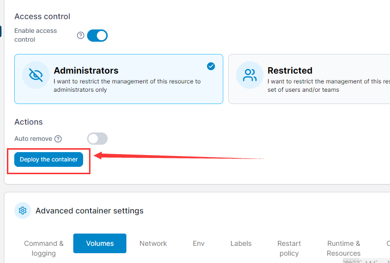

创建完成会自动跳转到容器列表，会看到 busybox 已经运行。

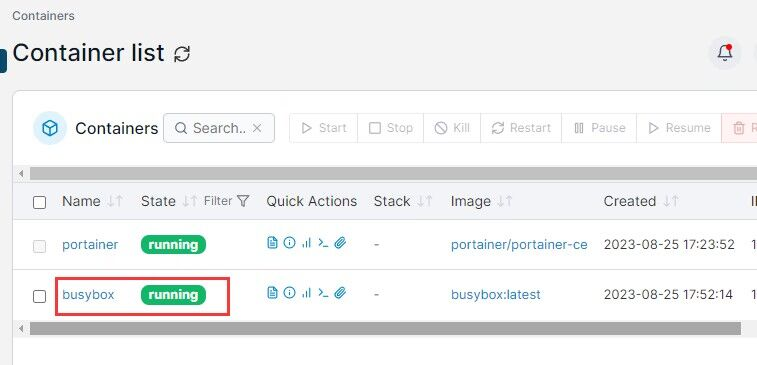

* #### 解锁SSH

1.点击容器列表运行的 Busybox 容器的“回形针”图标，进入容器终端；

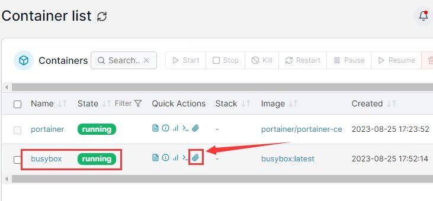

2.准备解锁SSH；

输入以下命令回车；

~~~
chroot /mnt
~~~

继续输入以下命令回车，编辑 dropbear 文件；

~~~
vi /etc/init.d/dropbear
~~~

然后下翻到中间位置，找到如图位置，键盘输入 “i” 编辑，把红框内容全部注释掉(每一行前面加 “#” )；

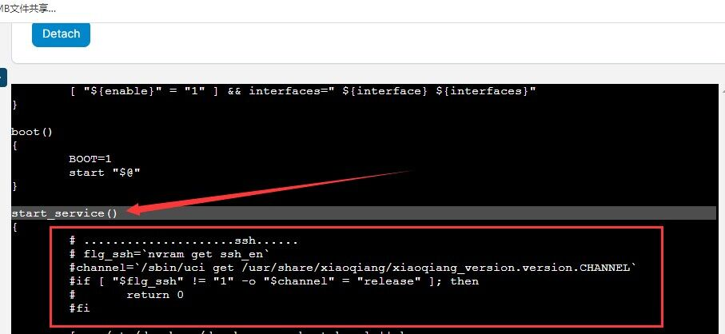

修改完成后，按下 Esc 键，然后输入英文冒号，再输入 “wq” 保存退出。

3.启动SSH服务；

输入以下命令回车，启动 ssh 服务；

~~~
/etc/init.d/dropbear start
~~~

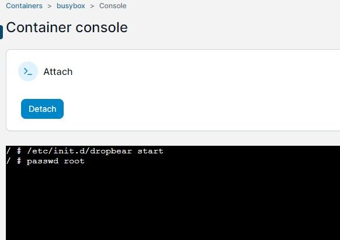

4.修改SSH密码；

输入以下命令回车，修改 ssh 密码；

如果无法修改或者出错，那就是前面没完成，或者未成功；

~~~
passwd root
~~~

* 会提示输入2次新密码，回车完成，一定要记得这个修改的 ssh 密码，后面要用；

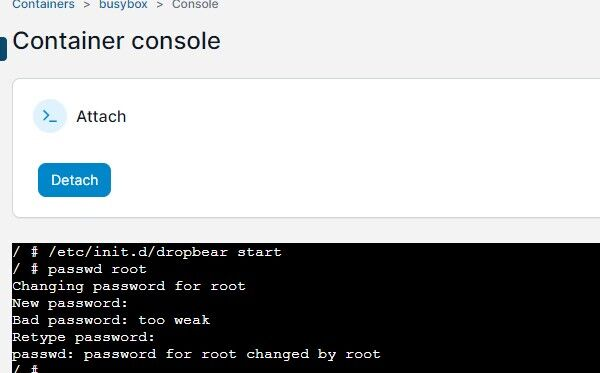

5.测试SSH是否正常；

利用 MobaXterm、Putty 等工具访问 AX9000 的 SSH ，能看到 “are u ok” ，即为成功解锁 SSH 。

~~~
用户名：root
密码：前面步骤修改的SSH密码
~~~

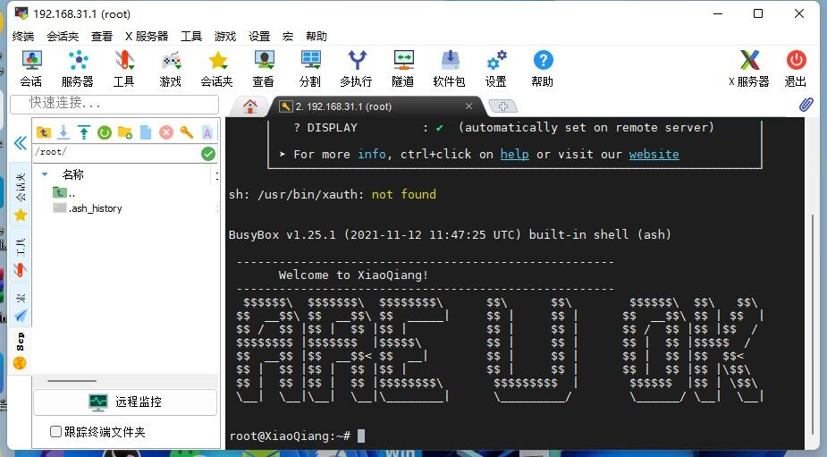

## 2.刷入uboot

* [AX9000 uboot文件下载](http://fw.koolcenter.com/Lean/Xiaomi_AX9000/)

1.把uboot和扩大分区两个文件传到AX9000的root目录下，然后修改权限；

上传两个文件后，输入以下命令回车，修改文件权限；

~~~
chmod 755 *.bin
~~~

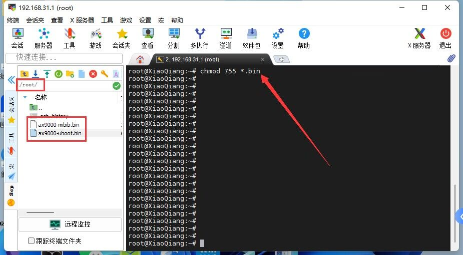

2.刷入uboot；

输入以下命令回车，无错误即成功刷入uboot和扩大分区。

~~~
mtd write mibib.bin /dev/mtd1

mtd write uboot.bin /dev/mtd15

mtd write uboot.bin /dev/mtd16
~~~

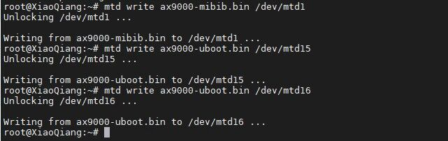

3.进入uboot界面；

* 电脑与 AX9000 通过网线连接，将电脑的ip地址设置为 192.168.1.x 的静态 ip (比如：192.168.1.111，网关为：192.168.1.1)。

* 先拔掉 AX9000 的电源，然后按住AX9000 “reset按键” 的同时插入电源，等10s后松开 “reset按键” ，浏览器输入 192.168.1.1 即可进入 uboot 界面。

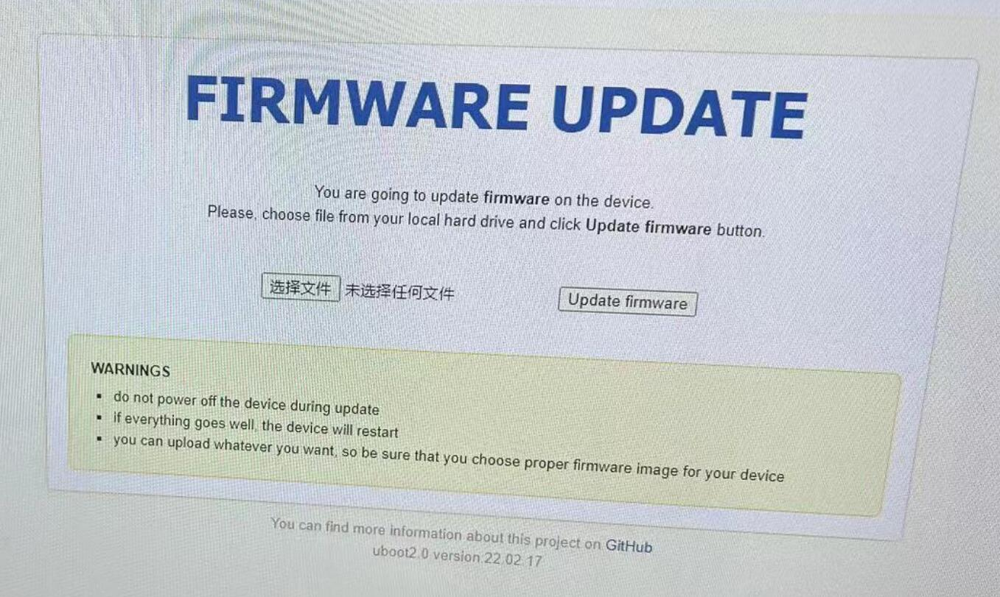

## 3.uboot刷机

1.先下载固件；

* [AX9000 固件下载](http://fw.koolcenter.com/Lean/Xiaomi_AX9000/)

~~~
固件均为 WinRAR 压缩包，需要解压后刷入；
文件名带 squashfs-nand-factory 的是 Uboot 不死刷机包；
文件命带 squashfs-nand-sysupgrade 的是 Web 界面升级包。
~~~

* 因为是要用 uboot 刷机，所以把带有 squashfs-nand-factory 的固件压缩包解压，得到类似 “istoreos-ipq807x-xxxxxxxxx-xiaomi_ax9000-squashfs-nand-factory.bin” 的固件；

2.进入uboot界面刷机；

* AX9000 先进入 uboot 界面，“选择文件” 按钮选中 “istoreos-ipq807x-xxxxxxxxx-xiaomi_ax9000-squashfs-nand-factory.bin” ，然后点击 “update firmware” 按钮刷写固件，等待刷写完成。

* 机器重启即可通过 192.168.100.1 进入 “istoreos固件” 界面。

3.以后升级：

* 用 uboot 刷机成功后，以后如果升级，不一定每次都要用 uboot 刷机，只需要 web 升级界面，刷写 squashfs-nand-sysupgrade 固件即可。

