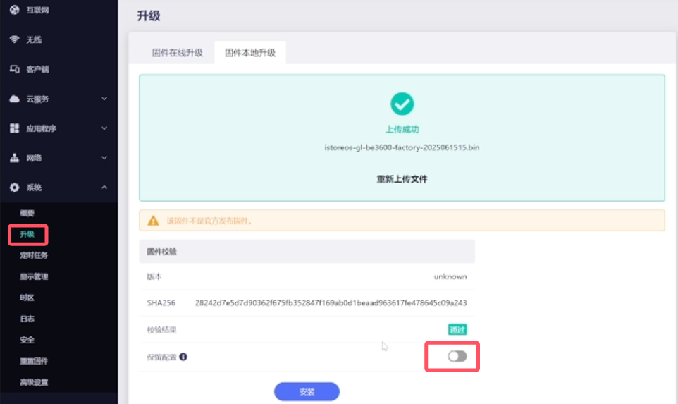

### GL.iNet BE3600 沉浸式刷 iStoreOS 体验

参考视频教程：

<iframe src="//player.bilibili.com/player.html?isOutside=true&aid=114692622124268&bvid=BV1QVMizZEZL&cid=30529094071&p=1&autoplay=0" scrolling="no" border="0" frameborder="no" framespacing="0" allowfullscreen="true"></iframe>

## 1.下载固件

首次刷入 iStoreOS（当前还是 GL 官方固件，准备刷入 iStoreOS。），必须先下载 factory 固件（**istoreos-gl-be3600-factory-xxxxxx.bin**）；

* [GL BE3600 factory 固件下载](https://fw21.koolcenter.com:60010/iStoreOS/gl-be3600/istoreos-gl-be3600-factory-2025061515.bin/)


## 2.刷机

* 进入 GL-BE3600 官方固件管理页面；系统——>升级——>固件本地升级——>选择已下载的 factory 固件；

* 等待上传完成，然后 **取消「保留配置」**，最后点击安装；



* 等待刷机完成；


* 刷入完成后，可以搜索「iStoreOS-5G」或者「iStoreOS-2G」的 WiFi 进行连接，然后浏览器通过「192.168.100.1」进入 GL-BE3600 的 iStoreOS 管理后台；


## 3.配置

* 进入到 iStoreOS 管理页面后，可通过左侧「无线」配置 WiFi 密码等。


## 4.注意
* 目前没有「在线更新」，后续我们会继续优化！

 如果发现 [GL BE3600 固件下载](https://site.istoreos.com/firmware/download?devicename=gl-be3600&firmware=iStoreOS/) 有新固件，直接下载，在 iStoreOS 管理页面——>系统——>备份与升级——>刷写固件——>选择下载的固件，直接保留当前配置升级即可。


## 5.刷回官方

* 如果想从 iStoreOS 刷回官方很简单：

- 先下载 GL-BE3600 官方固件；

```
https://dl.gl-inet.cn/router/be3600/stable
```


- iStoreOS 管理页面——>系统——>备份与升级——>刷写固件——>选择下载的官方固件，等待上传完成；然后 **取消「保留当前配置」**，继续下一步，等待刷写完成。

