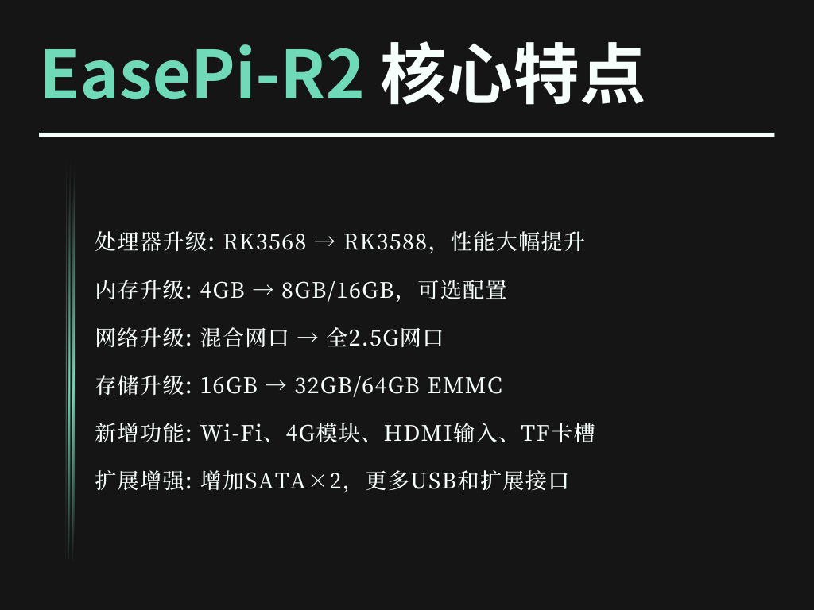
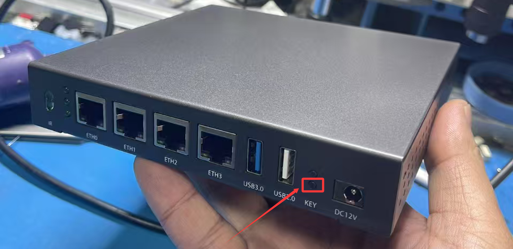
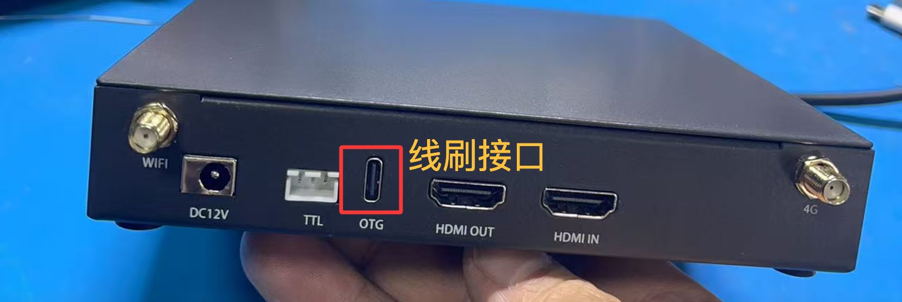

### EasePi R2

产品优势：[R2 硬件细节全面解析](https://www.koolcenter.com/t/topic/15105)

配置详情：[R2 硬件详情](https://www.koolcenter.com/t/topic/12861)

[刷机参考 Rockchip 通用线刷教程](/zh/guide/istoreos/install_rockchip_sysupgrade.html)

* [RK3588 Loader 文件](https://fw0.koolcenter.com/binary/other-tools/rockchip-loader/rk3588_spl_loader_v1.19.113.bin)

* 靠近 KEY 为 ROM 按键，持续按住 ROM 键，机器进入 Maskrom 模式；

* 数据线一端连接电脑，另一端 C 口接入 R2 的 C 口(OTG)。

[EasePi R2 iStoreOS 固件下载](https://site.istoreos.com/firmware/download?devicename=easepi-r2)
