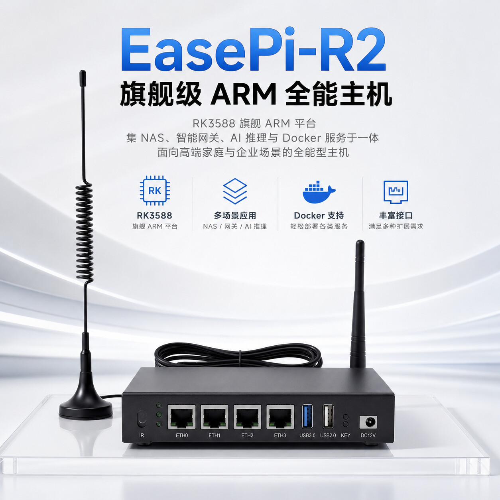
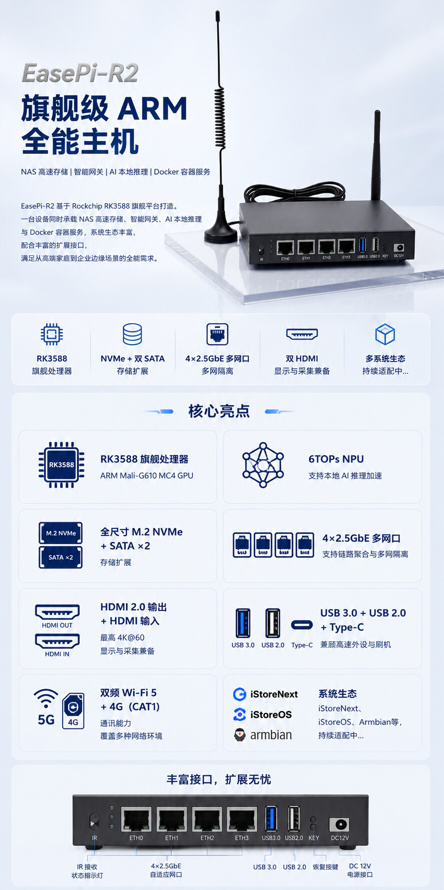
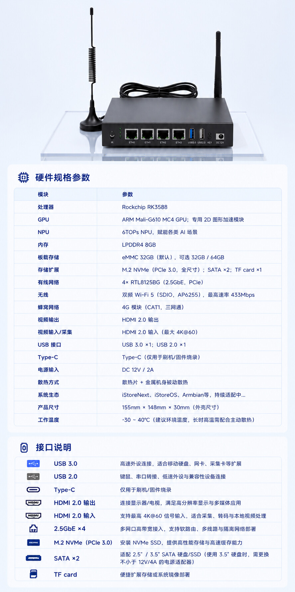

### EasePi R2

<video src="https://dl.istoreos.com/iStoreOS/easepi-r2/easepi-r2.mp4" width="600" height="400" controls autoplay muted>
浏览器不支持视频格式.
</video>

产品优势：[R2 硬件细节全面解析](https://www.koolcenter.com/t/topic/15105)

配置详情：[R2 硬件详情](https://www.koolcenter.com/t/topic/12861)

### [EasePi R2 线刷教程](https://www.koolcenter.com/t/topic/21922)

* [RK3588 Loader 文件](https://fw0.koolcenter.com/binary/other-tools/rockchip-loader/rk3588_spl_loader_v1.19.113.bin)

* [EasePi R2 iStoreOS 固件下载](https://site.istoreos.com/firmware/download?devicename=easepi-r2)

EasePi R2 如何进入 Maskrom 模式：

* 数据线一端连接电脑，另一端 C 口接入 R2 的 C 口(OTG)；

* 靠近 KEY 为 ROM 键，持续按住 ROM 键，机器进入 Maskrom 模式（电脑刷机工具发现 Maskrom 设备后，松开！）。

