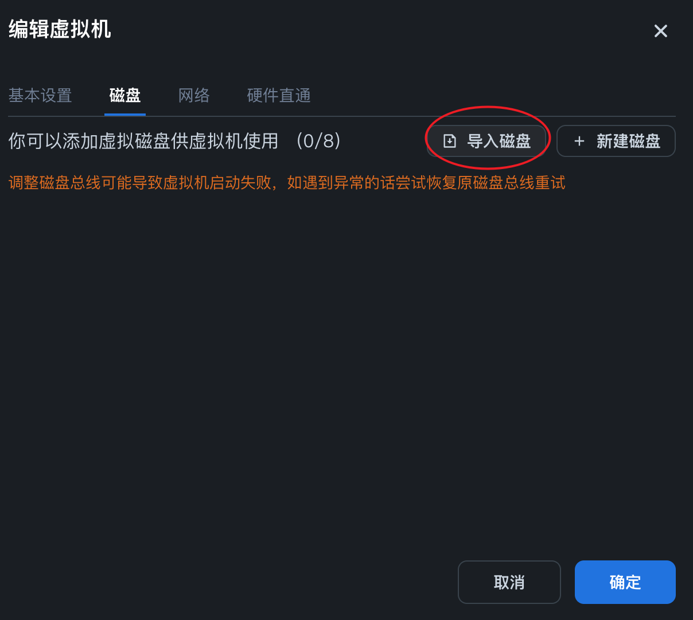

## iStoreOS 飞牛私有云 (fnOS) 安装教程（保姆级）

这篇教程面向刚接触 fnOS 的朋友，目标是用最简单、最直观的方式把 **iStoreOS 跑在 fnOS 虚拟机里**。过程不复杂，只要耐心跟着来，就能顺利完成。

### 一、创建虚拟机

在 fnOS 管理页面里新建一台虚拟机：

1. **机型选择 Q35** —— 它更适合现代系统，兼容性好。
2. **固件选择 UEFI** —— 因为 iStoreOS 的镜像是 UEFI 版，所以必须配合 UEFI 启动。
3. **磁盘暂时不要添加** —— 我们后面会手动挂载 iStoreOS 的镜像。
4. **网络建议用 OVS 桥接**，这样 VM 能直接访问宿主网络。

（参考下面几张截图，照着做就好）


### 二、准备 iStoreOS 硬盘镜像


因为我们选的是 **UEFI 启动**，所以要下载 **x86_64 EFI 镜像**：

👉 下载地址：[iStoreOS 官方 EFI 镜像](https://fw.koolcenter.com/iStoreOS/x86_64_efi/)

建议选一个最新版本。下载好后，把它上传到 fnOS 的存储里。

*小提示：最好放在固态硬盘卷里，性能更好。*

### 三、解压并转换镜像

进入 fnOS 的 shell（通过 SSH 登录宿主），找到你上传的目录，然后执行：

```shell
gzip -d istoreos-*.img.gz
qemu-img convert -f raw -O qcow2 istoreos-*.img istoreos.qcow2
```

说明：

- `gzip -d` 用来解压 `.gz` 压缩包；
- `qemu-img convert` 把原始镜像转成 **qcow2 格式**，这样更适合 KVM 使用（支持精简、快照）。

如果你习惯，也可以先在本地转好再上传，效果一样。

### 四、附加硬盘并启动




回到虚拟机配置页面，把刚生成的 `istoreos.qcow2` 附加到 VM 作为主硬盘。保存配置后，再调整硬盘大小，最后启动虚拟机，就能看到 iStoreOS 正常引导了。


