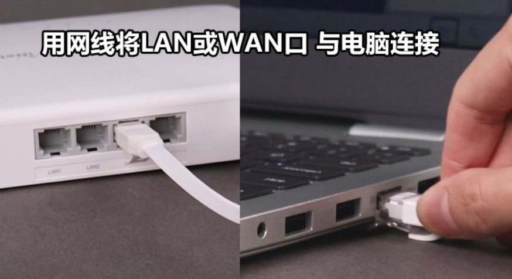
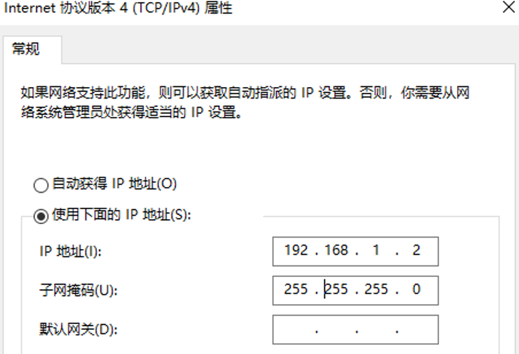
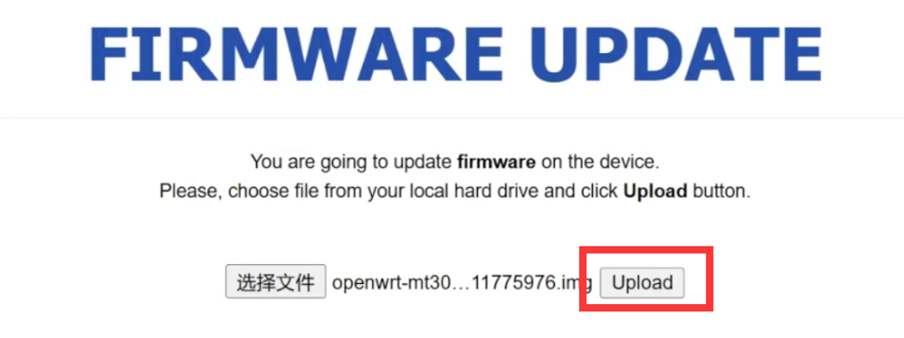
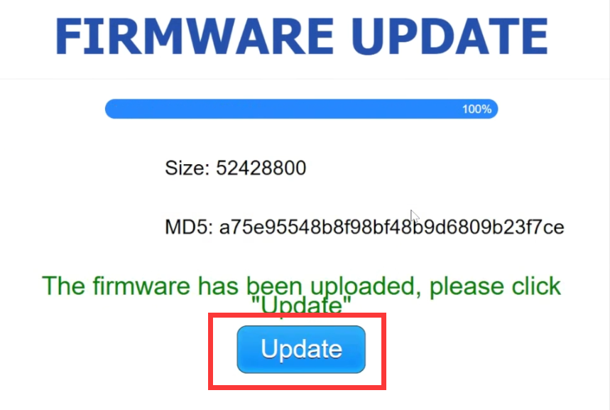
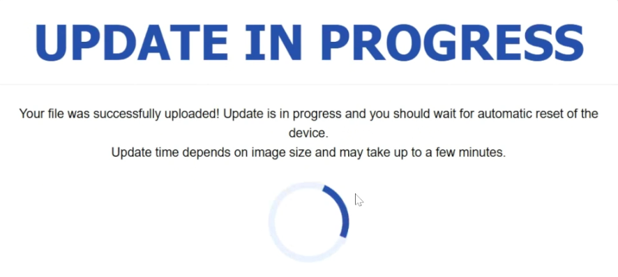
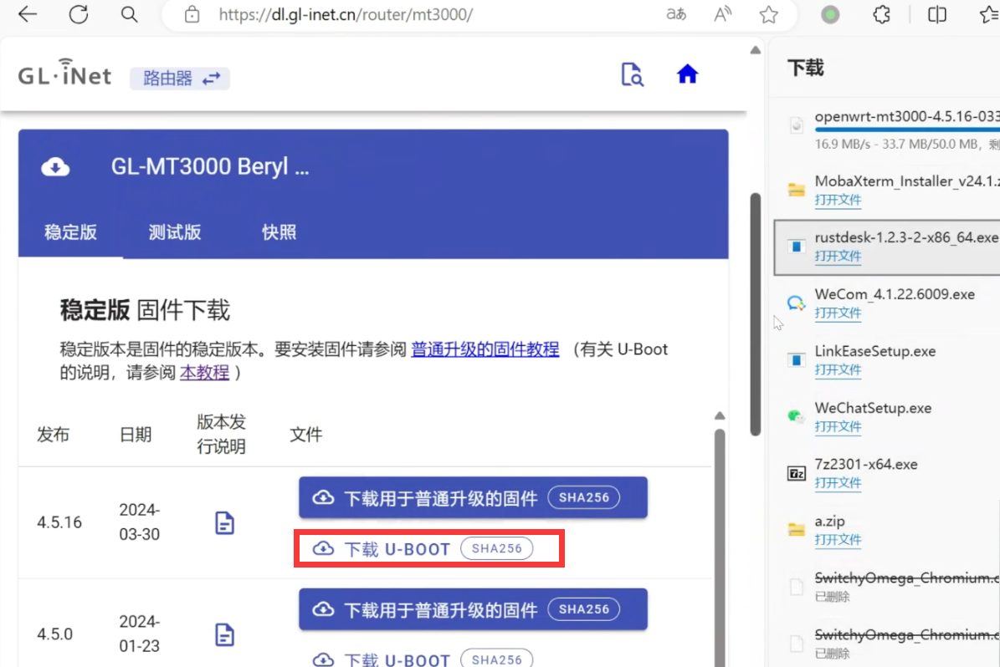

### GL.iNet MT3000 沉浸式刷 iStoreOS 体验

参考视频教程：

<iframe src="//player.bilibili.com/player.html?isOutside=true&aid=1805643800&bvid=BV1sb421v7XB&cid=1573981098&p=1&autoplay=0" scrolling="no" border="0" frameborder="no" framespacing="0" allowfullscreen="true"></iframe>

## 1.下载固件

首次刷入 iStoreOS（当前还是 GL 官方固件，准备刷入 iStoreOS。），先下载 factory 固件（**istoreos-xxxxxx-mt3000-squashfs-factory.img**）；

* [GL MT3000 factory 固件下载](https://fw21.koolcenter.com:60010/iStoreOS/mt3000/istoreos-21.02-20241011-mt3000-squashfs-factory.img/)


## 2.刷机（uboot）

* 机器先拔掉电源，再使用网线一端连接到 MT3000 的 LAN 口，另一端接到电脑；



然后先按住 Reset 键，再给路由器上电；指示灯蓝色闪烁6次后白灯亮起松开即可。

* 打开电脑的控制面板 —> 网络和共享中心 —> 以太网 —> 属性 —> lnternet协议版本4 (TCP/IPv4)；把你电脑的IP地址设置成 192.168.1.2 ，子网掩码设置成 255.255.255.0，点击确认；



* 浏览器访问 http://192.168.1.1 进入 Uboot 页面；



* “upload”选择下载的 factory 固件，等待走进度条；进度条走完，会出现“update”，点击“update”刷入系统；



* 等待两三分钟刷写完成；搜索「iStoreOS-5G」 WiFi 进行连接，然后浏览器通过「192.168.100.1」进入 GL-MT3000 的 iStoreOS 管理后台；




## 3.配置

* 进入到 iStoreOS 管理页面后，可通过左侧「网络」——「MTK WiFi」配置 WiFi 密码等。


## 4.注意
* 目前没有「在线更新」，后续我们会继续优化！

 如果发现 [GL MT3000 固件下载](https://site.istoreos.com/firmware/download?devicename=mt3000&firmware=iStoreOS/) 有新固件，直接下载，在 iStoreOS 管理页面——>系统——>备份与升级——>刷写固件——>选择下载的固件，直接保留当前配置升级即可。


## 5.刷回官方（uboot）

* 如果想从 iStoreOS 刷回官方很简单：

* 先下载 GL-MT3000 官方固件，下载带 uboot 的固件；；

```
https://dl.gl-inet.cn/router/mt3000/
```


* 参考前面的刷机步骤进入 Uboot 页面； “upload”选择下载的官方固件刷写即可。


