### X86 虚拟机

* X86物理机，玩法太多，有些小伙伴不一定会实机安装iStoreOS。

* 这里介绍X86各种虚拟机安装iStoreOS固件。

## PVE 安装

### 1.首先X86机器已经安装好PVE机器，且能正常联网；

* 这里不提供X86机器安装pve教程，自行科普。

### 2.下载固件

* [固件下载](https://fw.koolcenter.com/iStoreOS/x86_64/)
* [固件下载-EFI](https://fw.koolcenter.com/iStoreOS/x86_64_efi/)

越后面的版本越新，下载最新的版本。下载完成之后不需要解压。

### 3.在PVE里新建虚拟机；

* 进入PVE系统管理界面，右上角“新建虚拟机”；

* 只填写名称，VM ID即为虚拟机ID，自动排序的，也可自定义，其余不管，下一步：

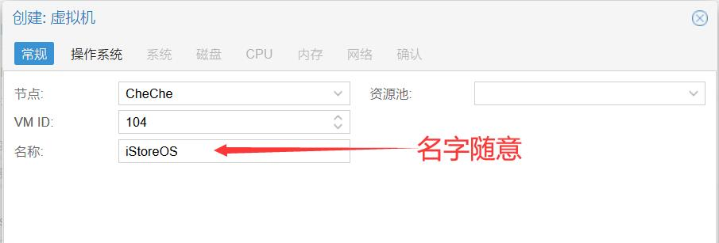

* 勾选“不使用任何介质”，其余不管，下一步；

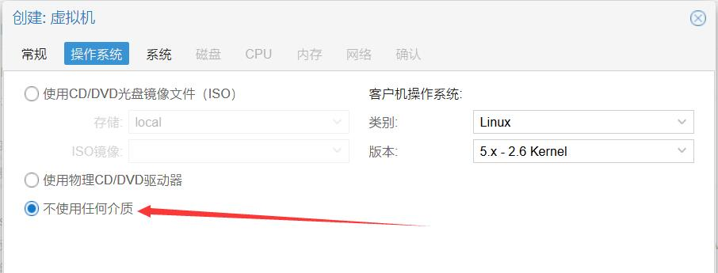

* 如果是下载的EFI固件，BIOS选择“OVMF(UEFI)”，EFI存储选择PVE的虚拟盘，其余不管，下一步：

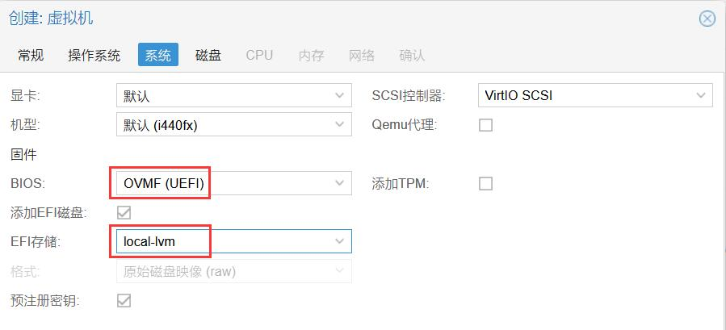

如果下载的非EFI固件，此页面不用管，直接下一步；

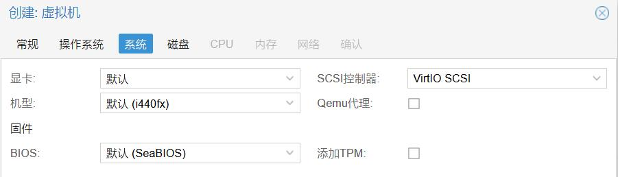

* 磁盘，不需要创建，直接删掉，下一步；

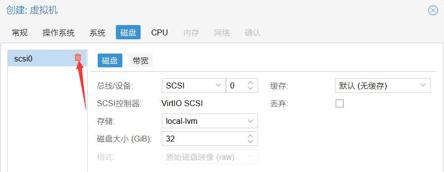

* CPU核心，根据你的实机CPU核设置(比如实机是6核12线程，大于等于1且小于等于12都成)，类别建议选host；

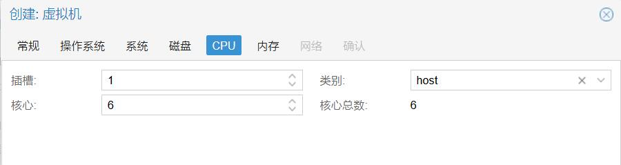

* 内存根据实际需求设置；

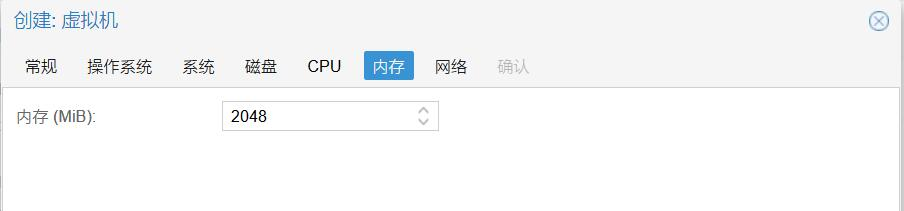

* 网络默认即可，默认已经选了PVE的虚拟LAN；

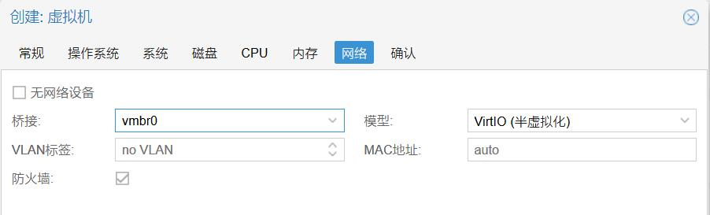

* 完成，等待虚拟机创建好。

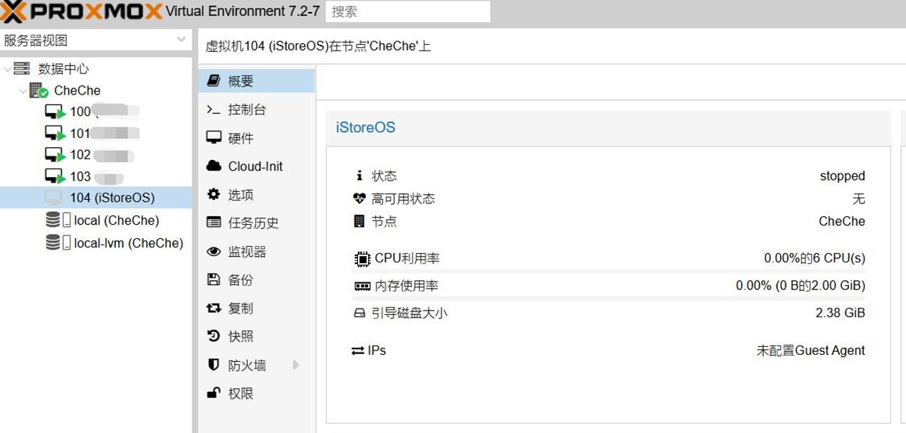

### 4.往刚创建的虚拟机里写入固件；

* 利用WinSCP等工具，把下载好的固件(教程用的EFI固件)和img2kvm工具放入root目录下；

* 终端登录PVE系统后台，终端输入命令：`chmod 777 ./img2kvm`

* 继续终端输入：`./img2kvm 固件完整名 虚拟机ID`

比如教程所示的虚拟机ID是104，下载的固件完整名：istoreos-21.02.3-2022092019-x86-64-squashfs-combined-efi.img.gz

所以输入的命令就是：`./img2kvm istoreos-21.02.3-2022092019-x86-64-squashfs-combined-efi.img.gz 104`

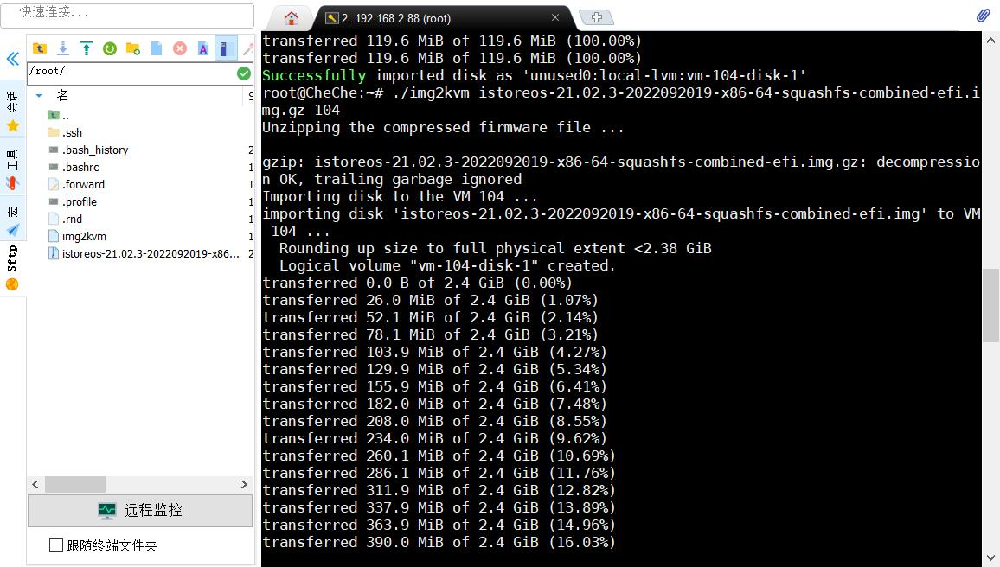

然后看PVE虚拟机104的硬件界面，会出现一个未添加的硬盘，双击添加：

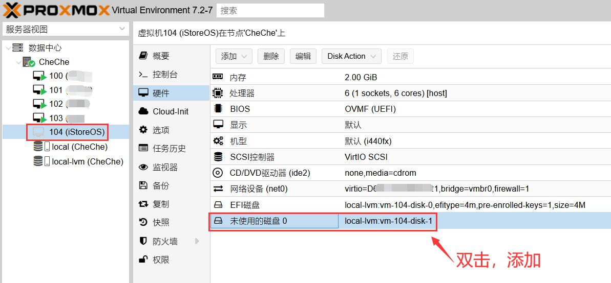

不用设置直接添加：

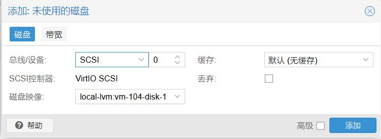

添加完成，会出现一个硬盘：

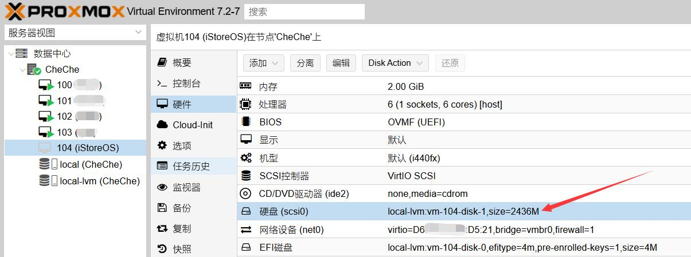

选项——引导顺序，双击进入编辑：

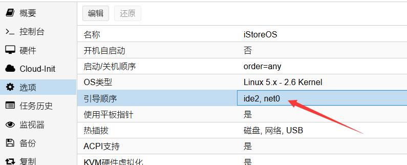

把刚添加的硬盘作为第一启动：

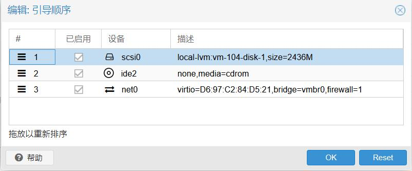

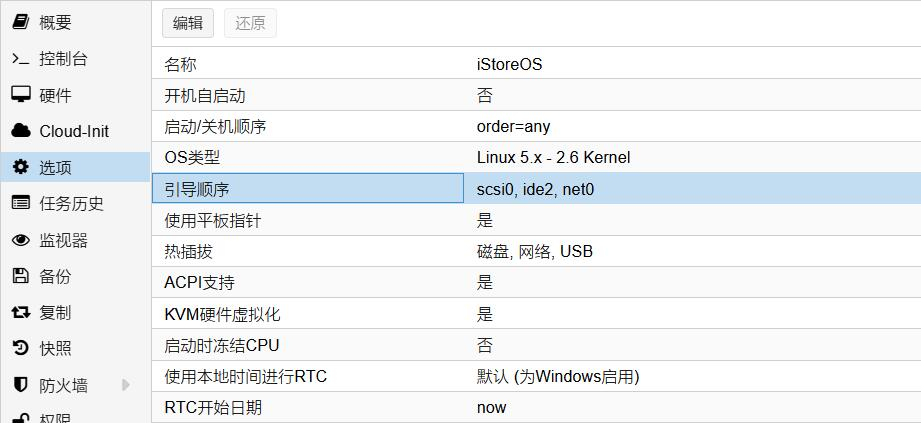

* 把EFI磁盘删掉，若BIOS不是UEFI，无此项设置；

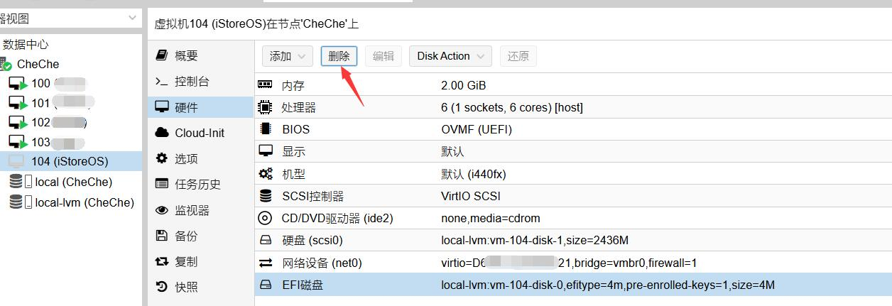

### 5.启动iStoreOS：

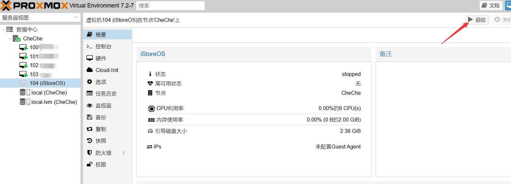

* 如果前面的步骤没出错，是能正常启动的：

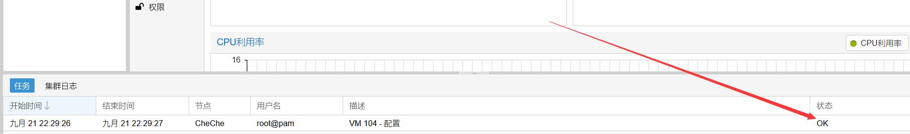

* 等系统启动一两分钟，然后点击此虚拟机——控制台(右上角控制台也可)：

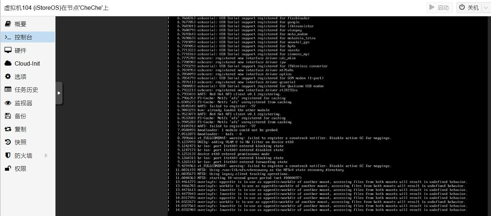

鼠标点在此界面，键盘回车：就会出现终端入口：

输入：`quickstart`，利用键盘“上下键”选择2，回车：

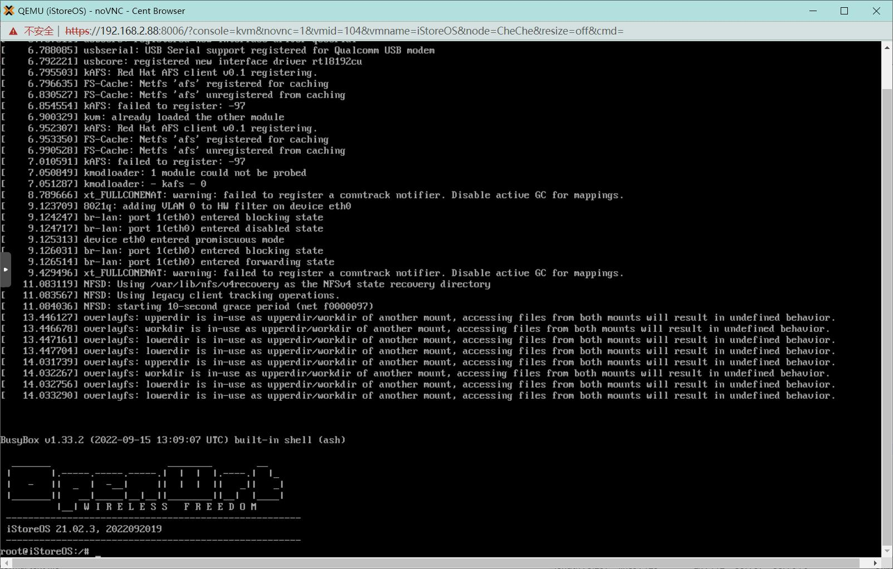

输入要分配给iStoreOS的LAN口的ip(必须是PVE虚拟LAN的IP段，比如PVE的管理IP是192.168.2.88，那么此处的IP就必须是192.168.2.XXX)，回车生效；

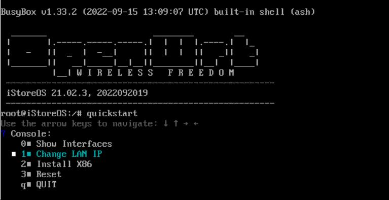

要求输入掩码(mask)，照着填：255.255.255.0，回车生效：

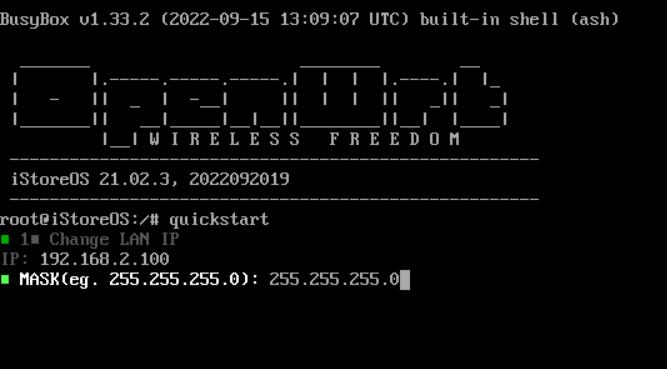

然后选择QUIT退出此界面：

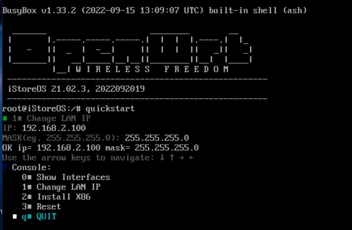

* 输入：`reboot`重启iStoreOS，这样浏览器输入我们设置的IP，就进入iStoreOS界面了。

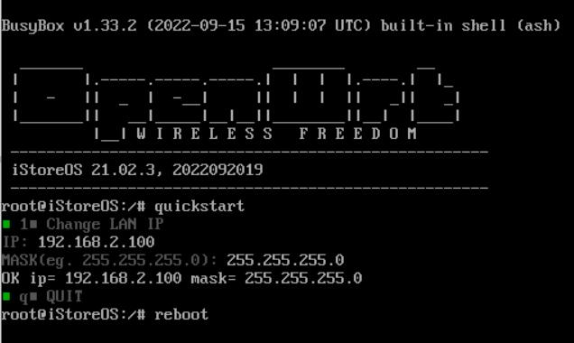

iStoreOS默认登录密码是：password

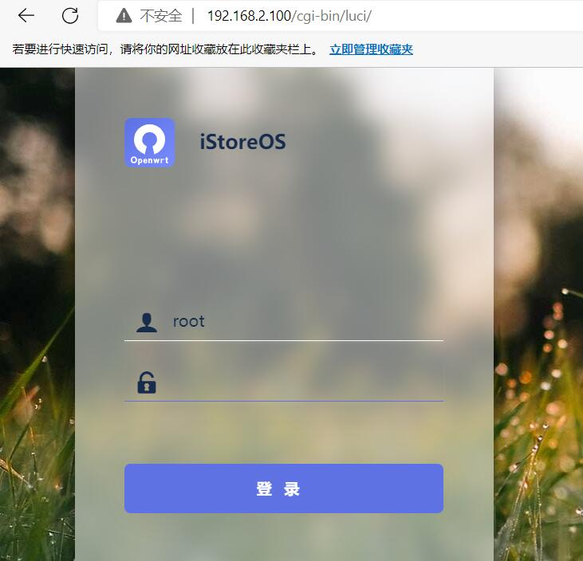

### 6.配置iStoreOS：

此刻我们进入iStoreOS，但是目前iStoreOS是个单笔路由状态，只有一个LAN口。

* 如果PVE里已有主路由系统，需要把iStoreOS配置为旁路由，在“网络向导”里配置“旁路由”即可。

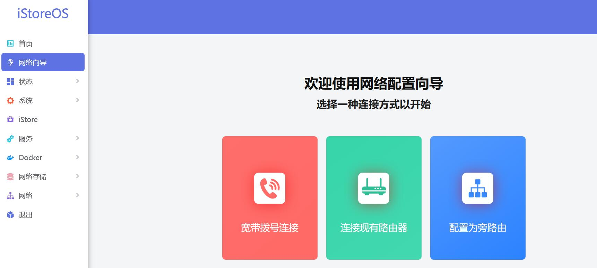

* 如果需要将iStoreOS作为主路由系统，就需要添加网口：

首先在PVE里关闭iStoreOS虚拟机，然后硬件——添加一个PVE的网口作为WAN口；

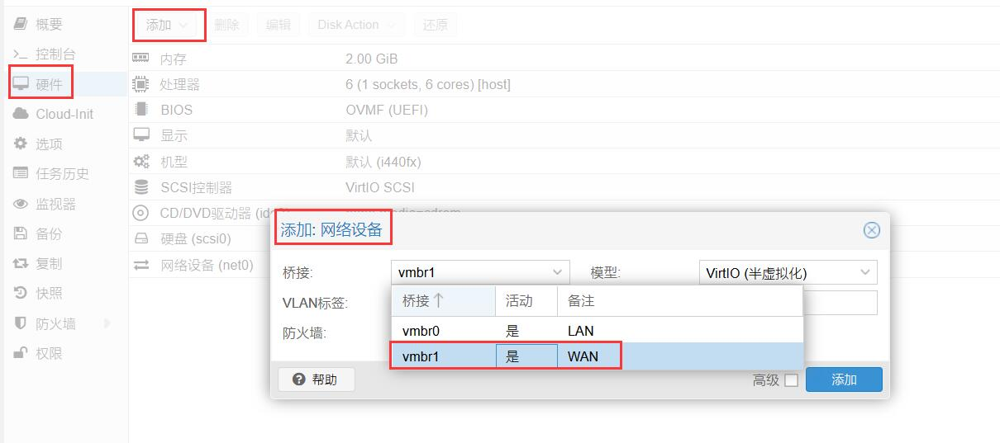

* 然后再确认2个IP，首先确认：PVE的虚拟LAN管理IP，比如是192.168.2.88，那么就必须把iStoreOS的IP改成192.168.2.1~192.168.2.77之间，比如把PVE的IP放在iStoreOS主路由LAN口IP之后，不然PVE无法联网。

* 然后启动iStoreOS虚拟机，进入iStoreOS后，在“网络向导”里配置联网即可。

## EXSI 安装

## VMware 安装