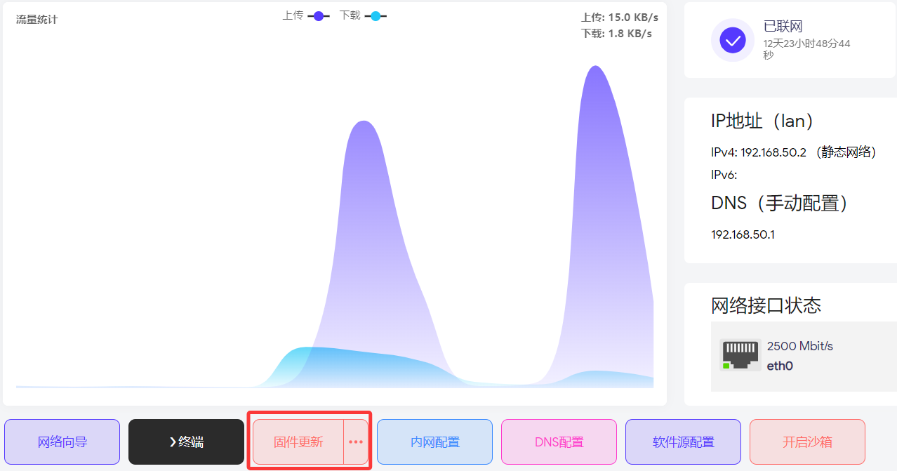
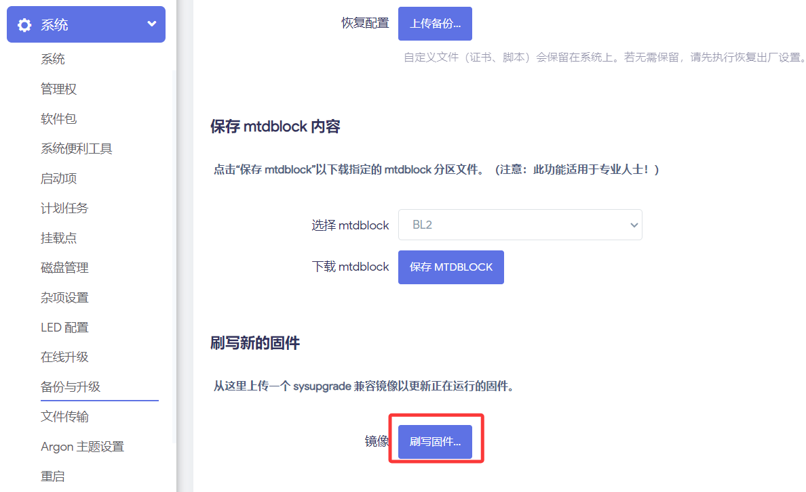

### EasePi R1

[EasePi](/zh/guide/easepi-r1/easepi.html) 是由易有云团队专为家庭智能网关、轻 NAS 设计的硬件产品系列。 
`EasePi-R1`配置丰富且易用的小主机，支持家庭网关、NAS、照片备份、家庭影院和数据备份等多种应用场景。
<!-- 淘宝链接：[`EasePi-R1`](https://item.taobao.com/item.htm?ft=t&id=851159153974) 指的是单盘位的多功能网关。 -->

视频介绍：[EasePi-R1 全新易用而又有趣的多功能主机](https://www.bilibili.com/video/BV1hoDUYdE3q/)

产品优势：[R1产品优势](/zh/guide/easepi-r1/advantage.html)

配置详情：[R1配置详情](/zh/guide/easepi-r1/hardware.html)

购买链接：[`EasePi-R1`](https://item.taobao.com/item.htm?ft=t&id=851159153974)

<video src="https://dl.istoreos.com/iStoreOS/easepi-r1/easepi-r1-3.mp4" width="600" height="400" controls autoplay muted>
浏览器不支持视频格式.
</video>

* [EasePi R1](https://doc.linkease.com/zh/guide/easepi-r1/)已经预装 iStoreOS 系统。
* [EasePi R1 使用文档](https://doc.linkease.com/zh/guide/easepi-r1/)

* 若是老版本的固件，可在首页在线**固件更新**。

* 手动升级请下载[最新固件](https://site.istoreos.com/firmware/download?devicename=easepi-r1&firmware=iStoreOS)；如果是全千兆网口版，请下载[千兆版最新固件](https://fw.koolcenter.com/iStoreOS/easepi-r1-lite/)。

