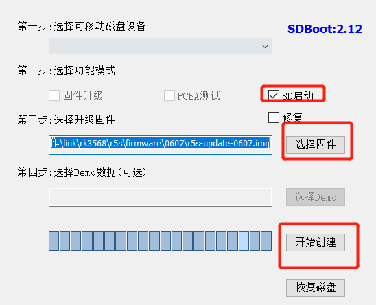
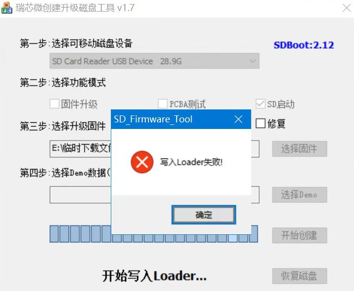

### R5S 设备

## 方法一：

* 同 R2s/R4s，用 rufus 写入固件到 TF 卡启动。必须下载 `r5s-sdcard-xxxx.img.gz` 这样格式的固件。

* 固件下载地址不一样，请从 [这里](https://fw.koolcenter.com/iStoreOS/r5s/)下载

## 方法二：

必须下载 `r5s-update-xxxx.img` 这样格式的固件。

用瑞芯威升级磁盘工具来刷写固件。工具很小，具体跟上面的方法一样，但是这个方法可以写入 eMMC 启动。

* 首先下载[瑞芯威升级磁盘工具](https://fw.koolcenter.com/iStoreOS/alpha/SDDiskTool_v1.7.zip)，解压并运行，如图所示：

1. 选择你的 TF 卡读卡器
2. 选择固件
3. 选择从 ”SD启动”

* 开始创建。如果创建提示错误，可以直接再重新创建一次，如图所示：

