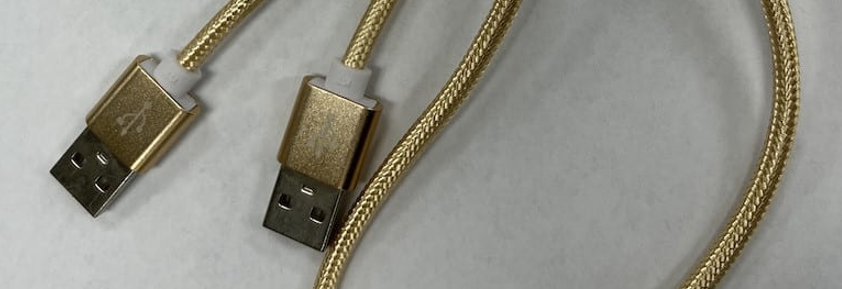
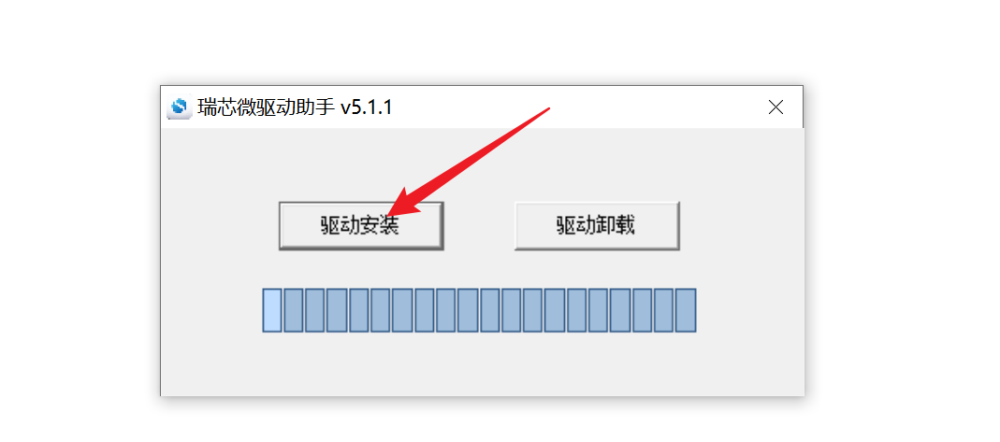
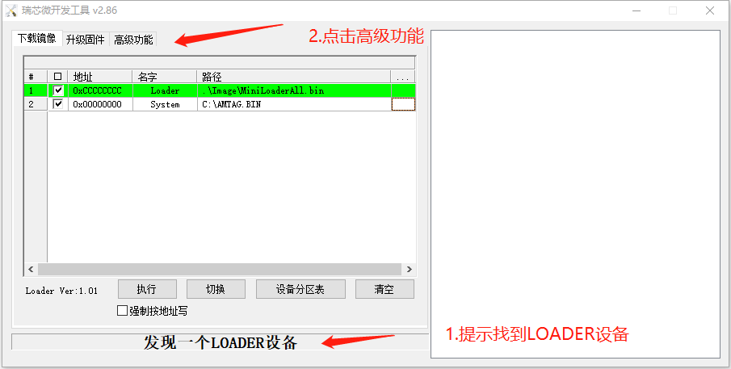
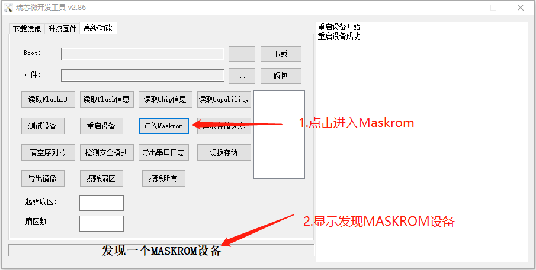
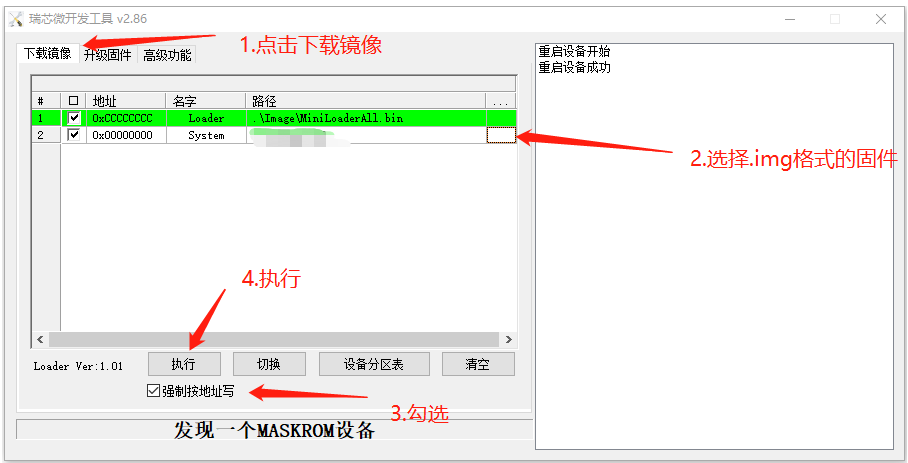

### R68S 设备

#### 安装驱动跟刷机软件

* 准备 USB 数据线

* 下载[DriverAssitant](https://fw.koolcenter.com/binary/other-tools/DriverAssitant_v5.1.1.zip) 并安装：

* 下载[刷机软件](https://fw.koolcenter.com/binary/other-tools/RKDevTool_Release_v2.86.zip)

#### 下载固件

* [下载固件](https://fw.koolcenter.com/iStoreOS/r68s/)

越前面版本越新，请注意看中间的日期，比如 istoreos-xxx-xxx20221123xx-r68s-xxx.img.gz，**下载以后需要解压**

**注意**：只有 USB 线刷才需要解压 `img.gz` 固件，以后在网页上升级固件的时候不需要解压。

#### 进入 Loader 模式

* 解压并运行 RKDevTool (瑞芯微开发工具) 
* 先断开电源适配器连接
* 双公头 USB 数据线一端连接 PC，一端连接 R68s 上印有 OTG 标志的USB 接口
* 按住设备上的 RECOVERY （恢复）键并保持不松开
* 接上电源
* 大约两秒钟后，松开 RECOVERY 键
* 如果瑞芯微开发工具中显示 “发现一个 Loader 设备”，说明已经成功进入刷机模式, 刷机模式应该只有绿灯长亮，如果蓝灯亮了，说明没有成功进入刷机模式。

#### 刷入固件
1. 进入到 Maskrom 模式
  
2. 加载固件并执行刷写
  

#### 进入后台管理

* 默认IP http://192.168.100.1
* 默认密码：password
* 如果只有一个网口，默认的网口是 LAN；如果大于一个网口，默认 eth0 是 WAN 口，其它都是 LAN
* 如果要修改 LAN 口 IP，首页有个内网设置，或者命令行用 quickstart 命令修改
* 必读一轮我们的 [FAQ](/zh/guide/istoreos/question.html)，以防后续出现问题知道如何解决！

#### 参考链接

* [电犀牛r68s线刷openwrt教程](https://supes.top/%E7%94%B5%E7%8A%80%E7%89%9Br68s%E7%BA%BF%E5%88%B7openwrt%E6%95%99%E7%A8%8B/)

