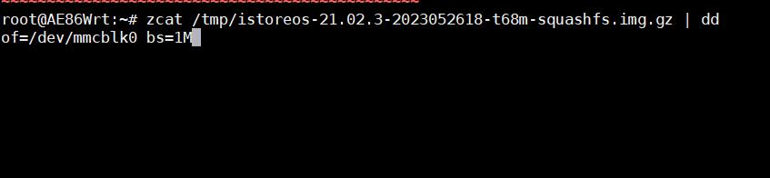

# Rockchip 通用刷入eMMC

## 1.准备工作
* 一台电脑(系统不限)
* 电脑上装有Xshell、MobaXterm等软件
* 适用于 rockchip 系列带有 eMMC 的机器，如电犀牛R68S、莱因特T68M等
* 目前 rockchip 机器能正常启动(无论是 TF 启动或者 eMMC 启动都可)

## 2.下载固件
根据具体机型的文档，下载 `.img.gz` 固件，下载后不需要解压。

## 3.登录到目前系统的SSH

教程以T68M为例：

* 首先登录到T68M的SSH后台；

* 把下载的固件 `istoreos-21.02.3-2023052618-t68m-squashfs.img.gz` 上传到路由器的 /tmp 目录或者 /root 目录，记得位置就成；

也可以用系统——文件传输功能，上传固件，那么固件位置就是：/tmp/upload/xxxxxxx.img.gz

* 在终端输入 `zcat 固件具体位置 | dd of=/dev/mmcblk0 bs=1M` 然后回车，等待完成。

比如我上传固件到 /tmp 下，那么命令：

 `zcat /tmp/istoreos-21.02.3-2023052618-t68m-squashfs.img.gz | dd of=/dev/mmcblk0 bs=1M` 
 
又比如我上传固件到 /tmp/upload/ 下，那么命令：

 `zcat /tmp/upload/istoreos-21.02.3-2023052618-t68m-squashfs.img.gz | dd of=/dev/mmcblk0 bs=1M` 

## 4.启动系统

等待终端执行完成，然后拔电再通电启动。

### 进入后台管理
* 默认IP http://192.168.100.1 或者 http://iStoreOS.lan/
* 默认密码：password
* 如果设备只有一个网口，则此网口就是 LAN；如果大于一个网口，默认第一个网口是 WAN 口，其它都是 LAN
* 如果要修改 LAN 口 IP，首页有个内网设置，或者用命令 quickstart 修改
* 必读一轮我们的 [FAQ](/zh/guide/istoreos/question.html)，后续出现问题知道如何解决！
