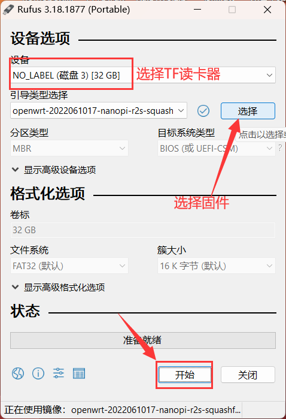

# Rockchip TF/SD 卡通用刷写教程

## 1.准备工作
* 一个 TF卡/SD卡
* 一个 USB 读卡器
* 一台 windows 电脑

## 2.下载固件
根据具体机型的文档，下载 `xxxx.img.gz` 固件，下载后不需要解压。

## 3.做启动盘

* 电脑上用 rufus 将固件写入 TF卡/SD卡

[Rufus下载](https://rufus.ie/zh/)

* 电脑插入U盘/读卡器，打开rufus工具，选择下载好的固件，把固件写入到TF卡/SD卡中

## 4.启动系统

将写入了固件的TF卡/SD卡插入到目标设备中，通电启动。

### 进入后台管理
* 默认IP http://192.168.100.1 或者 http://iStoreOS.lan/
* 默认密码：password
* 如果设备只有一个网口，则此网口就是 LAN；如果大于一个网口，默认第一个网口是 WAN 口，其它都是 LAN。
* 如果要修改 LAN 口 IP，首页有个内网设置，或者用命令 quickstart 修改。
* 必读一轮我们的 [FAQ](/zh/guide/istoreos/question.html)，后续出现问题知道如何解决！
