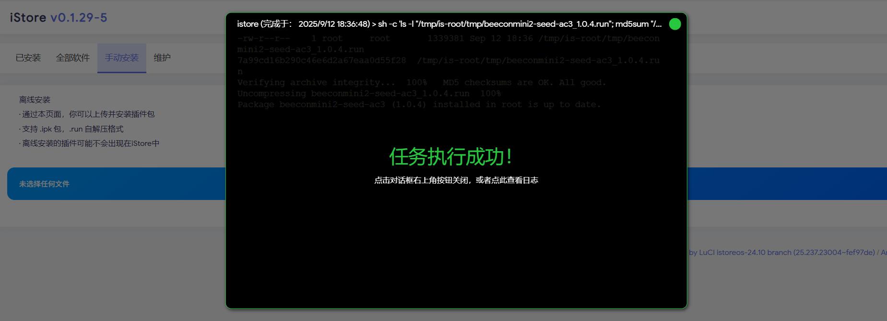
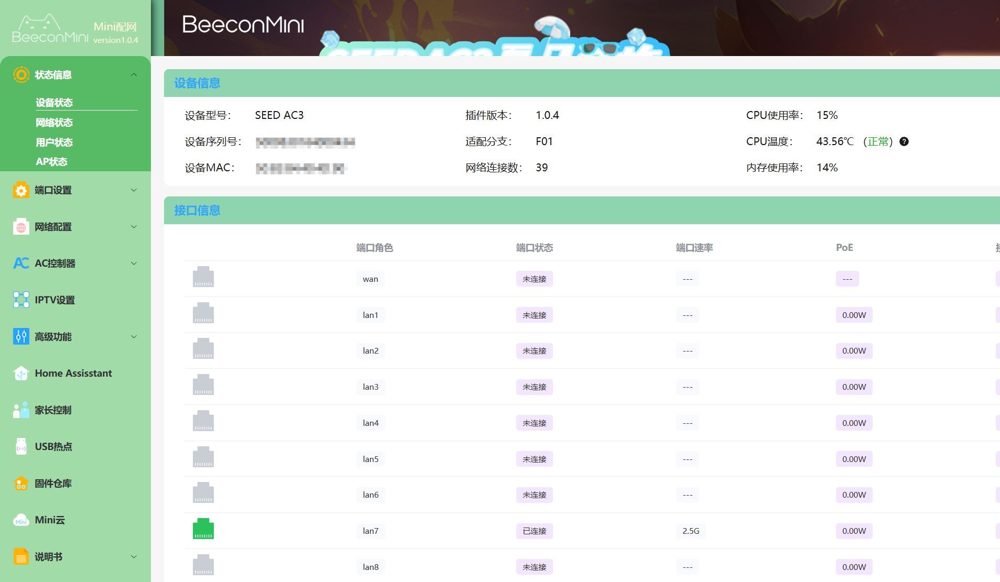
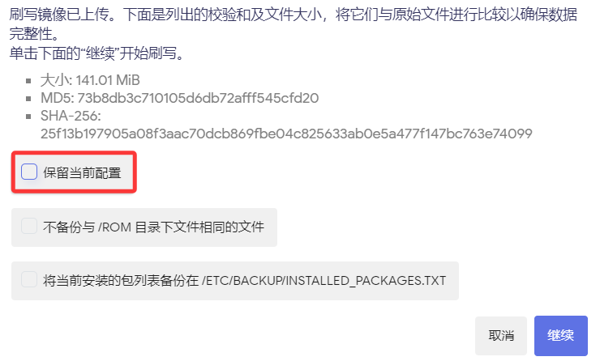

# BeeconMini SEED AC3 安装教程

**BeeconMini-配网中心火热公测中~ **
* [配网中心下载](https://fw.koolcenter.com/binary/BeeconMini-Soft/)
* 目前仅适配 SEED-AC3；AC1 和 AC2 适配、测试中;
* AC3 升级最新的 iStoreOS 固件；
* iStore 商店——手动安装，选择下载的 beeconmini-xxxxxx.run 完成安装。
* 目前为公测版、个别功能可能不完善，继续优化中......

## 1.下载固件

* [SEED AC3 固件下载](https://site.istoreos.com/firmware/download?devicename=seed-ac3&firmware=iStoreOS)

越前面版本越新，请注意看中间的日期，比如 istoreos-x.x.x-**2025071716**-ac3-squashfs-sysupgrade.bin。

## 2.刷机
* 默认 BMoS 系统 192.168.88.1 进入管理页面，「系统」—>「备份与升级」—>「刷写固件」，「浏览」选择 iStoreOS 固件，一定**取消「保留当前配置」**，下一步刷入即可。

* 刷回官方 BMoS 系统：在 iStoreOS 192.168.100.1 管理页面，「系统」—>「备份与升级」—>「刷写固件」，「浏览」选择官方 BMoS 固件，**取消「保留当前配置」**，下一步刷入即可。

## 3.注意
**不要混刷不同作者的固件**！以免出现问题或损坏硬件，[详情](https://github.com/istoreos/istoreos/issues/1012)