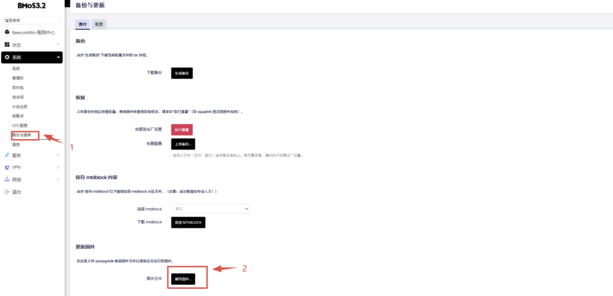
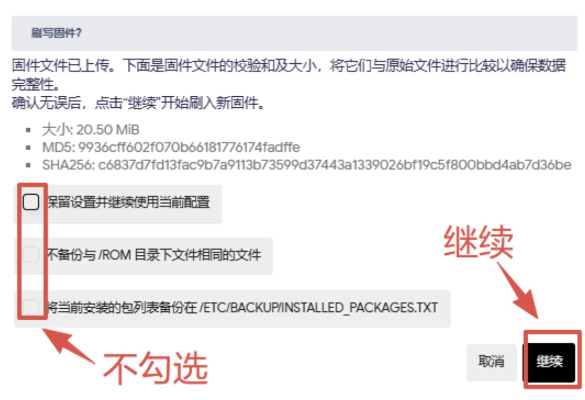
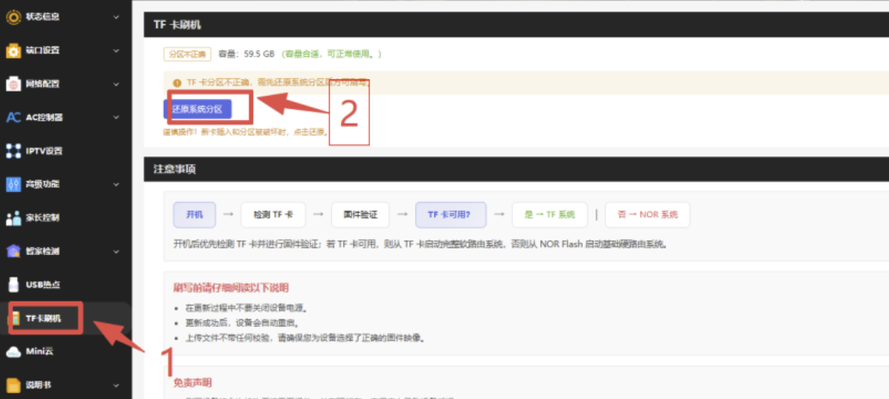
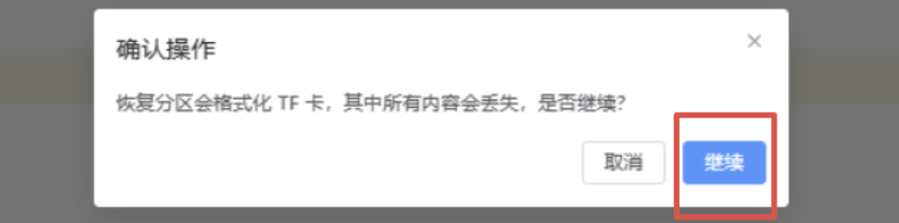
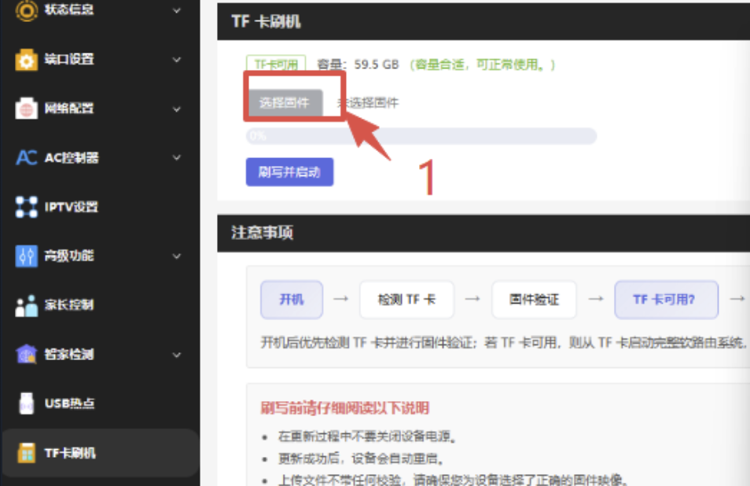

# BeeconMini SEED AC5S 安装教程

## 1.先刷官方 Nor flash 固件

* [AC5S Nor-flash-20260717 固件下载](https://fw0.koolcenter.com/iStoreOS/seed-ac5s/BMoS.NOR.SA5S.3.2.10-20260717.bin)

* 登录到 SEED AC 系统的 WEB 管理页面(192.168.88.1)；默认用户名：root 默认密码：password

* 「系统」—>「备份与升级」—>「刷写固件」，「浏览」选择 Nor-flash 固件，一定**取消「保留当前配置」**，下一步刷入即可。

* 注意观察SYS灯，刷写时候得SYS闪烁，由闪烁变为常亮即可刷新页面重新进入后台。

## 2.TF 卡刷 iStoreOS 固件

* [SEED AC5S 固件下载](https://site.istoreos.com/firmware/download?devicename=seed-ac5s&firmware=iStoreOS)

越前面版本越新，请注意看中间的日期，比如 istoreos-x.x.x-**2026071515**-ac5s-squashfs-sysupgrade.bin。

* 断电关机插入TF卡后，上电启机后 192.168.88.1 进入系统——>配网中心——>TF卡刷机

1.先点击还原系统分区 ，格式化 TF 卡完成；

2.TF卡刷机——>选择固件——>iStoreOS——>刷写并启动——>确认

## 3.注意

**不要混刷不同作者的固件**！以免出现问题或损坏硬件，[详情](https://github.com/istoreos/istoreos/issues/1012)
