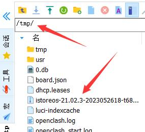
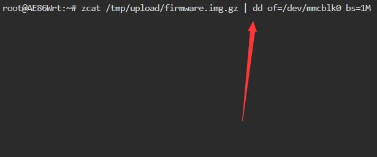

# 系统内刷机教程

* 此教程用于在正常运行系统中将标准 OpenWRT/iStoreOS 格式固件刷写到 eMMC 上。

* 适用的机器，如：莱因特T68M、电犀牛R68S等。

## 1.准备工作
* 一台电脑，浏览器；
* 目前机器能正常启动，且能打开后台页面（无论是 TF 启动或者 eMMC 启动都可）。

## 2.下载固件
根据具体机型的文档，下载 `.img.gz` 固件，下载后不需要解压。

## 3.登录到后台刷机

1. 将下载到的固件重命名成`firmware.img.gz`；
2. 登录到设备的后台页面；
3. 转到"系统-文件传输"页面，上传固件；
  
4. 转到“首页”，点击“终端”，在弹出的终端窗口登录，用户名是`root`，密码与登录后台时一样。
5. 在终端输入 `zcat /tmp/upload/firmware.img.gz | dd of=/dev/mmcblk0 bs=1M` 然后回车，等待完成。
  

## 4.启动系统

等待终端执行完成，然后拔电再通电启动。

### 进入后台管理
* 默认IP http://192.168.100.1 或者 http://iStoreOS.lan/
* 默认密码：password
* 如果设备只有一个网口，则此网口就是 LAN；如果大于一个网口，默认第一个网口是 WAN 口，其它都是 LAN 。
* 如果要修改 LAN 口 IP，首页有个内网设置，或者用命令 quickstart 修改。
* 必读一轮我们的 [FAQ](/zh/guide/istoreos/question.html)，后续出现问题知道如何解决！
