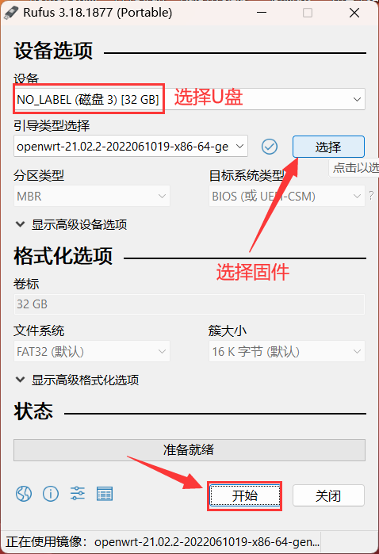

### x86 物理机

* x86物理机，范围很广，可以是各种"电脑"，或者J4125/N5105等小主机。

* 这里介绍x86实机安装iStoreOS固件。

## 1.视频介绍

<iframe src="//player.bilibili.com/player.html?aid=811882019&bvid=BV1p34y1j7Jw&cid=729311389&page=1" scrolling="no" border="0" frameborder="no" framespacing="0" allowfullscreen="true"> </iframe>

## 2.准备工作

* 一个 U盘
* 一个显示器
* 一个键盘
* 一台 windows 电脑

## 3.下载固件

* [固件下载](https://fw.koolcenter.com/iStoreOS/x86_64/)
* [固件下载-EFI](https://fw.koolcenter.com/iStoreOS/x86_64_efi/)

越前面版本越新，请注意看中间的日期，比如 xxx20221123xx-xxx.img.gz。下载完成之后不需要解压。

## 4.做启动盘

* 电脑上用 rufus 做 USB 启动盘 

[Rufus下载](https://rufus.ie/zh/)

* 电脑插入U盘，打开rufus工具，选择下载好的固件，把固件写入到U盘

* 把 U盘/键盘/显示器 接入X86机器

选择从U盘启动，一般按 F11 (x86机器太多，范围太广，可能不一定所有的机器都是F11快捷启动，具体自行查看)，选择接入的U盘，就可以启动。

如果找不到U盘，那么可能你的U盘不兼容，需要换一个U盘。

* 把固件从U盘安装到系统

登录U盘系统，登录成功之后，输入：

`quickstart` (或者 qu + tab 自动补全)

选择 Install X86，一直按确定，就行了。具体如下图所示：

* 用 `Show Interfaces` 查看网线插入到了哪个网口，以及查看当前LAN口的IP

## 5.启动系统

系统写入完成后，拔掉外接设备(U盘/键盘等)，通电启动。

### 进入后台管理

* 默认IP http://192.168.100.1
* 默认密码：password
* 如果只有一个网口，默认的网口是 LAN；如果大于一个网口，默认 eth0 是 WAN 口，其它都是 LAN
* 如果要修改 LAN 口 IP，首页有个内网设置，或者命令行用 quickstart 命令修改
* 必读一轮我们的 [FAQ](/zh/guide/istoreos/question.html)，后续出现问题知道如何解决！
