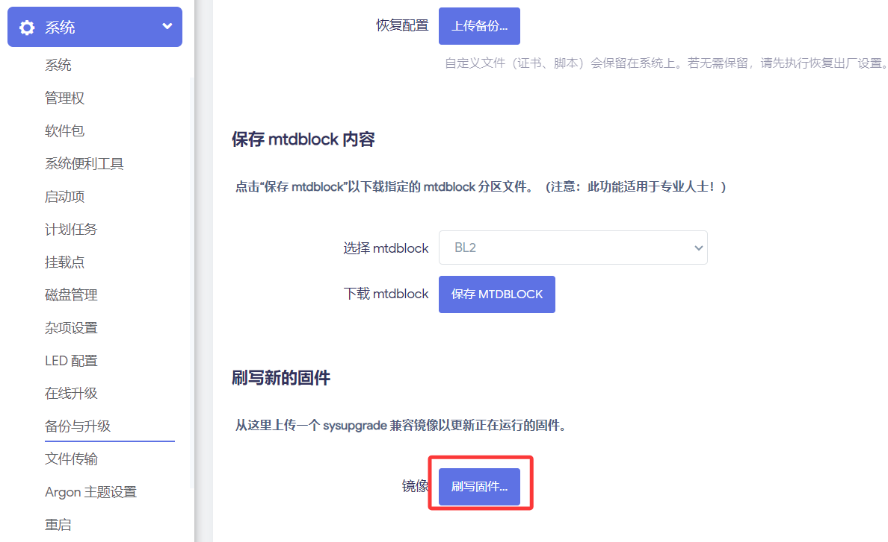

# ZX3000 安装教程

## 1.下载固件

* [ZX3000 固件下载](https://site.istoreos.com/firmware/download?devicename=zx3000&firmware=iStoreOS)

越前面版本越新，请注意看中间的日期，比如 istoreos-x.x.x-sysupgrade-**2025071614**.bin。

## 2.刷机
* 手动升级：「系统」—>「备份与升级」—>「刷写固件」，「浏览」选择新固件。

## 3.注意
**不要混刷不同作者的固件**！以免出现问题或损坏硬件，[详情](https://github.com/istoreos/istoreos/issues/1012)