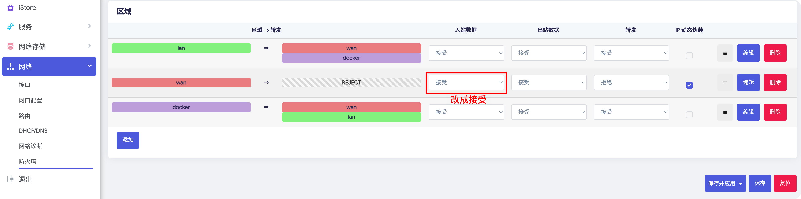

按照[设备联网](/zh/guide/istoreos/network/wired_connection.html)接线后，通过手机扫描或上级路由快速获取设备IP访问管理后台。

默认用户名：**root**
密码：**password**

## 主路由

- 有线连接访问

电脑用网线连接LAN口，浏览器上直接访问IP地址 **192.168.100.1** 即可访问管理后台。

- 无线连接访问

手机或电脑连接Wi-Fi后，局域网内浏览器上直接访问IP地址 **192.168.100.1** 即可访问管理后台。

## 旁路由

- 获取设备IP

通过上级路由器后台获取iStoreOS设备局域网IP地址，局域网内浏览器上直接访问即可访问管理后台。

- 配置为旁路由模式

## 纯主机

通过上级路由器后台获取设备局域网IP地址，局域网内浏览器上直接访问即可访问管理后台。

## 无法访问的解决办法

如何你已经拿到了设备的局域网IP，但是浏览器输入后无法访问，可能是以下情况：

- WAN口防火墙入站数据改成接受

 

