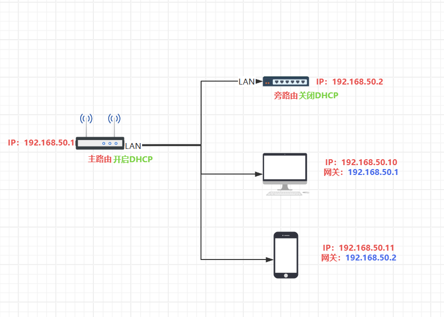
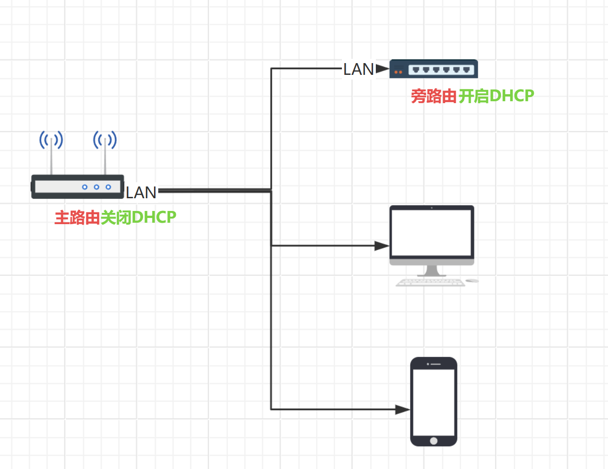
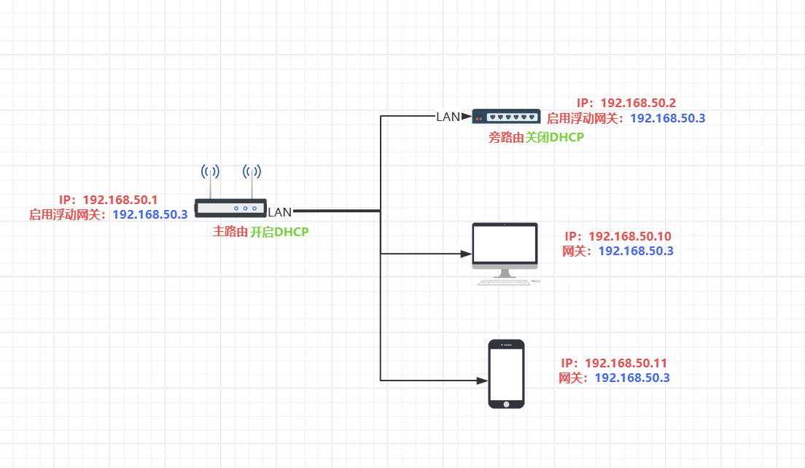

## 如何更好地使用旁路由

## 静态IP方案

<iframe src="//player.bilibili.com/player.html?isOutside=true&aid=115230466246919&bvid=BV18zW3zfEhn&cid=32488097556&p=1&autoplay=0" scrolling="no" border="0" frameborder="no" framespacing="0" allowfullscreen="true"></iframe>

## 旁路由DHCP方案

<iframe src="//player.bilibili.com/player.html?isOutside=true&aid=115191022878789&bvid=BV1wtp3zVEWM&cid=32334743615&p=1&autoplay=0" scrolling="no" border="0" frameborder="no" framespacing="0" allowfullscreen="true"></iframe>

## 浮动网关(华硕)

## 浮动网关(iStoreOS)

## 浮动网关(iStoreOS分身)

