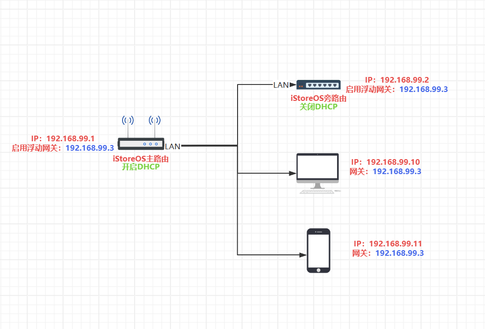
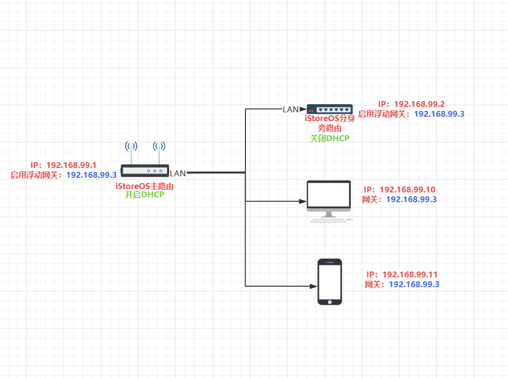

## 如何更好地使用旁路由

* 旁路由（也称为辅助路由或旁路网关）是网络中的一种特殊配置，通常用于在不改变主网络结构的情况下，提供额外的网络功能或优化流量。

* 通常是在主路由器上接入一台额外的路由设备（如运行iStoreOS或OpenWrt系统的设备），通过LAN口连接主路由，分担特定网络任务，而不直接连接互联网，从而扩展主路由功能而不影响其稳定性。

* 旁路由通过网关设置实现数据流控制，无需修改网络拓扑或IP地址；支持手动指定IP或DHCP分配等。

| 主旁方案 | 主路由 | 旁路由 | 优点 |
|:-:|:-:|:-:|:-:|
|[手动静态IP](https://mp.weixin.qq.com/s/10qixmNu0P88H3L1UN7c6g)|任何路由器|iStoreOS设备|最简单、最易上手、适合新手|
|[旁路由DHCP](https://mp.weixin.qq.com/s/vCwXLALzEce4atWRY8ooRQ)|任何路由器|iStoreOS设备|适应性最广、管理方便|
|[华硕浮动网关](https://mp.weixin.qq.com/s/RV0_PWIPhrw4E4LJBoG0Wg)|华硕ASUSGO固件|iStoreOS设备|华硕路由最佳旁路、自动切换|
|iStoreOS浮动网关|iStoreOS设备|iStoreOS设备|iStoreOS最佳旁路、自动切换|

***

## 手动静态IP方案

<iframe src="//player.bilibili.com/player.html?isOutside=true&aid=115230466246919&bvid=BV18zW3zfEhn&cid=32488097556&p=1&autoplay=0" scrolling="no" border="0" frameborder="no" framespacing="0" allowfullscreen="true"></iframe>

* 主路由：任何路由器，默认开启DHCP，不需要其他任何设置；
* 旁路由：搭载iStoreOS的设备，关闭DHCP；
* 连接：旁路由LAN口连接主路由LAN口；
* 局域网内设备：手动为设备分配静态IP，网关/DNS设为旁路由IP。
* 刷入ASUSGO梅林改版固件102.4及以上版本固件的设备（BE88U、BE86U、AX88U-Pro、AX86U-Pro等），和ROG魔盒最新官改固件；通过加强版“手动指定功能”，直接为局域网内的设备指定网关/DNS为旁路由IP。
* #### 具体文字教程——>>[最简单的旁路由配置——手动静态IP](https://mp.weixin.qq.com/s/10qixmNu0P88H3L1UN7c6g)

***

## 旁路由DHCP方案

<iframe src="//player.bilibili.com/player.html?isOutside=true&aid=115191022878789&bvid=BV1wtp3zVEWM&cid=32334743615&p=1&autoplay=0" scrolling="no" border="0" frameborder="no" framespacing="0" allowfullscreen="true"></iframe>

* 主路由：任何路由器，默认关闭DHCP，网关设为旁路由IP；
* 旁路由：搭载iStoreOS的设备，开启DHCP，全面接管局域网；
* 连接：旁路由LAN口连接主路由LAN口；
* 局域网内设备：通过iStoreOS旁路由上的“局域网设备管理”为设备自由分配网关为主/旁路由。
* #### 具体文字教程——>>[旁路由开启DHCP最佳方案解析！](https://mp.weixin.qq.com/s/vCwXLALzEce4atWRY8ooRQ)

***

## (华硕)浮动网关方案

<iframe src="//player.bilibili.com/player.html?isOutside=true&aid=115253132200691&bvid=BV1dQJkzjE3E&cid=32578078796&p=1&autoplay=0" scrolling="no" border="0" frameborder="no" framespacing="0" allowfullscreen="true"></iframe>

* 主路由：刷入ASUSGO改版固件的华硕路由器，默认开启DHCP，安装「浮动网关」软件；
* 旁路由：搭载iStoreOS的设备，关闭DHCP，安装「浮动网关」软件；
* 连接：旁路由LAN口连接主路由LAN口；
* 局域网内设备：手动为设备分配静态IP，网关/DNS设为浮动网关IP。
* 刷入ASUSGO梅林改版固件102.4及以上版本固件的设备（BE88U、BE86U、AX88U-Pro、AX86U-Pro等），和ROG魔盒最新官改固件；通过加强版“手动指定功能”，直接为局域网内的设备指定网关/DNS为浮动网关IP。
* #### 具体文字教程——>>[华硕路由器最稳妥、最智能的旁路由方案——浮动网关！](https://mp.weixin.qq.com/s/RV0_PWIPhrw4E4LJBoG0Wg)

***

## (iStoreOS)浮动网关方案

* 主路由：搭载iStoreOS的设备，默认开启DHCP，安装「浮动网关」软件；
* 旁路由：搭载iStoreOS的设备，关闭DHCP，安装「浮动网关」软件；
* 连接：旁路由LAN口连接主路由LAN口；
* 局域网内设备：通过iStoreOS主路由上的“局域网设备管理”为设备自由分配网关为主/旁路由/浮动网关IP。

***

## (iStoreOS分身)浮动网关方案

* 主路由：搭载iStoreOS的设备，默认开启DHCP，安装「浮动网关」软件；
* 旁路由：在主路由上安装「iStore分身」并启用，关闭DHCP，安装「浮动网关」软件；
* 连接：iStoreOS分身是在主路由上的「虚拟系统」，不需要实际连线；
* 局域网内设备：通过iStoreOS主路由上的“局域网设备管理”为设备自由分配网关为主/旁路由/浮动网关IP。
