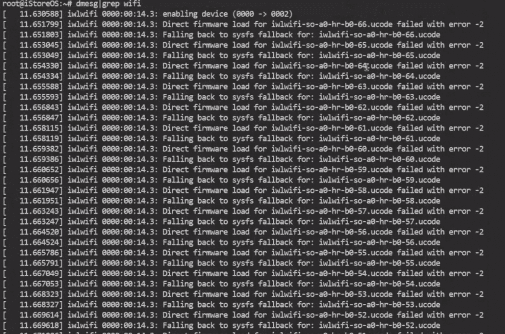
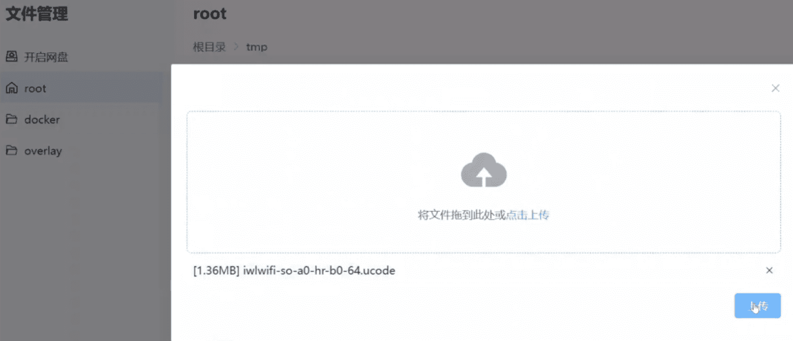
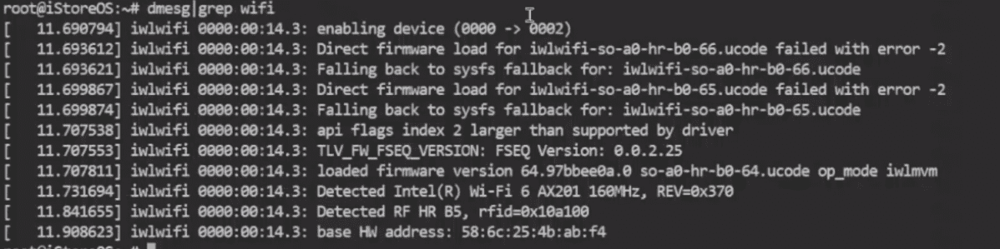
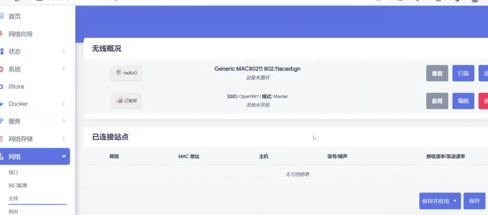

## iStoreOS 支持的无线

iStoreOS 继承了很多无线驱动，如果大家发现有些新的驱动无法支持，  
可以反馈到：[问题反馈](https://github.com/istoreos/istoreos/issues)。反馈问题信息请提供多一些，可以参考这个：[R4SE有什么办法驱动CF-811AC呢
](https://github.com/istoreos/istoreos/issues/1037)

这些是我们已知的，但不局限于这些的无线驱动：

* RTL8812AU/RTL8821AU
* RTL8822BU/RTL8822CU
* RTL8821CU，RTL8723DU
* AX201/AX210 等，但 Intel 无线网卡只能做客户端
* 推荐 MT7915/MT7916/MT7921 等

## 集成的内核模块

如何知道自己的无线是否有驱动？最简单是用 lsmod 命令，去查看有没有相关的驱动。比如目前我们已经集成了下面这些驱动：

  - kmod-mt76x0u
  - kmod-mt76x2u
  - kmod-mt7663u
  - kmod-mt7663-firmware-ap
  - kmod-mt7921u
  - kmod-mt7921-firmware
  - kmod-rtl8192cu
  - kmod-rtl8812au-ct
  - kmod-rtl8xxxu

## 定位某网友说的 AX201 无线驱动失败的问题

具体过程可以参考视频：

<iframe src="//player.bilibili.com/player.html?aid=281090593&bvid=BV1bc41167HY&cid=1336374963&p=1" scrolling="no" border="0" frameborder="no" framespacing="0" allowfullscreen="true"> </iframe>

## AX201 驱动失败之后，我们先看内核日志

从首页，终端，就可以直接输入命令：
```
dmesg|grep -i wifi
```

具体错误

## 从错误可知道少了一个文件

搜索到这个文件，并下载好，从首页就可以上传，上传到 /tmp 文件夹：


## 复制到对应的驱动文件夹去


## 再次查看内核日志，没有之前的报错



## 从网络，无线里面去进一步设置无线信息




