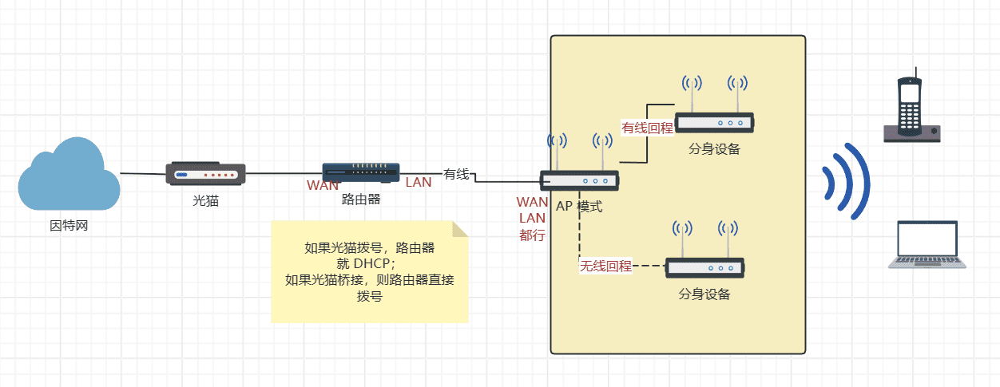
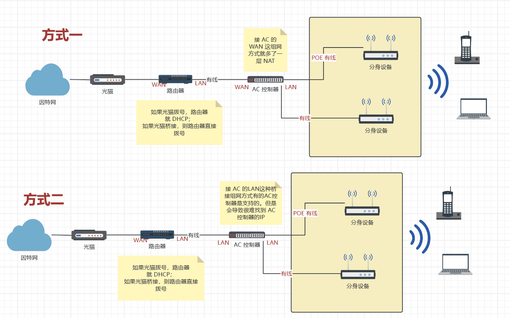
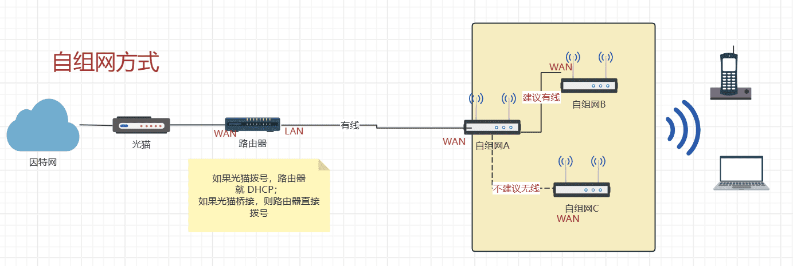

# 软路由跟无线 Mesh 路由器的组网方式参考

视频教程参考：

<iframe src="//player.bilibili.com/player.html?aid=450474903&bvid=BV1Lj411Y7Dp&cid=1319318338&p=1" scrolling="no" border="0" frameborder="no" framespacing="0" allowfullscreen="true"> </iframe>

## 软路由跟 Orbi 或者 AiMesh 等让主机做 AP 模式的组网方式

核心是把主机做成 AP 模式，可以减少一层 NAT，让 AP 下面的设备跟软路由一个网段，从而可以在流量控制里面看到所有的手机电脑设备。

## 软路由跟 AC/AP 的组网方式

让 AC 作为网关肯定没问题，但是这样就多一层 NAT。也就是软路由里面无法看到 AC 下面的 AP，以及连接 AP 的手机或者电脑。

让 AC 做桥接模式（连接 AC 的LAN，关闭 AC 的DHCP）。这种部分 AC 可能不支持，需要自己单独测试，特别要测试下漫游再使用。

## 自组网方式，参考 Seed One 的自组网路由

只要把设备接入，无线设置自动有主和从，只需要配置任意一台设备就可以。

因为视频里面没有说到 SSID 如何修改，这里做个补充：

用电脑或者手机连接到 Seed One 的无线，在浏览器输入IP：http://10.14.16.18
上面这个 IP 是固定的，不管你自己设置的内网 IP 是什么，都可以输入上面的IP 进行访问。
然后就可以修改 SSID 跟密码了。建议把 5G 跟 2.4G 无线分开。

