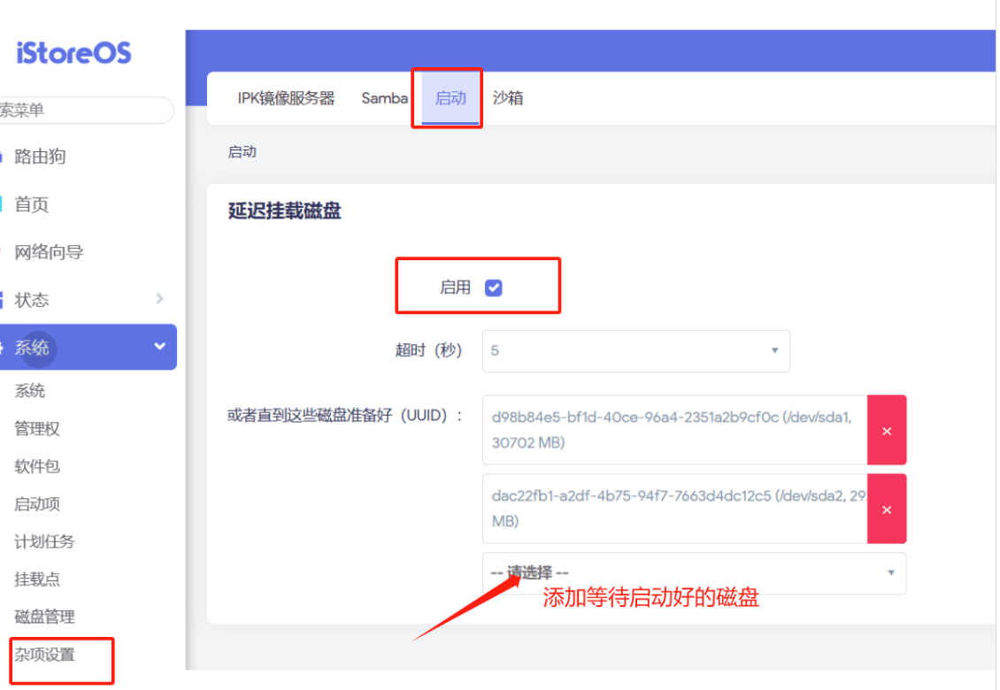

iStoreOS 很多的插件都是基于 Docker 开发的，因为对 Docker 的不理解，导致安装 Docker 插件出问题之后不知所措。  
Docker 可以简单理解为跟 iStoreOS 共用系统内核，共享系统硬件的“虚拟机”。所以它的性能无限接近真实的宿主主机（也就是 iStoreOS）。

## Docker 核心逻辑

* Docker 的“虚拟机 ”系统，也叫“镜像”需要通过网络下载到本地
* Docker 镜像下载很慢，所以有了多个 Mirror 地址，也可以称之为镜像源
* Docker 镜像一直有人更新维护，所以它也有版本号，最新的也就是 latest
* Docker 镜像安装的时候，需要配置很多参数，比如存储路径，网络，DNS 等等。（iStoreOS Docker 插件自动做了这些配置，不需担心）
* Docker 镜像安装完成之后，相当于跑了一个新的用户态系统，也称之为容器实例
* 因为有版本的存在，有时候从镜像源下载到的镜像，它可能不是最新版本的，这个时候可以选择指定版本来下载（参考网心云镜像选择）
* 如果不知道版本号，也可以强制使用特定的镜像源的最新版本（参考网心云镜像选择）

## 网络超时，网络下载太慢


换镜像源，或者升级自己的网络。

## 更新 lastest，竟然还是旧的版本。或者安装到错误的版本

可以指定从官方镜像源下载，或者指定最新的版本号下载镜像，或者在Docker配置页面删掉“注册表镜像”（其实就是镜像仓库的 Mirror）

## Docker 把系统盘整满了，导致其它配置保存错误

必须把 Docker 迁移到 EXT4 文件系统的非系统盘上

## Docker 启动的时候，磁盘还没挂载好

可以到杂项设置，设置等待磁盘挂载好！如图所示：


## 其它奇怪的问题

其它奇怪的问题，比如：
```
docker: Error response from daemon: failed to update store for object type *libnetwork.endpointCnt: Key not found in store.
```

可以考虑到 iStoreOS 首页，停止 Docker 服务，然后再重新启用一次。

## 网心云镜像选择参考

