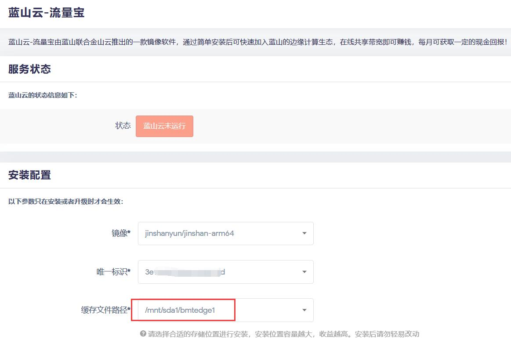
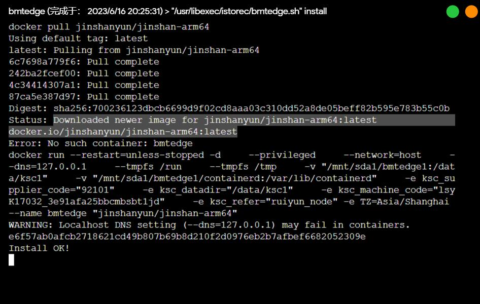
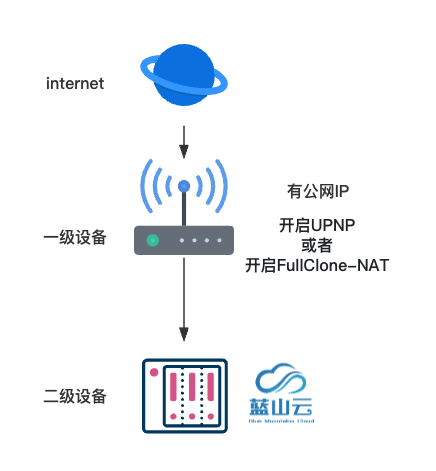
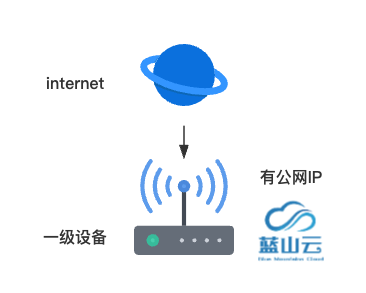
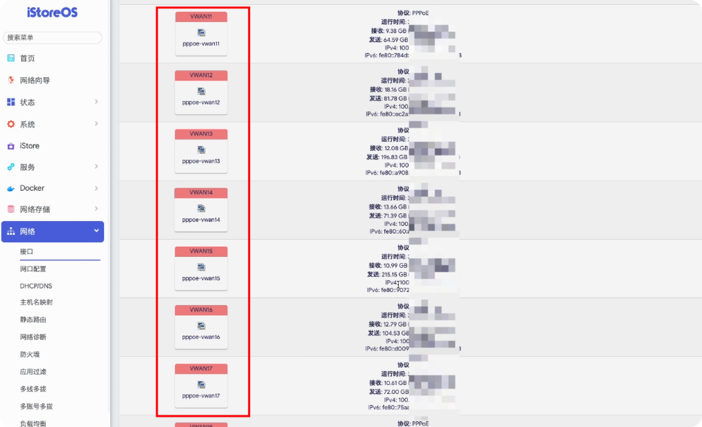

### 蓝山云

注意：此教程仅适用于iStoreOS系统，请先安装[iStoreOS系统](/zh/guide/istoreos/README.md)。

「蓝山云 - 流量宝」由蓝山联合头部云厂商推出的一款镜像软件，通过简单安装后可快速加入蓝山的边缘计算生态，在线共享带宽即可赚钱，每月可获取一定的现金收益回报。了解更多，请登录[蓝山云官网](https://www.bmtcloud.com.cn/)。

如果安装出问题，请查看[Docker FAQ](/zh/guide/istoreos/question.html#docker-%E7%9B%B8%E5%85%B3)。首页找到并加入我们的[QQ频道](https://pd.qq.com/s/7w59c4lvn)，也可以相互探讨安装过程的问题。

### 使用前必读

1. iStoreOS 不会承诺能给用户带来任何收益
2. iStoreOS 也不会在后台主动上传用户的任何流量或者数据
3. 软件中心的插件都需要用户主动安装，并且自己对插件的风险负责
4. 蓝山云插件为蓝山云相关团队开发，并且代码开源在：[开源代码](https://github.com/linkease/openwrt-app-actions/tree/main/applications/luci-app-bmtedge)


**1.安装蓝山云，点击左侧“iStore“，商店中搜索 “蓝山云”，选择“安装”，等待安装完成。**


**2.蓝山云安装完成后，即可在iStore应用商店的已安装类别里看到蓝山云应用，点击打开，打开后可在“服务”中，查看到蓝山云软件，如下图所示：**


**3.打开蓝山云界面后，如下所示，需要先选择需要用到的存储路径，因为存储大小和收益强相关，建议分配较大存储；最后点击“安装”，安装蓝山云容器。**

* 如果存储路径没有可选项，需要先格式化磁盘，并在系统中挂载磁盘。



* 耐心等待一段时间，下载需要用到的容器镜像，当出现Status: Downloaded newer image for jinshanyun/jinshan-arm64:latest
docker.io/jinshanyun/jinshan-arm64:latest这样的日志时，说明安装完成，如下图所示，可以关闭跳出的窗口。



**4.关闭跳出窗口后，界面会回到蓝山云的界面如下，点击如下图中的“点击查看二维码”后，会进入蓝山云的绑定二维码，然后微信查找“蓝山云”小程序，注册并登录，首页扫描此二维码绑定。（请务必前往绑定设备，否则无法获得收益）**


**5.绑定设备。**

注意：绑定设备是获取收益的必须操作，请务必绑定！

1）微信“蓝山云”小程序，扫描二维码;


```
业务版本：D业务
备注：随意名字，若有多台机器，建议区分
地域：自家宽带所在地区
运营商：自家宽带运营商(目前支持电信、移动、联通)
```


```
来源：如果是arm64设备，选盒子；如果是x86_64设备，选X86服务器
```
2）绑定成功后，即可在蓝山云小程序首页查看收益。

### 蓝山云 iStoreOS 注意事项

如果是 iStoreOS  的蓝山云离线没有收益的问题，那么解决办法是：
1. 停止镜像，重新启动镜像，那么会自动更新到最新的 Docker 镜像
2. 如果更新不了，那么就手动自定义镜像，名字：jinshanyun/jinshan-x86_64:v1.1
3. 以上操作要等 10 多分钟。如果还没生效，则继续
4. 停止镜像，删除文件路径的文件夹，并自定义一个新的 id
5. 重新绑定新的ID，并选择用 D 业务，并用”盒子“这个选项
6. 补充，如果是 arm64 则镜像地址是：jinshanyun/jinshan-arm64:v2.1

### 如何增加收益？

跑蓝山云的时候，可以通过以下方式来提高收益。

- 第一种情况：
如果你运行蓝山云的设备是一个二级设备，并且你的上一级设备是有公网IP的，那么我们建议你在上级设备直接开启UPNP，或者你也可以开启FullClone-NAT。



- 第二种情况：如果你运行蓝山云的设备是一级路由并且有公网IP，那么你就不需要做额外太多的配置。



### 建议使用多拨插件，对蓝山云多开

如果还你还要继续增加收益的话，比如说你有多个公网IP，我们建议就是每个公网IP都独立跑一个蓝山云，或者你可以用我们新开发的这个多播插件，这个多播插件可以很方便的让你有多个账号，每个账号可以独立的进行多播。




然后再通过我们这个[jinshanbatch工具（开发中）]()，它可以自动根据你的接口的多少，来自动来给每个接口都独立创建一个蓝山云的容器，这样原本系统里面的蓝山云容器就可以关闭掉，也就是通过这个插件来跑，这个工具现在是没有相关的UI界面的，如果你们有相关需求的话可以来到我们相关的群来咨询，我们也会提供更多相关这个工具的文档。

如果发现还有别的问题，建议大家来蓝山云客服群咨询他们。

### 如何进群

大家可以加他们的售后微信，私信下客服，让他把你们拉到相应的用户群里面去。


参考视频教程：  

<a href="https://www.bilibili.com/video/BV1ij411B7r7/?spm_id_from=333.999.0.0&vd_source=8e363fb838693d4a1c274983edfd43fc" target="_blank">蓝山云注意事项，离线/多开/多拨等</a>  

<iframe src="//www.bilibili.com/blackboard/html5mobileplayer.html?aid=447326734&bvid=BV1ij411B7r7&cid=1235223709&page=1&fjw=0&danmaku=0" scrolling="no" border="0" frameborder="no" framespacing="0" allowfullscreen="true"></iframe>