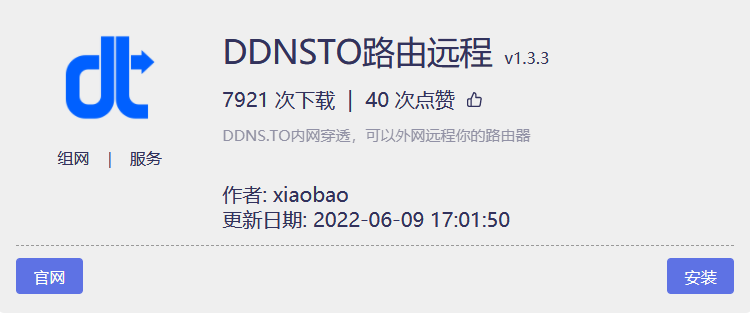

### DDNSTO远程穿透

* 首先在iStore应用商店中安装DDNSTO：

* 按照[DDNSTO获取Token](https://doc.linkease.com/zh/guide/ddnsto/koolshare_merlin.html#获取token)；

* 回到插件，填入Token，并启动ddnsto；

* 然后[设置穿透](https://doc.linkease.com/zh/guide/ddnsto/koolshare_merlin.html#穿透设置)，配置完成即可。

* 当然DDNSTO还有更多很好玩的教程。[DDNSTO玩转远程应用中心](https://doc.linkease.com/zh/guide/ddnsto/cloudapp.html)及[更多玩法](https://doc.linkease.com/zh/guide/ddnsto/scene.html)。

