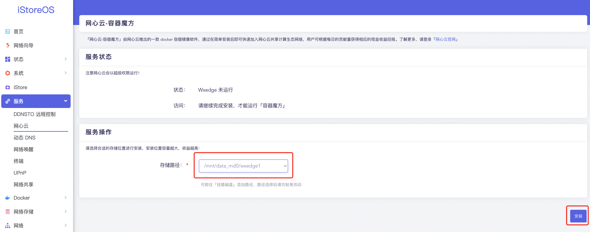
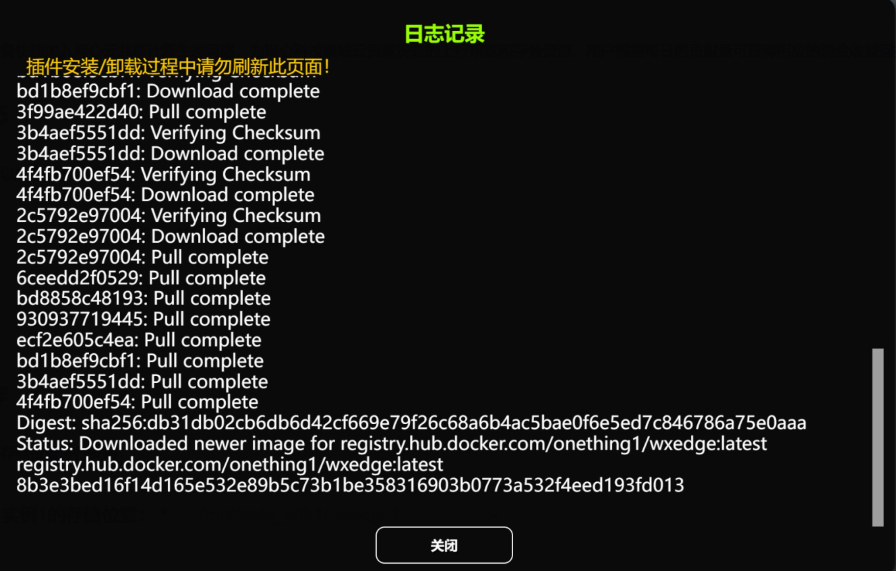
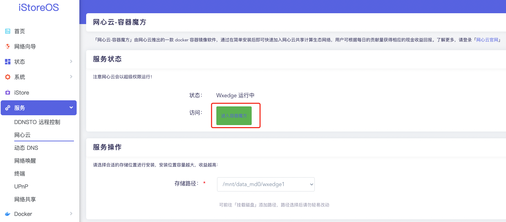

### 网心云

注意：此教程仅适用于iStoreOS系统，请先安装[iStoreOS系统](/zh/guide/istoreos/README.md)。

「网心云-容器魔方」由网心云推出的一款 docker 容器镜像软件，通过在简单安装后即可快速加入网心云共享计算生态网络，用户可根据每日的贡献量获得相应的现金收益回报。了解更多，请登录[网心云官网](https://www.onethingcloud.com/)。

如果安装出问题，请查看[Docker FAQ](/zh/guide/istoreos/question.html#docker-%E7%9B%B8%E5%85%B3)。首页找到并加入我们的QQ频道，也可以相互探讨安装过程的问题。

视频教程：
<iframe src="//player.bilibili.com/player.html?aid=258564653&bvid=BV1ya411S7J1&cid=778736680&page=1" scrolling="no" border="0" frameborder="no" framespacing="0" allowfullscreen="true"> </iframe>

**1.安装网心云，点击左侧“iStore“，商店中搜索 “网心云”，选择“安装”，等待安装完成。**

**2.网心云安装完成后，即可在iStore应用商店的已安装类别里看到网心云应用，点击打开，打开后可在“服务”中，查看到网心云软件，如下图所示：**

**3.打开网心云界面后，如下所示，需要先选择需要用到的存储路径，因为存储大小和收益强相关，建议分配较大存储；最后点击“安装”，安装网心云容器。**

* 如果存储路径没有可选项，需要先格式化磁盘，并在系统中挂载磁盘。

* 耐心等待一段时间，下载需要用到的容器镜像，当出现Status: Downloaded newer image for registry.hub.docker.com/onething1/wxedge:latest这样的日志时，说明安装完成，如下图所示，可以关闭跳出的窗口。

**4.关闭跳出窗口后，界面会回到网心云的界面如下，点击如下图中的“进入容器魔方”后，会进入网心云容器魔方的管理界面（请务必前往绑定设备，否则无法获得收益）**

* 容器魔方的管理界面如下图所示：

**5.绑定设备。**

注意：绑定设备是获取收益的必须操作，请务必绑定！

1）扫描容器魔方管理界面中的二维码，下载网心云APP;

2）绑定设备： 打开网心云APP点击【右上角“+”-扫一扫】再次扫描上图中的二维码，可将设备绑定到网心云APP。  

至此，绑定成功，可通过网心云APP时时看收益。