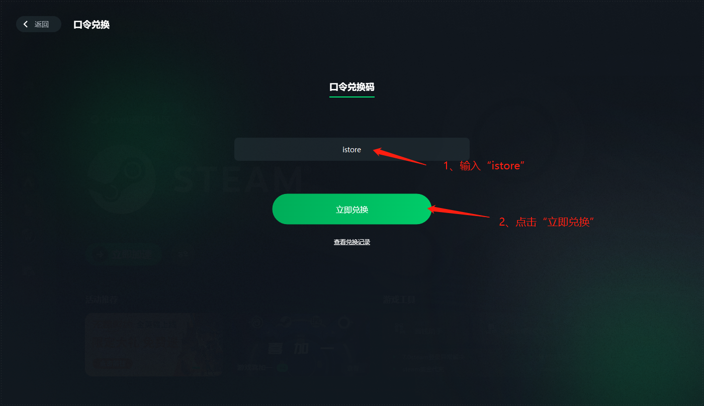
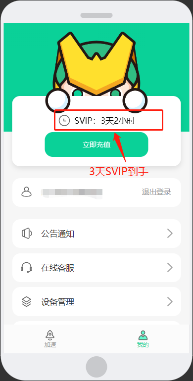

## 迅游加速器
注意：此教程仅适用于iStoreOS系统，请先安装[iStoreOS系统](https://doc.linkease.com/zh/guide/istoreos/)。  
迅游是一款小巧且功能强大的网游加速器，迅游所采用的第五代网游加速技术能更有效地为您解决网游卡机、掉线、延时高、登录难等问题。更多信息请[访问官网](https://www.xunyou.com/)
#### 1.安装迅游加速器，点击左侧“iStore”，商店中搜索 “迅游”，选择“安装”，等待安装完成。

#### 2.迅游加速器安装完成后，即可在iStore应用商店的已安装类别里看到迅游加速器应用，点击“打开”

#### 3.点击“保存并应用”，然后点击“打开迅游”

### 免费白嫖迅游加速器（需要安装迅游客户端或者迅游APP）
#### 安装迅游客户端，[访问官网下载](https://www.xunyou.com/)，安装完成后，打开迅游客户端，然后登录或者注册迅游账号

#### 点击“口令兑换”，输入口令兑换码“istore”，领取3天免费SVIP，点击“使用”，免费享受3天迅游SVIP

#### 4.免费领取完迅游SVIP后，只需要登录迅游账号，就可以免费享受3天迅游SVIP

