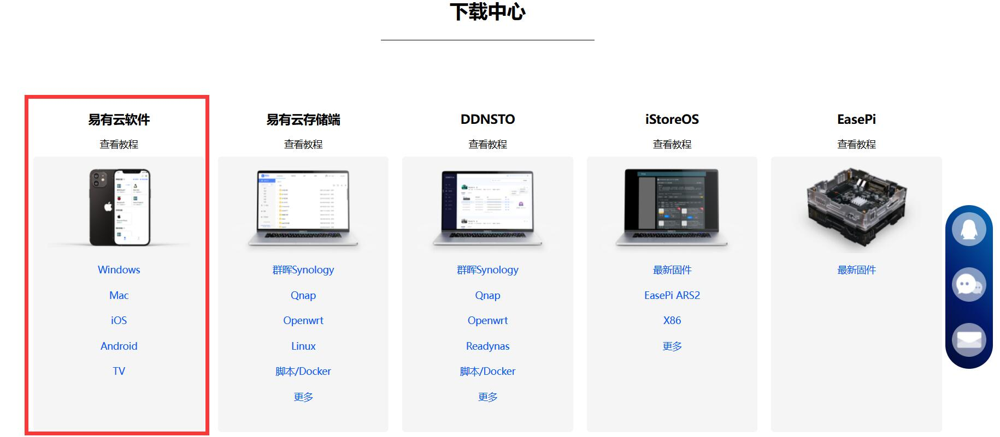

# 易有云

**使命**

帮用户解决：随着互联网的发展，流媒体数据越来越多，而存储、管理、备份的难度越来越大的矛盾；人们对数据安全、隐私安全会更加的重视，我们需要将我们的数据完全的私有化。

**解决问题：**

* 手机相片越来越多，而公有云盘越来越慢；
* 私有云存储搭建太专业，外网访问设置很麻烦；
* 用 webdav、samba 等，有没有个好的全平台一致体验的客户端；
* 数据备份、容灾是个大问题，设置太专业，还容易设置错误造成数据丢失；
* 公司写的文档不方便同步到家里。

**易有云软件提供：**

* 整套私有化的网络存储服务，用户可以轻松达成各种专业级别功能；
* 一个可以随时随地远程连接个人文件或设备的私有存储云；
* 全平台的数据互通，P2P的极速体验。随时随地备份你的照片、文件；
* 完全的数据私有化。

**易有云支持：**

易有云分为客户端和存储端，几乎支持市面上常见的设备和系统。

* [客户端下载](https://doc.linkease.com/downloads/) 

* 易有云客户端，目前支持：

| 类型 |平台|支持|
|-|-|-|
| PC端 | Windows | 支持 |
| PC端 | MacOS | 支持 |
| 移动端 | Android | 支持 |
| 移动端 | iOS | 支持 |
| TV端 | Android TV | 支持 |

* 单纯的客户端支持的功能有限，建议配合存储端开启全功能，这样才能更好的体验。
  
* [安装存储端](/zh/guide/linkease/install/device/windows.html) -->

