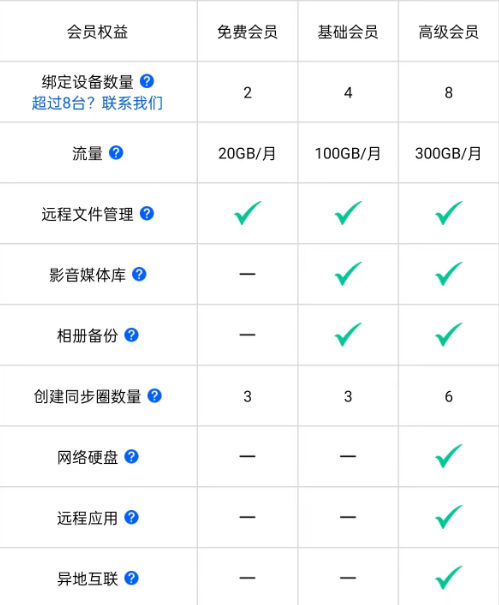
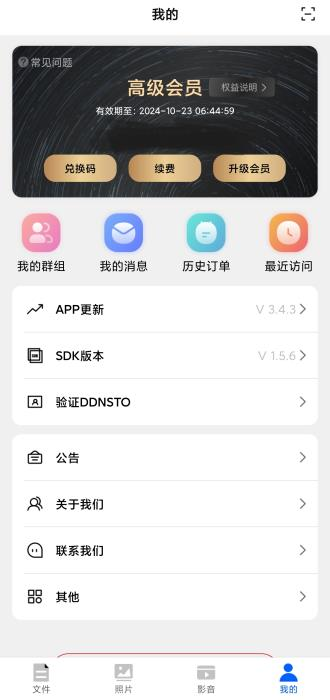
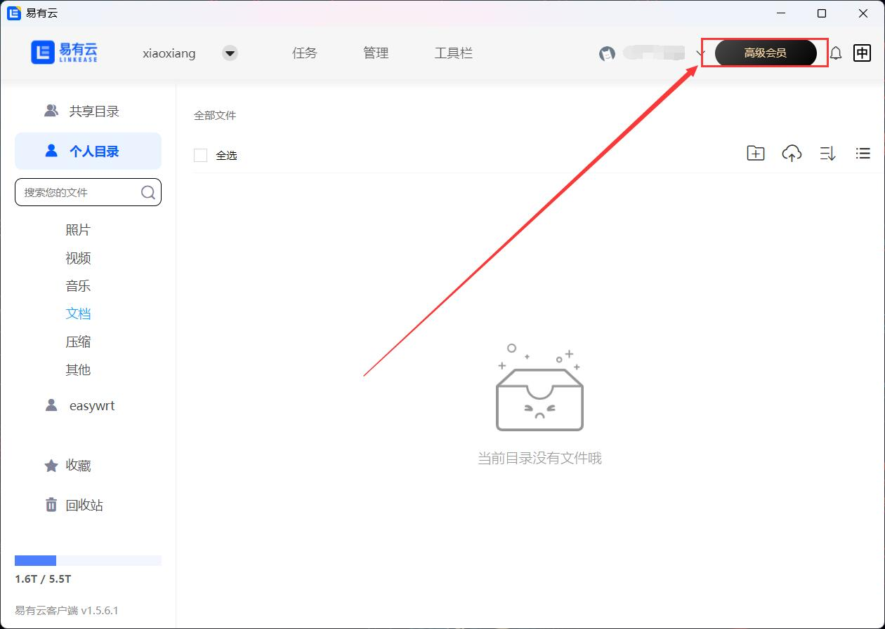
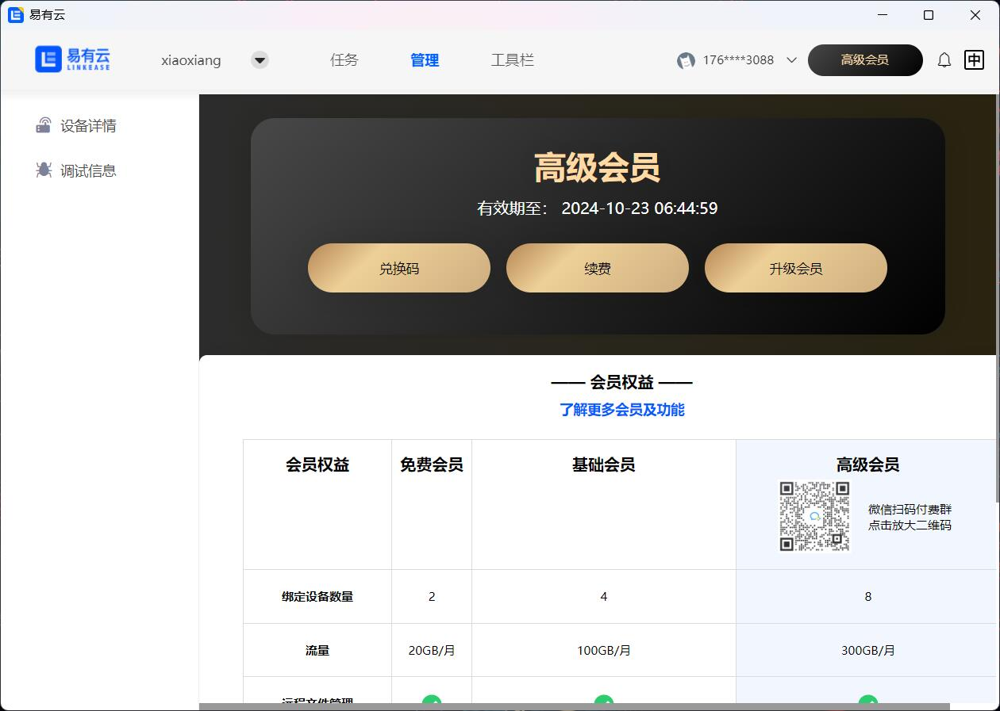

## 收费价格
因为相比公有云，用户自己承担了硬盘与硬件的存储，所以易有云收费相对便宜。
易有云未来偏向基于时长与带宽收费，而功能不收费。

~~易有云只对存储端收费，用户客户端下载安装不收费。~~
~~**(即1台本地电脑可开启存储服务，作为1台NAS设备绑定使用，如您在2台电脑都开启存储服务，就相当于绑定2台NAS设备，我们就要收取2个套餐价格。)**~~

### 从 2024 年 4 月 24 日起， 易有云APP将调整付费方案。
**也请大家把易有云App/客户端全部升级为[最新版](https://www.linkease.com/download)。**
- 为了降低软件的使用门槛， 也为了把软件推广给更多的付费用户，我们去掉了按“设备”付费的概念；
- 改成了按“用户”付费的概念；
- 如果您之前有两个设备，你需要买两个套餐，三个设备就需要三个套餐；
- 现在你只需要把自己的一个账号升级为会员，就可以同时使用多个设备。

**新付费方案优势**
- 您有多个设备的时候，不需要单独买多个设备的套餐，这样总价肯定更便宜了；
- 而对我们来说，把软件升级成按会员收费，更好理解；毕竟大多数软件都是按会员订阅收费的。

**新的付费方案：** 
- 降低学习成本： 不再区分存储端及客户端；
- 单次付费：每个用户根据需求订阅会员套餐，根据套餐不同等级可以使用相应数量的设备以及功能权益；
- 降低资费：不再需要为多台设备多次付费、免除解除及绑定套餐操作。

当然，我们也会保持免费使用的策略，轻度使用的您，可以持续免费使用我们的软件。下面是具体的细节： 

|套餐|设备数量|功能|流量|价格| 
|:-:|:-:|:-:|:-:|:-:|
|免费会员|2 台|**文件管理**| 20G/月|**0元**| 
|基础会员|4 台|**文件管理、相册备份、同步圈**| 100G/月|8.8元/月 **48.8元/年**| 
|高级会员|8 台|**基础会员功能+网络硬盘、** **异地互联、远程应用导航**| 300G/月|16.8元/月 **98.8元/年**| 

看到细节，可能大家担心流量会不会太小？——完全不用担心，因为对于通信流量，我们只计算：
- 当您的网络无法点对点通信的时候，经过我们服务器转发的流量大小；
- 当您在内网，或者外网是点对点通信的时候使用的流量，我们不纳入计算范围；
- 点对点通信的意思是，您的设备之前互传文件的时候，数据直接用了你的家庭带宽，数据不经过我们的服务器；
- 中转服务器带宽我们会保证在 8Mbps+，而且我们提供了十几台服务器。未来我们将逐步过度到不限速的理念。

**群组共享：** 
* #### 群组功能不是会员功能，是独立于会员的收费功能，只有基础和高级会员才能购买群组功能。（新用户购买会员套餐时会送对应的群组!） 
* 群组管理员可以根据需求创建不同人数和有效期的群组。
* 群组管理员可以为每个群组绑定一台设备（管理员已开启网盘的设备），群组成员可以通过该群组设备相互分享文件。
* 根据管理员的会员等级，决定了群组设备可以使用哪些功能（比如群组成员可以备份照片或者同步到该网盘)。
* 群组成员无需购买会员也可以访问群组设备。

|群组人数|价格| 
|:-:|:-:|
|2人|28元/年|
|3人|55元/年|
|4人|66元/年|
|7人|99元/年|

## 购买套餐
* **新用户可以免费使用30天会员套餐**

### 易有云APP
#### 建议使用安卓易有云APP购买会员套餐/群组；iOS众所周知的原因，价格会贵一点，建议iOS用户使用安卓手机/PC客户端购买。 

绑定设备后，登录易有云App，首页【我的】——【顶部】会显示您的会员信息，按需购买套餐或者续费，或者用兑换码兑换；

### PC客户端

* **绑定设备后，登录易有云PC客户端，右上角点击进去，然后按需购买套餐或者续费，或者用兑换码兑换；**

ps：目前新UI的v1.7.4的PC版，无法购买/续费套餐，建议先换回经典UI的PC版（功能一样，只是UI不同）。

[windows 旧版经典 UI](https://fw0.koolcenter.com/binary/LinkEase/Client/LinkEaseSetup-20250707.exe)  [macOS 旧版经典 UI](https://fw0.koolcenter.com/binary/LinkEase/Client/LinkEase-20250707.dmg)

### 续费或者升级

### 续费
**注意：续费仅可选择相同的会员套餐！**

### 升级
#### 升级套餐规则：已付费并未过期的基础会员套餐可以升级至高级会员套餐
#### 注意：升级方式为补交套餐差价，升级后会员套餐有效时间将按所选升级会员套餐有效时长重新计算。

绑定设备后，登录易有云PC客户端，右上角点击进去，然后按需续费或升级会员； 

## 常见问题

**我现在是免费会员，怎么购买新会员套餐？**

答：新用户可以免费使用30天高级会员，如果套餐到期或者想购买新会员套餐，直接购买需要的会员套餐。

* [设备套餐迁移等其他相关问题，移步](/zh/guide/linkease/account/new_pay.html) -->

## 产品退款的规则说明

- 请发送邮件至 support@linkease.com 进行退款申请，并附带账号及微信付款截图信息，如信息不全将无法退款； 
- 仅接受付款14天内的订单，逾期不接受申请； 
- 退款申请批准后可能最多需要 7 天的处理时间，退还款项将原支付路径返还。
- 苹果支付订单请使用苹果商店退款，参考：https://support.apple.com/zh-cn/118223  
- 收到邮件后将在 7 个工作日内处理
